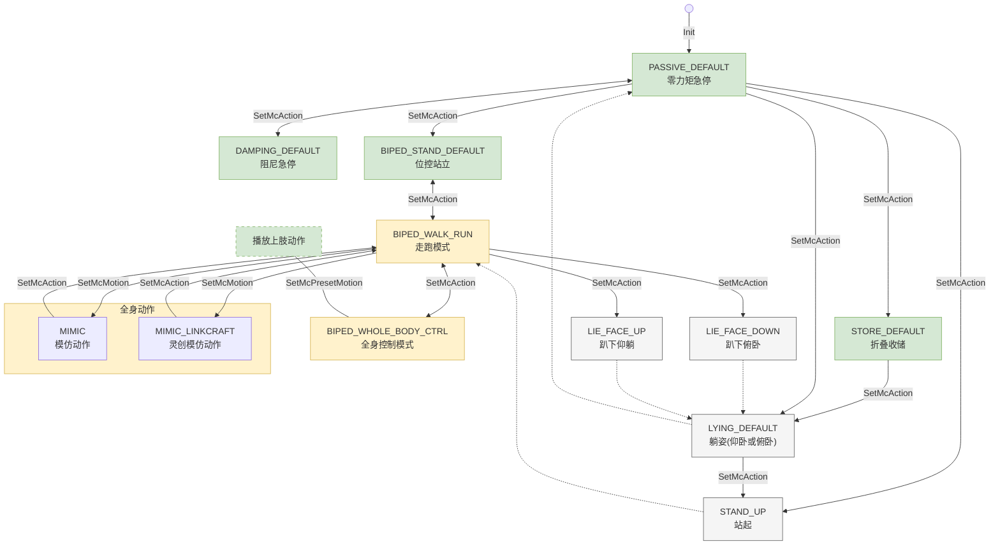

<!-- FRAMEWORK_SKELETON: LOCKED -->
# 目录

- [# 1. API列表](#1-api列表)
- [# 2. 接口详情](#2-接口详情)
  - [## 接口公共说明](#接口公共说明)
    - [### 接口响应规范](#接口响应规范)
    - [### CLI 调试指南](#cli-调试指南)
    - [### 接口调用稳定性提醒](#接口调用稳定性提醒)
  - [## 2.1 运动控制模块](#21-运动控制模块)
    - [### 2.1.1 运控高层接口](#211-运控高层接口)
      - [#### 2.1.1.1 运动模式控制](#2111-运动模式控制)
        - [【服务】查询运动模式服务](#服务查询运动模式服务)
        - [【服务】设置运动模式服务](#服务设置运动模式服务)
        - [【服务】设置全身动作服务](#服务设置全身动作服务)
      - [#### 2.1.1.2 预设动作控制](#2112-预设动作控制)
        - [【服务】预设动作控制服务](#服务预设动作控制服务)
      - [#### 2.1.1.3 速度控制](#2113-速度控制)
        - [【话题】走跑控制话题](#话题走跑控制话题)
      - [#### 2.1.1.4 输入源控制](#2114-输入源控制)
        - [【服务】设置输入源服务](#服务设置输入源服务)
        - [【服务】获取当前控制输入源服务](#服务获取当前控制输入源服务)
    - [### 2.1.2 运控低层接口](#212-运控低层接口)
      - [#### 2.1.2.1 关节控制](#2121-关节控制)
        - [【话题】关节控制话题](#话题关节控制话题)
        - [【话题】关节状态话题](#话题关节状态话题)
  - [## 2.2 交互控制模块](#22-交互控制模块)
    - [### 2.2.1 语音控制](#221-语音控制)
      - [#### 2.2.1.1 音量控制服务](#2211-音量控制服务)
        - [【服务】获取音量服务](#服务获取音量服务)
        - [【服务】设置音量服务](#服务设置音量服务)
        - [【服务】获取静音状态服务](#服务获取静音状态服务)
        - [【服务】设置静音服务](#服务设置静音服务)
      - [#### 2.2.1.2 语音合成服务](#2212-语音合成服务)
        - [【服务】语音合成服务](#服务语音合成服务)
      - [#### 2.2.1.3 音频文件播放服务](#2213-音频文件播放服务)
        - [【服务】音频文件播放服务](#服务音频文件播放服务)
      - [#### 2.2.1.4 音频流采集话题](#2214-音频流采集话题)
        - [【话题】音频码流录制话题](#话题音频码流录制话题)
      - [#### 2.2.1.5 音频流回放话题](#2215-音频流回放话题)
        - [【话题】音频码流播放话题](#话题音频码流播放话题)
    - [### 2.2.2 屏幕控制](#222-屏幕控制)
      - [#### 2.2.2.1 表情与视频管理](#2221-表情与视频管理)
        - [【服务】播放表情和视频服务](#服务播放表情和视频服务)
  - [## 2.3 硬件抽象模块](#23-硬件抽象模块)
    - [### 2.3.1 触觉传感器](#231-触觉传感器)
      - [#### 2.3.1.1 触觉传感器状态](#2311-触觉传感器状态)
        - [【话题】头部触摸状态话题](#话题头部触摸状态话题)
    - [### 2.3.2 视觉传感器](#232-视觉传感器)
      - [#### 2.3.2.1 视觉采集管理](#2321-视觉采集管理)
        - [【服务】获取相机单帧图像服务](#服务获取相机单帧图像服务)
        - [【话题】获取相机视频流服务](#话题获取相机视频流服务)
    - [### 2.3.3 电源管理](#233-电源管理)
      - [#### 2.3.3.1 电源管理](#2331-电源管理)
        - [【话题】电源管理话题](#话题电源管理话题)
    - [### 2.3.4 灯语控制](#234-灯语控制)
      - [#### 2.3.4.1 灯光样式控制](#2341-灯光样式控制)
        - [【服务】灯带控制服务](#服务灯带控制服务)
- [# 3. 下级协议定义](#3-下级协议定义)
  - [## 3.1 公共类型定义](#31-公共类型定义)
  - [## 3.2 运动控制模块](#32-运动控制模块)
    - [### 3.2.1 运控高层接口](#321-运控高层接口)
    - [### 3.2.2 运控低层接口](#322-运控低层接口)
  - [## 3.3 交互控制模块](#33-交互控制模块)
    - [### 3.3.1 语音控制](#331-语音控制)
  - [## 3.4 硬件抽象模块](#34-硬件抽象模块)
    - [### 3.4.1 触觉传感器](#341-触觉传感器)
    - [### 3.4.2 视觉传感器](#342-视觉传感器)
    - [### 3.4.3 电源管理](#343-电源管理)
- [# 4. 编程示例](#4-编程示例)
  - [## 4.1 运动控制模块](#41-运动控制模块)
    - [### 4.1.1 运控高层接口](#411-运控高层接口)
        - [动作控制](#动作控制)
        - [速度控制](#速度控制)
        - [预设动作设置](#预设动作设置)
    - [### 4.1.2 运控低层接口](#412-运控低层接口)
        - [关节运动控制](#关节运动控制)
  - [## 4.2 交互控制模块](#42-交互控制模块)
    - [### 4.2.1 语音控制](#421-语音控制)
        - [音频播放](#音频播放)
        - [音频参数控制](#音频参数控制)
        - [音频流采集与回放](#音频流采集与回放)
    - [### 4.2.2 屏幕控制](#422-屏幕控制)
        - [表情播放](#表情播放)
  - [## 4.3 硬件抽象模块](#43-硬件抽象模块)
    - [### 4.3.1 触觉传感器](#431-触觉传感器)
        - [读取触觉状态](#读取触觉状态)
    - [### 4.3.2 视觉传感器](#432-视觉传感器)
        - [摄像头单帧数据获取](#摄像头单帧数据获取)
        - [视频流获取](#视频流获取)
    - [### 4.3.3 电源管理](#433-电源管理)
        - [读取电源状态](#读取电源状态)
    - [### 4.3.4 灯语控制](#434-灯语控制)
        - [灯语控制](#灯语控制)

---

<!-- FRAMEWORK_SKELETON: INDEX_MAPPING_START -->

# 1. API列表

| 模块分类 | 功能分类 | 接口名称 | 功能描述 |
|---|---|---|---|
| **运动控制模块**| 运控高层接口 | [`/aimdk_5Fmsgs/srv/GetMcAction`](#服务查询运动模式服务) | 查询运动状态 |
| | | [`/aimdk_5Fmsgs/srv/SetMcAction`](#服务设置运动模式服务) | 设置运动状态 |
| | | [`/aimdk_5Fmsgs/srv/SetMcMotion`](#服务设置全身动作服务) | 设置全身动作 |
| | | [`/aimdk_5Fmsgs/srv/SetMcPresetMotion`](#服务预设动作控制服务) | 设置预设动作控制 |
| | | [`/aima/mc/locomotion/velocity`](#话题走跑控制话题) | 走跑控制 |
| | | [`/aimdk_5Fmsgs/srv/SetMcInputSource`](#服务设置输入源服务) | 设置输入源 |
| | | [`/aimdk_5Fmsgs/srv/GetCurrentInputSource`](#服务获取当前控制输入源服务) | 查询当前控制输入源 |
| | 运控低层接口 | [`/aima/hal/joint/command`](#话题关节控制话题) | 关节控制命令 |
| | | [`/aima/hal/joint/state`](#话题关节状态话题) | 关节状态反馈 |
|**交互控制模块**| 语音控制 | [`/aimdk_5Fmsgs/srv/PlayTts`](#服务语音合成服务) | 语音合成服务|
| | | [`/aimdk_5Fmsgs/srv/GetVolume`](#服务获取音量服务) | 获取音量 |
| | | [`/aimdk_5Fmsgs/srv/SetVolume`](#服务设置音量服务) | 设置音量 |
| | | [`/aimdk_5Fmsgs/srv/GetMute`](#服务获取静音状态服务) | 获取静音状态 |
| | | [`/aimdk_5Fmsgs/srv/SetMute`](#服务设置静音服务) | 设置静音 |
| | | [`/aimdk_5Fmsgs/srv/PlayAudioFile`](#服务音频文件播放服务) | 音频文件播放 |
| | | [`/aima/hal/audio/capture`](#话题音频码流录制话题) | 音频码流录制话题|
| | | [`/aima/hal/audio/playback`](#话题音频码流播放话题) | 音频码流播放话题 |
| | 屏幕控制 | [`/aimdk_5Fmsgs/srv/PlayEmotion`](#服务播放表情和视频服务) | 播放表情和视频 |
|**硬件抽象模块** | 触觉传感器 | [`/aima/hal/touch/state`](#话题头部触摸状态话题) | 头部触摸状态 |
| | 视觉传感器 | [`/aima/hal/camera/CaptureJpegImage`](#服务获取相机单帧图像服务) | 获取指定相机单帧JPEG图像 |
| | | [`rtsp_url = "rtsp://<IP>:<Port>/live_<camera_id>"`](#话题获取相机视频流服务) | RTSP流媒体服务 |
| | 电源管理 | [`/aima/hal/bms/state`](#话题电源管理话题) | 电源管理相关数据 |
| | 灯语控制 | [`/aimdk_5Fmsgs/srv/LedStripCommand`](#服务灯带控制服务) | 设置整机灯语样式 |

<!-- FRAMEWORK_SKELETON: INDEX_MAPPING_END -->

# 2. 接口详情

本SDK提供了一套完整的ROS2接口，用于控制启元机器人。接口遵循ROS2标准，支持C++和Python两种编程语言，为开发者提供灵活、高效的机器人应用开发环境。

## 接口公共说明

### 接口响应规范

SDK 采用统一的响应模型。所有服务调用均返回 `CommonResponse`、`ResponseHeader` 或 `CommonTaskResponse` 结构，建议遵循“框架返回码优先，业务状态码随后”的判定原则。

**完整响应模型概览**

| 字段 | 类型 | 语义说明 |
| :--- | :--- | :--- |
| **header** | `ResponseHeader` | **RPC / 框架层信息**。包含系统时间戳 `stamp` 与返回码 `code`。 |
| **status / state** | `CommonState` | **核心业务状态**。反映具体指令的执行进展，通过 `.value` 获取。 |
| **message** | `string` | **诊断信息**。当调用非 `SUCCESS` 时，提供可读的错误排查描述。 |
| **task_id** | `uint64` | **任务标识**。仅在 `CommonTaskResponse` 中提供，用于异步任务追踪。 |

**1. 系统状态码语义映射 (ResponseHeader)**

该结构体定义了分布式通信及框架层的响应状态。

| 字段 | 类型 | 语义说明 |
| :--- | :--- | :--- |
| **stamp** | `builtin_interfaces/Time` | **时间戳**。框架层生成的消息处理时间。 |
| **code** | `int64` | **框架返回码 (Enum)**。见下表枚举描述。 |

<!-- DERIVED_TABLE_START: ResponseCode -->
| code值 | 枚举标识 | 框架解析 | 开发者处理建议 |
| :--- | :--- | :--- | :--- |
| `0` | `SUCCESS` | 调度成功 | 请求已被底层系统接受并进入执行序列。 |
| `1` | `FAIL` | 调度失败 | 请求被拦截（如状态机冲突、资源占用或权限不足）。 |
<!-- DERIVED_TABLE_END: ResponseCode -->

**2. 业务状态码语义映射 (CommonState)**

以下枚举定义了整个二次开发 SDK 的全生命周期状态语义：

<!-- DERIVED_TABLE_START: CommonState -->
| 状态值 | 枚举标识 | 业务解析 | 开发者处理建议 |
| :--- | :--- | :--- | :--- |
| `0` | `UNKNOWN` | 未知状态 | 建议记录日志并触发系统自检或安全回退。 |
| `1` | `SUCCESS` | 调用成功 | 业务逻辑正常完成或异步请求已成功入队。 |
| `2` | `FAILURE` | 执行失败 | 业务规则冲突或资源报错，请查阅 `message` 诊断。 |
| `3` | `ABORTED` | 任务中止 | 任务已被外部停止、中途取消或被高优先级任务抢占。 |
| `4` | `TIMEOUT` | 响应超时 | 检查网络链路、底层驱动状态或系统负载。 |
| `5` | `INVALID` | 无效请求 | 检查参数是否越界、格式是否非法或状态机切换是否受限。 |
| `6` | `IN_MANUAL` | 手动接管 | 机器人处于离线物理接管或手动维护模式，拒绝指令。 |
| `100` | `NOT_READY` | 系统未就绪 | 模块仍处于引导/初始化阶段，建议延时重试。 |
| `200` | `PENDING` | 任务排队中 | 异步任务已受理，正处于底层执行器的资源消费序列。 |
| `300` | `CREATED` | 任务已创建 | 任务实例已就绪并完成预设参数绑定，等待执行开口。 |
| `400` | `RUNNING` | 正在运行 | 任务处于活动状态，正实时控制机器人硬件或消耗资源。 |
<!-- DERIVED_TABLE_END: CommonState -->

> **多级判别准则**：开发者应首先核对 `header.code == 0`（系统调度成功），再结合 `status.value == 1`（业务逻辑成功）来判定最终结果。
> **故障详情获取**：当调用失败（包括框架及其业务层）时，建议通过 `message` 字段获取具体的错误排查详情。
> **状态码冲突提醒**：部分底层模块（如运动模式控制接口）返回的 `status.value` 遵循 `McActionStatus` 协议，其 `100` 代码代表 `RUNNING`。处理反馈时请务必核对具体接口的模型定义。

---

### CLI 调试指南

您可以利用 ROS 2 命令行工具对上述接口进行点对点调试：
- **服务调用 (Service Call)**：`ros2 service call <service_name> <service_type> '<data>'`
- **话题发布 (Topic Pub)**：`ros2 topic pub <topic_name> <message_type> '<data>'`
- **参数获取**：
  - **字段溯源**：载荷中的 Key 必须与对应 `.srv` 或 `.msg` 定义中的字段名**严格一致**。若定义存在嵌套，需按层级展开。
- **填充规范**：数值直接填写；布尔值全小写 `true/false`；字符串建议“外层单引、内层双引”（如 `'text: "..."'`）。
- **缺省占位**：对 `RequestHeader` 等嵌套对象，建议直接使用 `{}` 占位（例如 `header: {}`）。
- **示例**：`ros2 service call /aimdk_5Fmsgs/srv/SetMcAction aimdk_msgs/srv/SetMcAction '{header: {}, command: {action: {value: 201}}}'`

---

### 接口调用稳定性提醒

在代码中动态创建（实例化）新的 ROS 2 Client 后，即使 `wait_for_service` 返回成功，底层的通信链路可能仍需极短的时间（通常为毫秒级）来完成最终的连接匹配。
- **现象**：在 Client 刚创建后的瞬间发起的**首次**请求，即便网络正常，也可能出现“请求发出了但服务端没收到”的情况（在跨芯片通讯场景下较常见）。
- **开发建议**：
    1. **推荐长连接**：建议在节点初始化时一次性创建 Client 并全局复用，**避免**在业务循环或函数内部频繁创建与销毁 Client。
    2. **增加重试或延时**：如必须动态创建，建议在服务就绪后额外等待一小段时间（如 200ms），或为首次调用增加重试逻辑。
> 详情可参考 ROS2 官方关于 Client 匹配滞后的 [技术讨论](https://github.com/ros2/ros2cli/issues/37)。

### 友好用户使用声明
> [!CAUTION]
> **重要安全性须知**：底层硬件控制（尤其是关节伺服）具有极高的物理操作性风险。在开始正式业务开发前，**请务必先行阅读并签署**根目录下的 [《友好用户使用声明》](./友好用户使用声明.md)。任何因不当指令导致的硬件损毁或安全事故，均由开发者承担全部后果。

---

## 2.1 运动控制模块

本模块负责启元机器人的运动控制，涵盖了高层运动模式（如走跑、预设动作）的全局管控指令，以及底层关节电机（角度、力位）伺服的精细化控制接口。

**核心功能**

- **高阶业务指令调用**：支持通过特定宏指令（Action/Motion）一键触发机器人预设动作或轨迹。
- **运动模式与信号源管理**：支持机器人整机运动状态（如走跑、站立）的查询切换及输入源优先级配置。
- **底层关节精细伺服控制**：支持下发关节电机标定量（位置、力矩等），支持进行高频状态监控。

### 2.1.1 运控高层接口

本模块提供高层运动指令全局管控，包含运动模式切换、输入源控制、走跑控制及预设动作触发。

#### 2.1.1.1 运动模式控制

**Q1机型** 运控状态机切换逻辑如下：

<!-- DERIVED_DIAGRAM_START: McStateTransition -->

<!-- DERIVED_DIAGRAM_END: McStateTransition -->

  > ⚠️ **状态切换限制**：
  
  > 状态的切换通常需要严格遵循上图中箭头指向的逻辑连线路径（不支持跨状态强行越级切换）。若您下发不在合法拓扑连线范围内的 `Action` 指令，将触发底层控制系统拦截保护。
  
  > **任何状态**均可直接切换至 **阻尼急停** (`DAMPING_DEFAULT`)，但阻尼急停状态只能切换至 **零力矩急停** (`PASSIVE_DEFAULT`)。
  
  > **任何状态**均可直接切换至 **零力矩急停** (`PASSIVE_DEFAULT`)，但零力矩急停状态只能切换至 **位控站立** (`BIPED_STAND_DEFAULT`)、**阻尼急停** (`DAMPING_DEFAULT`)、**折叠收储** (`STORE_DEFAULT`) 和 **躺姿** (`LYING_DEFAULT`)。
  
  > 在全身动作（`MIMIC`相关动作）执行结束后，系统将自动执行状态切换，切换至 **走跑模式** (`BIPED_WALK_RUN`)。
  
  > 仅在状态切换至 **全身控制模式** (`BIPED_WHOLE_BODY_CTRL`) 下，方可调用 `SetMcPresetMotion` 接口播放预设的上肢动作。

##### 【服务】查询运动模式服务
**功能描述**

查询机器人当前正在执行的运动或形态动作（Action）生命周期阶段。

**接口元数据**

- 版本：1.0 (Stable)
- 接口类型：Service
- 接口名称：/aimdk_5Fmsgs/srv/GetMcAction
- 数据类型：`aimdk_msgs/srv/GetMcAction`
- 数据流向：Robot -> Outer (状态/查询返回)
- 调用方式：Service Call (调用/请求)
- CLI 调用：`ros2 service call /aimdk_5Fmsgs/srv/GetMcAction aimdk_msgs/srv/GetMcAction '{...}'`
- QoS：Reliable（服务默认 QoS）

**接口定义**

<!-- PROTOCOL_START: GetMcAction -->
- 协议路径：`aimdk_msgs/mc/action/srv/GetMcAction.srv`
```srv
# ==========================================
# [请求部分 Request] 客户端下发的数据结构
# ==========================================
CommonRequest    request    # Request 部分

---
# ==========================================
# [响应部分 Response] 服务端返回的数据结构
# ==========================================
ResponseHeader    header
McActionInfo      info      # Action信息
```
<!-- PROTOCOL_END: GetMcAction -->

**GetMcAction 协议定义**

| 字段 | 数据类型 | 描述 |
|---|---|---|
| `request` | [`CommonRequest`](#commonrequest) | 请求参数（包含优先级等通用配置） |
| `header` | [`ResponseHeader`](#responseheader) | 响应头信息（包含序列号与状态回传） |
| `info` | [`McActionInfo`](#mcactioninfo) | 当前机器人运动模式的详细信息 |

**特别说明**

- **状态轮询与业务时序控制**：
  1. 动作的物理切换在下发后虽立即返回成功，但机械实际过渡可能长达数秒，此期间并发其他指令极易引发冲撞风险。
  2. 下发切换请求后，开发者需启动循环高频探测。当且仅当本接口返回的 `status.value` 由 `200 (TRANSITION)` 变更为 `100 (RUNNING)` 时，方可进入下一步业务逻辑。
- **未知动作的防御性兜底解析**：当探测到 `info.current_action.value` 等于 `0` 时，切勿将其简单判定为机器人处于“空闲待机态”。
  1. 在特定状态下，底层可能触发了仅驻留于配置文件中、尚未映射至公开 API 枚举表的内部保护动作，导致强制序列化回退为 `0`。
  2. 遇到 `value = 0` 无法对应已知场景时，业务逻辑必须优先提取 `info.action_desc` 字段。该字段能无视枚举字典限制，直接上报底层内核当前真正在跑的字符串标签。

**编程示例**

<!-- REDIRECTION_LINK_START: ActionControl -->
- Cpp示例：[点击跳转](#动作控制-Cpp示例)
- Python示例：[点击跳转](#动作控制-Python示例)
<!-- REDIRECTION_LINK_END: ActionControl -->

##### 【服务】设置运动模式服务
**功能描述**

设置合法的运动模式（如稳定站立或走跑等）。

**接口元数据**

- 版本：0.1 (Beta / 开发中)
- 接口类型：Service
- 接口名称：/aimdk_5Fmsgs/srv/SetMcAction
- 数据类型：`aimdk_msgs/srv/SetMcAction`
- 数据流向：Outer -> Robot (控制命令/设置)
- 调用方式：Service Call (调用/请求)
- CLI 调用：`ros2 service call /aimdk_5Fmsgs/srv/SetMcAction aimdk_msgs/srv/SetMcAction '{...}'`
- QoS：Reliable（服务默认 QoS）

**接口定义**

<!-- PROTOCOL_START: SetMcAction -->
- 协议路径：`aimdk_msgs/mc/action/srv/SetMcAction.srv`
```srv
# ==========================================
# [请求部分 Request] 客户端下发的数据结构
# ==========================================
RequestHeader      header
McActionCommand    command    # Action命令

---
# ==========================================
# [响应部分 Response] 服务端返回的数据结构
# ==========================================
CommonResponse    response
```
<!-- PROTOCOL_END: SetMcAction -->

**SetMcAction 协议定义**

| 字段 | 数据类型 | 描述 |
|---|---|---|
| `header` | [`RequestHeader`](#requestheader) | 请求头 |
| `command` | [`McActionCommand`](#mcactioncommand) | Action命令 |
| `response` | [`CommonResponse`](#commonresponse) | - |

**特别说明**

- **双通道调用**：底层接口支持通过整型标识符 (`action.value`) 或字符串描述 (`action_desc`) 两种方式下发动作指令。
- **解析顺序与回退逻辑**：
  1. 系统优先解析 `action.value`。若该数值在内核枚举映射中存在（例如 `1` 对应 `PASSIVE_DEFAULT`），则直接执行对应动作。
  2. 若 `action.value` 为空值（`0`）或未定义的数值，系统将退而解析 `action_desc` 字段。若该字符串配置文件中定义的动作名称精确匹配，则执行对应动作。
- **状态切换逻辑图**：当前机型的运动模式状态切换规则及其闭环拓扑如下所示：

**编程示例**

<!-- REDIRECTION_LINK_START: ActionControl_Set -->
- Cpp示例：[点击跳转](#动作控制-Cpp示例)
- Python示例：[点击跳转](#动作控制-Python示例)
<!-- REDIRECTION_LINK_END: ActionControl_Set -->

##### 【服务】设置全身动作服务
**功能描述**

有别于上面那种按键触发式的固有动作控制（Action），`Motion` 接口专门用于运控高级开发——**播放基于神经网络推理模型 (.onnx) 或是特定外部特征文件记录的动作细则序列**。

**接口元数据**

- 版本：0.6.0 (Beta / 开发中)
- 接口类型：Service
- 接口名称：/aimdk_5Fmsgs/srv/SetMcMotion
- 数据类型：`aimdk_msgs/srv/SetMcMotion`
- 调用方式：Call (服务客户端下发)
- CLI 调用：`ros2 service call /aimdk_5Fmsgs/srv/SetMcMotion aimdk_msgs/srv/SetMcMotion '{...}'`
- QoS：Reliable（服务默认 QoS）

**接口定义**

<!-- PROTOCOL_START: SetMcMotion -->
- 协议路径：`aimdk_msgs/mc/motion/srv/SetMcMotion.srv`
```srv
# ==========================================
# [请求部分 Request] 客户端下发的数据结构
# ==========================================
RequestHeader    header          # 此接口是播放全身动作接口
int32            type            # 资源类型

# 自有模型
int32            MIMIC_QY = 1

# 灵创模型
int32            MIMIC_LC = 2

string           motion          # 全身动作名称，若motion为空，加载model中resource; 反之，从本地加载执行资源。
string           model           # onnx 模型绝对路径
string           resource        # 资源绝对路径，比如轨迹参考
bool             interrupt       # 是否打断(给后面animation接口合并预留)

---
# ==========================================
# [响应部分 Response] 服务端返回的数据结构
# ==========================================
CommonTaskResponse    response   # 响应头 (含 task_id)
```
<!-- PROTOCOL_END: SetMcMotion -->

**SetMcMotion 协议定义**

| 字段 | 数据类型 | 描述 |
|---|---|---|
| `header` | [`RequestHeader`](#requestheader) | 请求头 |
| `type` | `int32` | 资源类型 (`1`: MIMIC_QY, `2`: MIMIC_LC) |
| `motion` | `string` | 全身动作名称 |
| `model` | `string` | onnx 模型绝对路径 |
| `resource` | `string` | 资源绝对路径，比如轨迹参考 |
| `interrupt` | `bool` | 是否打断 |
| `response` | [`CommonTaskResponse`](#commontaskresponse) | 响应头 (含 task_id) |

**特别说明**

- **强制时序前置条件**：
  1. **开启基础框架阀门**：调用本接口前，必须先使用 `SetMcAction` 接口将系统切入指定的Action（`BIPED_STAND_DEFAULT` 或 `BIPED_WALK_RUN`）。
  2. **阻塞确认状态跃迁**：框架开启指令发出后，切勿立刻盲发本动作。调用端必须写明轮询检测逻辑，通过比对 `GetMcAction` 的实时反馈，确认底层执行态彻底平稳跃迁并停留至 `RUNNING` 后，方能安全地下发最终动作指令。
- **仅支持内置动作调用**：
  1. 调用者必须在 `motion` 字段传入系统内置的合法动作名称（如 `"INTRO_POSE1"`，系统可用的 Motion 列表参见下表）。若传入空值或未登记名称，接口将无法正常执行。
  **Q1机型** **Motion** 枚举值列表：
<!-- DERIVED_TABLE_START: MotionList_Q1 -->
| 名称 | Type | 描述 |
| :--- | :--- | :--- |
| `INTRO_POSE1` | `MIMIC` | 亮相动作1 |
| `INTRO_POSE3` | `MIMIC` | 亮相动作3 |
| `INTRO_POSE6` | `MIMIC` | 亮相动作6 |
| `INTRO_POSE7` | `MIMIC` | 亮相动作7 |
| `BOXING` | `MIMIC` | 拳击 |
| `SPINNING_CRESCENT_KICK` | `MIMIC` | 踢月转体 |
| `HEAD_SPIN` | `MIMIC` | 头旋 |
| `THOMAS_FLAIR` | `MIMIC` | 托马斯大回环 |
| `FLOOR_COMBO` | `MIMIC` | 小地板动作 |
| `STANDING_SIDE_FLIP` | `MIMIC` | 原地侧空翻 |
| `ELBOW_STAND` | `MIMIC` | 肘倒立动作 |
| `BACK_HAND_SPRING_BACK_SOMERSAULT` | `MIMIC` | 后手翻加后空翻 |
| `STANDING_TO_LYING_FACE_UP` | `MIMIC` | 站立到躺下（完成后自动回退至 `BIPED_STAND_DEFAULT`） |
| `LYING_FACE_UP_TO_STANDING` | `MIMIC` | 躺下到站立 |
| `STANDING_TO_LYING_FACE_DOWN` | `MIMIC` | 站立到趴下（完成后自动回退至 `BIPED_STAND_DEFAULT`） |
| `LYING_FACE_DOWN_TO_STANDING` | `MIMIC` | 趴下到站立 |
| `LYING_FACE_DOWN_TO_STANDING_BY_STANDING` | `MIMIC` | 趴下到站立（特技版） |
| `DANCE_LOCKING` | `MIMIC` | 舞蹈锁定 |
| `LINKCRAFT_MIMIC_SIMPLE` | `MIMIC_LINKCRAFT` | 灵创模型动作（模仿动作示例） |
| `TEST` | `MIMIC` | 测试动作（仅供内部调试） |
<!-- DERIVED_TABLE_END: MotionList_Q1 -->
  2. 服务端目前不提供解析 `model` 和 `resource` 等外部路径字段实现相应功能。
- **异步任务编排机制（非阻塞响应）**：
  1. 此服务采用非阻塞队列机制。接口返回 `SUCCESS` 及 `task_id`，仅代表动作请求校验合格且已成功入队。
  2. 由于物理动作耗时长，服务端不会阻塞等待执行结束。上层若需监控实际动作何时播完，需保存 `task_id` 去异步监听专属的排队进度。

**编程示例**

- Cpp示例：[点击跳转](#动作控制-Cpp示例)
- Python示例：[点击跳转](#动作控制-Python示例)

#### 2.1.1.2 预设动作控制

##### 【服务】预设动作控制服务
**功能描述**

用于控制机器人的局部或全身执行预设的动画序列。与 `SetMcMotion` 依赖神经网络推理不同，`PresetMotion` 通常播放的是基于关键帧或预录制的关节空间轨迹文件（如 `.csv`）。常用于礼仪挥手、比心、拍照姿态等固定交互动作。执行前需要确保机器人已进入稳定站立模式。

**接口元数据**

- 版本：1.0 (Stable)
- 接口类型：Service
- 接口名称：/aimdk_5Fmsgs/srv/SetMcPresetMotion
- 数据类型：`aimdk_msgs/srv/SetMcPresetMotion`
- 数据流向：Outer -> Robot (控制命令)
- 调用方式：Service Call (调用/请求)
- CLI 调用：`ros2 service call /aimdk_5Fmsgs/srv/SetMcPresetMotion aimdk_msgs/srv/SetMcPresetMotion '{...}'`
- QoS：Reliable（服务默认 QoS）

**接口定义**

<!-- PROTOCOL_START: SetMcPresetMotion -->
- 协议路径：`aimdk_msgs/mc/motion/srv/SetMcPresetMotion.srv`
```srv
# ==========================================
# [请求部分 Request] 客户端下发的数据结构
# ==========================================
RequestHeader     header
McControlArea     area         # 控制区域
McPresetMotion    motion       # 预设动作
bool              interrupt    # 是否打断前一个动作
string            ani_path     # 自定义动作地址

---
# ==========================================
# [响应部分 Response] 服务端返回的数据结构
# ==========================================
CommonTaskResponse    response
```
<!-- PROTOCOL_END: SetMcPresetMotion -->

**SetMcPresetMotion 协议定义**

| 字段 | 数据类型 | 描述 |
|---|---|---|
| `header` | [`RequestHeader`](#requestheader) | 请求头 |
| `area` | [`McControlArea`](#mccontrolarea) | 控制区域 |
| `motion` | [`McPresetMotion`](#mcpresetmotion) | 预设动作 |
| `interrupt` | `bool` | 是否打断前一个动作 |
| `ani_path` | `string` | 自定义动作地址 |
| `response` | [`CommonTaskResponse`](#commontaskresponse) | - |

**特别说明**

- **强制时序前置条件**：
  1. **开启基础框架阀门**：调用本接口前，必须先使用 `SetMcAction` 接口将系统切入指定的Action（`BIPED_WHOLE_BODY_CTRL`）。
  2. **阻塞确认状态跃迁**：框架开启指令发出后，切勿立刻盲发本动作。调用端必须写明轮询检测逻辑，通过比对 `GetMcAction` 的实时反馈，确认底层执行态彻底平稳跃迁并停留至 `RUNNING` 后，方能安全地下发最终动作指令。
  **Q1机型** 支持的预设动作列表如下：
<!-- DERIVED_TABLE_START: PresetMotionList_Q1 -->
| 动作编号 | 描述 |
| :---: | :--- |
| `0` | 恢复默认姿态 |
| `3001` | 招手 |
| `3002` | 握手 |
| `3003` | 碰拳 |
| `3004` | 挥手 |
| `3005` | 情绪动作 - 开心 |
| `3007` | 双手比心 |
| `3008` | 加油 |
| `3010` | 伸懒腰 |
| `3012` | 讲话动作A |
| `3013` | 讲话动作B |
| `3014` | 讲话动作C |
| `3018` | 拥抱 |
| `3021` | 拒绝 |
| `3046` | 跳舞动作A |
| `3047` | 跳舞动作B |
| `3048` | 跳舞动作C |
<!-- DERIVED_TABLE_END: PresetMotionList_Q1 -->
- **支持外部绝对路径加载**：
  1. 若 `ani_path` 非空，优先加载其指定的 `.csv` 路径文件；否则退回使用 `motion` 枚举去匹配内置库。
  2. `area` 控制掩码仅作上层标识参考。系统不会基于此过滤动作，而完全依照提取出的文件曲线强驱电机。
- **缺失强制稳态拦截机制**：
  1. 服务端不设置稳态检查，在任何极端运动姿态中发出的动画预设指令都会被立即响应下发。
  2. 为避免控制权冲突导致设备动作不可控，业务端必须主动施加安全时序约束。强烈建议配合 `GetMcAction` 进行状态判断，确认系统已落位至稳定状态后再下发预设请求。
- **防打断模式拒接断言特征**：
  1. 当 `interrupt = false`，且当前系统正处于其他动画序列的播放进程中时，服务端会拒接本次新覆盖下发请求以保护原有动画完成。
  2. 被拦截时接口返回的 `state` 依然是 `RUNNING`。调用方无法通过系统态识别失败，必须协同解析头帧错误码判定：`header.code == 0` 代表新请求被正常响应入队，`header.code == 1` 即被拦截丢弃。

**编程示例**

<!-- REDIRECTION_LINK_START: PresetMotion -->
- Cpp示例：[点击跳转](#预设动作设置-Cpp示例)
- Python示例：[点击跳转](#预设动作设置-Python示例)
<!-- REDIRECTION_LINK_END: PresetMotion -->

#### 2.1.1.3 速度控制

##### 【话题】走跑控制话题
**功能描述**

控制机器人在水平面内的平移速度（前进/侧移）及转向速度。该接口专门用于接收外部（如遥控器、App 摇杆、自主导航 PNC）连续、高频发送的速度控制指令，它是所有“移动指令”的主干汇聚口。

**接口元数据**

- 版本：1.0 (Stable)
- 接口类型：Topic
- 接口名称：/aima/mc/locomotion/velocity
- 数据类型：`aimdk_msgs/msg/McLocomotionVelocity`
- 数据流向：Outer -> Robot (控制命令)
- 调用方式：Publish (发布)
- CLI 调用：`ros2 topic pub /aima/mc/locomotion/velocity aimdk_msgs/msg/McLocomotionVelocity '{...}'`
- QoS：Reliable / Volatile / Depth=10
- 频率：50 Hz ~ 100 Hz

**接口定义**

<!-- PROTOCOL_START: McLocomotionVelocity -->
- 协议路径：`aimdk_msgs/mc/motion/McLocomotionVelocity.msg`
```msg
# ==========================================
# [话题载荷 Payload] 走跑速度控制指令结构体
# ==========================================
MessageHeader    header              # ROS2 标准头部信息（包含时间戳）
string           source              # 指令下发端口来源 (如: pad, rc, navigation)
float64          forward_velocity    # （X轴）前后前进线速度 (-m/s ~ m/s)
float64          lateral_velocity    # （Y轴）左右横排行线速度 (-m/s ~ m/s)
float64          angular_velocity    # （Z轴）原地偏航旋转角速度 (-rad/s ~ rad/s)
float64          pitch_velocity      # 机体俯仰速度控制
float64          level               # 机身高度升降调节 (-1.0 ~ 1.0)
```
<!-- PROTOCOL_END: McLocomotionVelocity -->

**McLocomotionVelocity 协议定义**

| 字段 | 数据类型 | 描述 |
|---|---|---|
| `header` | [`MessageHeader`](#messageheader) | 消息头 |
| `source` | `string` | 消息源 |
| `forward_velocity` | `float64` | 前进速度 (m/s)。有效区间 [0.1, 2.0]（绝对值），正值为前，负值为后。低于 0.1 视为停机。 |
| `lateral_velocity` | `float64` | 侧移速度 (m/s)。有效区间 [0.3, 1.0]（绝对值），正值为左，负值为右。低于 0.3 视为停机。 |
| `angular_velocity` | `float64` | 转向速度 (rad/s)。有效区间 [0.8, 2.5]（绝对值），正值为左转，负值为右转。低于 0.8 视为停机。 |
| `pitch_velocity` | `float64` | 预留字段，当前不生效。俯仰速度 (rad/s)，正值为俯，负值为仰 |
| `level` | `float64` | 预留字段，当前不生效。控制强度百分比 |

**特别说明**

- **指令源仲裁与抢占机制**：
  1. `source` 必须填入合法的自定义的已注册标识（输入源设置方法参见 [输入源控制](#输入源控制) 章节）。系统基于来源优先级进行仲裁，高优先级源会自动拦截低优先级指令。
  2. **输入源冲突避免**：调用走跑控制接口时，自定义的输入源标识（`source`）**严禁**与系统内置信源（如 `rc`、`pnc`、`interaction`、`vr`、`app_proxy`）重复使用，以防不同信源在同层级互相冲刷覆盖，引发不可预期的物理运动表现。系统内置输入源参见：[内置输入源配置表](#内置输入源配置表)。
  3. 若单一信源中断超过 1000ms，系统将自动触发“脱锁”机制释放控制权，并按序顺延至次级信源或触发安全停机。
- **运动模式与生效时序要求**：
  1. 发送速度指令前，要求机器人已通过 `SetMcAction` 成功切换至运动模式（如 `BIPED_WALK_RUN`）。
  2. 建议调用端通过 `GetMcAction` 确认底层状态彻底进入 `RUNNING` 后再下发控制指令，否则下发的走跑控制无法生效。
  3. **速度范围限制**：针对 **Q1机型**，线速度与角速度的具体取值范围请严格参考上文的 **McLocomotionVelocity 协议定义** 表格。
  4. **极值速度预警**：在极低速度或接近速度边界值时，整机运动控制系统为维持机体动态平衡可能会触发代偿机制，从而引发非预期的运动姿态。建议在实际控制中尽量避免下发处于该极限区间的速度指令。

**编程示例**

<!-- REDIRECTION_LINK_START: VelocityControl -->
- Cpp示例：[点击跳转](#速度控制-Cpp示例)
- Python示例：[点击跳转](#速度控制-Python示例)
<!-- REDIRECTION_LINK_END: VelocityControl -->

#### 2.1.1.4 输入源控制

输入源控制是一套基于优先级的“交通指挥系统”，通过对**实时指令流**的唯一锁定与超时脱锁监控，确保机器人在多端并发操作下的运动稳定与物理安全。

优先级配置参考如下：

| 优先级范围 | 控制层级 | 典型信源示例 |
| :--- | :--- | :--- |
| **100 - 80** | **系统级控制** | 紧急停止 (E-Stop)、安全保护模式、物理阻感回撤等 |
| **79 - 60** | **高级控制** | 工业遥控器 (RC)、App 手动遥控、实体摇杆等 |
| **59 - 40** | **中级控制** | 语音控制指令、手势动作交互控制等 |
| **39 - 20** | **低级控制** | **SDK 二次开发信号**、PNC 仿真/自主算法等 |
| **19 - 0** | **备用控制** | 研发调试模式、低压测试、离线仿真补丁等 |

##### 内置输入源配置表

<!-- DERIVED_TABLE_START: InputSourceConfig -->
| 输入源标识 (source) | 预设优先级别 | 超时自动脱锁 (ms) | 对应物理信源说明 |
| :--- | :--- | :--- | :--- |
| `rc` | 80 | 1000 | 工业级实体遥控器 (Remote Control) |
| `pnc` | 80 | 1000 | 导航规划算法 (Planning and Control) |
| `interaction` | 80 | 1000 | 语音、视觉手势等交互指令源 |
| `vr` | 70 | 1000 | VR 远程操控终端 |
| `app_proxy` | 60 | 1000 | 移动端 App 代理转发信源 |
<!-- DERIVED_TABLE_END: InputSourceConfig -->

仲裁逻辑满足以下三项核心准则：
- **高优先级绝对抢占**：若系统当前由低优先级信源控制，此时一旦检测到高优先级信源（如 `rc`）的有效指令，系统将瞬间切换“指挥锁”，低优先级源会自动被拦截并静默处理。
- **等优先级互斥保护**：当多个相同优先级的信源同时发布指令时，系统遵循“先入为主”原则。当前已获得控制权的信源会独占“指挥锁”，直到其主动停止发送或发生指令超时。
- **超时脱锁与平滑顺延**：系统为每个信源都设有 1000ms（默认）的 Watchdog。一旦当前主控源指令中断超过该阈值，系统会自动释放控制权，并按优先级降序自动寻找下一个已就绪的候补信源，以确保运动指令流的连续性。

##### 【服务】设置输入源服务
**功能描述**

动态管理多个控制信号输入源（如手柄控制、算法控制等），并执行优先级仲裁配置。

**接口元数据**

- 版本：1.0 (Stable)
- 接口类型：Service
- 接口名称：/aimdk_5Fmsgs/srv/SetMcInputSource
- 数据类型：`aimdk_msgs/srv/SetMcInputSource`
- 数据流向：Outer -> Robot (控制命令)
- 调用方式：Service Call (调用/请求)
- CLI 调用：`ros2 service call /aimdk_5Fmsgs/srv/SetMcInputSource aimdk_msgs/srv/SetMcInputSource '{...}'`
- QoS：Reliable（服务默认 QoS）

**接口定义**

<!-- PROTOCOL_START: SetMcInputSource -->
- 协议路径：`aimdk_msgs/mc/motion/srv/SetMcInputSource.srv`
```srv
# ==========================================
# [请求部分 Request] 客户端下发的数据结构
# ==========================================
CommonRequest    request         # Request 部分
McInputAction    action          # ADD MODIFY DELETE DISABLE ENABLE
McInputSource    input_source

---
# ==========================================
# [响应部分 Response] 服务端返回的数据结构
# ==========================================
CommonTaskResponse    response
```
<!-- PROTOCOL_END: SetMcInputSource -->

**SetMcInputSource 协议定义**

| 字段 | 数据类型 | 描述 |
|---|---|---|
| `request` | [`CommonRequest`](#commonrequest) | Request 部分 |
| `action` | [`McInputAction`](#mcinputaction) |  |
| `input_source` | [`McInputSource`](#mcinputsource) |  |
| `response` | [`CommonTaskResponse`](#commontaskresponse) |  |

**特别说明**

- **接口 Action 与参数必填矩阵**：针对不同的 `action.value`，对 `input_source` 结构的填充要求有严格区别。
<!-- DERIVED_TABLE_START: InputActionMapping -->
| 动作类型 (`action.value`) | 功能说明 | `input_source` 必填参数 |
| :--- | :--- | :--- |
| **INPUTACTION_ADD (1001)** | 添加新输入源 | `name`, `priority`, `timeout` |
| **INPUTACTION_MODIFY (1002)** | 修改现有源属性 | `name`, `priority`, `timeout` |
| **INPUTACTION_DELETE (1003)** | 删除输入源 | `name` |
| **INPUTACTION_ENABLE (2001)** | 启用输入源 | `name` |
| **INPUTACTION_DISABLE (2002)** | 禁用输入源 | `name` |
<!-- DERIVED_TABLE_END: InputActionMapping -->
- **操作逻辑与隐式激活规则**：
  1. 系统会校验 `action` 与信源的当前状态。例如对已经存在的 `source` 再次执行 `ADD` 操作会触发参数校验报错。
  2. 只要 `ADD (1001)` 操作成功，该信源在内存中将被默认为 **Enable**（开启）态并直接参与仲裁，无需额外执行启用。
- **⚠️ 核心性能风险：修改不持久化**：
  1. 本接口所做的任何修改（添加、修改、启用或禁用等）**仅保存在当前运行内存（RAM）中**。
  2. 此操作**不会回刷 YAML 配置文件**。若系统重启，所有通过本接口生效的输入源配置都将丢失，系统将恢复为配置文件预设状态。

**编程示例**

- Cpp示例：[点击跳转](#速度控制-Cpp示例)
- Python示例：[点击跳转](#速度控制-Python示例)

##### 【服务】获取当前控制输入源服务
**功能描述**

查询当前处于激活状态的控制输入源。

**接口元数据**

- 版本：1.0 (Stable)
- 接口类型：Service
- 接口名称：/aimdk_5Fmsgs/srv/GetCurrentInputSource
- 数据类型：`aimdk_msgs/srv/GetCurrentInputSource`
- 数据流向：Robot -> Outer (状态/查询返回)
- 调用方式：Service Call (调用/请求)
- CLI 调用：`ros2 service call /aimdk_5Fmsgs/srv/GetCurrentInputSource aimdk_msgs/srv/GetCurrentInputSource '{...}'`
- QoS：Reliable（服务默认 QoS）

**接口定义**

<!-- PROTOCOL_START: GetCurrentInputSource -->
- 协议路径：`aimdk_msgs/mc/motion/srv/GetCurrentInputSource.srv`
```srv
# ==========================================
# [请求部分 Request] 客户端下发的数据结构
# ==========================================
CommonRequest    request    # Request 部分

---
# ==========================================
# [响应部分 Response] 服务端返回的数据结构
# ==========================================
CommonTaskResponse    response
McInputSource         input_source
```
<!-- PROTOCOL_END: GetCurrentInputSource -->

**GetCurrentInputSource 协议定义**

| 字段 | 数据类型 | 描述 |
|---|---|---|
| `request` | [`CommonRequest`](#commonrequest) | Request 部分 |
| `response` | [`CommonTaskResponse`](#commontaskresponse) |  |
| `input_source` | [`McInputSource`](#mcinputsource) |  |

**特别说明**

- **仲裁结果快照与控制权抖动监测**：
  1. 本接口返回调用瞬间系统内真正获得“设备物理控制权”，且正在驱动底层硬件运行的唯一控制源标识。
  2. 若 `name` 字段在多个标识间频繁切换（控制权抖动），通常意味着系统内存在不合理的信源竞争，会导致机器人动作执行出现明显卡顿。
- **关于空值（""）的初始化状态说明**：
  1. 在系统正常运行及已有信源接入的背景下，`input_source.name` 字段受限于默认配置一般不会为空。
  2. 仅在机器人开机启动后、尚未收到任何合法运动控制指令包的“初始化未受控”阶段，该字段才会上报为空字符串。
- **控制权归属权与指令活跃态的区别**：
  接口反映的是当前时刻的“受控归属权”。即便当前主控信源因通信超时导致机器人停动，本接口在未出现新的合法抢占者前，依然会返回该控制源的标识。因此开发者不能仅凭此接口返回的标识，就断定当前信源的控制流依然是高频、持续且活跃的。
- **业务逻辑的闭环认证基准**：
  1. 本接口是验证第三方应用（如 App 或 PNC 算法）是否成功获得机器人控制权的核心判定基准。
  2. 强烈建议在执行 `SetMcInputSource` 提权操作后，定期通过此接口校验 `name` 字段的返回结果，以建立完整的控制权校验闭环。

**编程示例**

- Cpp示例：[点击跳转](#速度控制-Cpp示例)
- Python示例：[点击跳转](#速度控制-Python示例)

### 2.1.2 运控低层接口

本模块提供底层关节电机伺服控制，包含关节位置/力矩命令下发与自由度状态循环上报。

#### 2.1.2.1 关节控制

提供机器人全身关节电机的底层同步控制与多维状态反馈架构，支持位置、力矩及阻抗参数实时交互。

**Q1机型** 的关节及限位信息如下：

<!-- DERIVED_TABLE_START: JointLimitConfig -->
| 关节归属 | 关节正式名称 (`name`) | 最小值 (rad) | 最大值 (rad) | 最大力矩 (N·m) |
| :--- | :--- | :---: | :---: | :---: |
| **左手臂** | `left_shoulder_pitch_joint` | -2.618 | 0.0 | 33.0 |
| | `left_shoulder_roll_joint` | -inf | inf | 14.0 |
| | `left_shoulder_yaw_joint` | -1.571 | 1.571 | 33.0 |
| | `left_elbow_joint` | 0.0 | 3.142 | 33.0 |
| **右手臂** | `right_shoulder_pitch_joint` | -2.618 | 0.0 | 33.0 |
| | `right_shoulder_roll_joint` | -inf | inf | 14.0 |
| | `right_shoulder_yaw_joint` | -1.571 | 1.571 | 33.0 |
| | `right_elbow_joint` | 0.0 | 3.142 | 33.0 |
| **左腿部** | `left_hip_pitch_joint` | -0.4887 | 0.4887 | 33.0 |
| | `left_hip_roll_joint` | 0.0 | 4.119 | 33.0 |
| | `left_hip_yaw_joint` | -2.618 | 2.618 | 33.0 |
| | `left_knee_joint` | -0.4887 | 0.4887 | 33.0 |
| | `left_ankle_pitch_joint` | 0.0 | 4.119 | 33.0 |
| | `left_ankle_roll_joint` | -2.618 | 2.618 | 33.0 |
| **右腿部** | `right_hip_pitch_joint` | -0.4887 | 0.4887 | 33.0 |
| | `right_hip_roll_joint` | 0.0 | 4.119 | 33.0 |
| | `right_hip_yaw_joint` | -2.618 | 2.618 | 33.0 |
| | `right_knee_joint` | -0.4887 | 0.4887 | 33.0 |
| | `right_ankle_pitch_joint` | 0.0 | 4.119 | 33.0 |
| | `right_ankle_roll_joint` | -2.618 | 2.618 | 33.0 |
| **躯干腰部** | `waist_yaw_joint` | -1.571 | 1.571 | 33.0 |
| | `waist_roll_joint` | 0.0 | 3.142 | 33.0 |
<!-- DERIVED_TABLE_END: JointLimitConfig -->

> **注意事项**
> 1. **连续转动关节 (inf)**：支持无限旋转，但务必避开内部线缆缠绕物理极限。
> 2. **多级越限保护**：超出表中软件限位可能触发底层固件拦截，导致电机强制关断 。
> 3. **量纲与坐标系**：遵循右手法则，位置单位为 `rad`，力矩单位为 `N·m`。
> 4. **边缘增益管理**：接近限位时建议降低 `stiffness` (K_p) 增益以抑制物理震荡，实现平滑落位。

##### 【话题】关节控制话题
**功能描述**

用于下发全身关节的控制目标值（位置、速度、力矩及 PD 增益）。
> ⚠️ **硬件安全警告**：使用底层关节控制接口前，**必须确保机器人进入低层运控开发者模式，且本体的高层运控模块处于关闭状态**。若高层指令与底层伺服流发生指令冲突，可能会引发剧烈的物理震颤或不可预期的异常保护行为。
> 进入低层运控开发者模式的指令及模式说明可参考 [快速入门指南 - 开发者模式说明](./PrimeBot_SDK快速入门与集成指南.md#4-开发者模式说明)。

**接口元数据**

- 版本：1.0 (Stable)
- 接口类型：Topic
- 接口名称：/aima/hal/joint/command
- 数据类型：`aimdk_msgs/msg/JointCommandArray`
- 数据流向：Outer -> Robot (控制命令)
- 调用方式：Publish (发布/写入控制)
- CLI 调用：`ros2 topic pub /aima/hal/joint/command aimdk_msgs/msg/JointCommandArray '{...}'`
- QoS：Best Effort / Volatile / Depth=10
- 频率：1000 Hz

**接口定义**

<!-- PROTOCOL_START: JointCommandArray -->
- 协议路径：`aimdk_msgs/hal/msg/JointCommandArray.msg`
```msg
# ==========================================
# [话题载荷 Payload] 关节控制指令数组
# ==========================================
MessageHeader    header              # 消息头
JointCommand[]   joints              # 关节指令列表
```
<!-- PROTOCOL_END: JointCommandArray -->

**JointCommandArray 协议定义**

| 字段 | 数据类型 | 描述 |
|---|---|---|
| `header` | [`MessageHeader`](#messageheader) | 消息头 |
| `joints` | [`JointCommand[]`](#jointcommand) | 关节指令列表 |

**JointCommand 子结构定义**

<!-- PROTOCOL_START: JointCommand -->
- 协议路径：`aimdk_msgs/hal/msg/JointCommand.msg`
```msg
# ==========================================
# [子结构] 关节控制指令结构体
# ==========================================
string           name                # 关节名称
float64          position            # 目标位置 (rad)
float64          velocity            # 目标速度 (rad/s)
float64          effort              # 目标力矩 (Nm)
float64          stiffness           # 刚度系数设置
float64          damping             # 阻尼系数设置
```
<!-- PROTOCOL_END: JointCommand -->

**JointCommand 协议定义**

| 字段 | 数据类型 | 描述 |
|---|---|---|
| `name` | `string` | 关节名称 |
| `position` | `float64` | 目标位置 (rad) |
| `velocity` | `float64` | 目标速度 (rad/s) |
| `effort` | `float64` | 目标力矩 (Nm) |
| `stiffness` | `float64` | 刚度系数设置 (K_p) |
| `damping` | `float64` | 阻尼系数设置 (K_d) |

**特别说明**

- **控制安全与指令幅值限制**：
  1. **步进增量限制**：单帧位置增量绝对值禁止超过 **0.2 rad**。大幅度突跳会导致扭矩过激，存在减速器崩齿或母线过流风险。
  2. **软关机离线逻辑**：程序运行异常或正常退出前，必须发送一帧全量空指令（设置 `stiffness: 0.0, damping: 5.0`），使机器人平稳进入阻尼保护态，严禁直接断连指令流。
- **寻址逻辑与数据完整性要求**：
  1. **逻辑寻址机制**：底层 HAL 仅通过 `name` 字段作为逻辑地址匹配电机。任何字段缺失或拼写错误都将导致对应子指令被静默丢弃。
  2. **全量下发策略**：强烈建议每帧下发完整的全身关节数据包（Cohesion），确保整机姿态在每一个高频权重节拍内高度同步，防止局部肢体逻辑断点。
- **频率特性与时序确定性保障**：
  1. **确定性频率保障**：建议稳定维持在 **500Hz - 1000Hz** 之间。若频率跌至 100Hz 以下，可能会触发硬件 Watchdog 安全保护并引发电机啸叫。
  2. **时钟单调性要求**：`header.stamp` 必须源于机载系统时钟且严格单调递增。底层总线驱动会自动丢弃任何乱序或重复的时间戳数据包，以确保物理执行的时序一致性。

**编程示例**

<!-- REDIRECTION_LINK_START: JointControl -->
- Cpp示例：[点击跳转](#关节运动控制-Cpp示例)
- Python示例：[点击跳转](#关节运动控制-Python示例)
<!-- REDIRECTION_LINK_END: JointControl -->
##### 【话题】关节状态话题
**功能描述**

实时回传机器人全身电机的运行状态、传感器读数及健康信息。

**接口元数据**

- 版本：1.0 (Stable)
- 接口类型：Topic
- 接口名称：/aima/hal/joint/state
- 数据类型：`aimdk_msgs/msg/JointStateArray`
- 数据流向：Robot -> Outer (状态反馈)
- 调用方式：Subscribe (订阅/读取反馈)
- CLI 调用：`ros2 topic echo /aima/hal/joint/state`
- QoS：Best Effort / Volatile / Depth=10
- 频率：500 Hz

**接口定义**

<!-- PROTOCOL_START: JointStateArray -->
- 协议路径：`aimdk_msgs/hal/msg/JointStateArray.msg`
```msg
# ==========================================
# [话题载荷 Payload] 关节状态上报数组
# ==========================================
MessageHeader    header              # 消息头
JointState[]     joints              # 关节状态上报列表
```
<!-- PROTOCOL_END: JointStateArray -->

**JointStateArray 协议定义**

| 字段 | 数据类型 | 是否必填 | 描述 |
|---|---|---|---|
| `header` | [`MessageHeader`](#messageheader) | 选填 | 消息头 |
| `joints` | [`JointState[]`](#jointstate) | **必填** | 关节状态上报列表 |

**JointState 子结构定义**

<!-- PROTOCOL_START: JointState -->
- 协议路径：`aimdk_msgs/hal/msg/JointState.msg`
```msg
# ==========================================
# [子结构] 关节状态上报结构体
# ==========================================
string           name                # 关节名称
float64          position            # 当前位置反馈 (rad)
float64          velocity            # 当前速度反馈 (rad/s)
float64          effort              # 当前力矩反馈 (Nm)
uint8            coil_temp           # 线圈温度 (℃)
uint8            motor_temp          # 电机温度 (℃)
uint8            motor_vol           # 电机电压 (V)
```
<!-- PROTOCOL_END: JointState -->

**JointState 协议定义**

| 字段 | 数据类型 | 描述 |
|---|---|---|
| `name` | `string` | 关节名称 |
| `position` | `float64` | 当前位置 (rad) |
| `velocity` | `float64` | 当前速度 (rad/s) |
| `effort` | `float64` | 当前力矩 (Nm) |
| `coil_temp` | `uint8` | 线圈温度 (℃) |
| `motor_temp` | `uint8` | 电机温度 (℃) |
| `motor_vol` | `uint8` | 电机电压 (V) |

**特别说明**

- **全量反馈与逻辑寻址机制**：
  1. **状态反馈完整性**：每帧均会完整上报机器人全身上下所有电机的实时状态。
  2. **解析安全建议**：列表顺序通常与 `JointCommandArray` 保持一致，但出于安全性与逻辑鲁棒性考量，解析时强制建议通过 `name` 字段执行键值匹配，以防止物理总线更新导致的列表乱序风险。

**编程示例**

<!-- REDIRECTION_LINK_START: JointState -->
- Cpp示例：[点击跳转](#关节运动控制-Cpp示例)
- Python示例：[点击跳转](#关节运动控制-Python示例)
<!-- REDIRECTION_LINK_END: JointState -->

## 2.2 交互控制模块

本模块提供人机交互界面，包含音量配置、文本转语音（TTS）播报以及音频采集流面板接口。

**核心功能**

- **音量与音频管理**：支持查询和设置整机系统主音量百分比，及获取高频原始音频流数据。
- **语音合成播报 (TTS)**：提供文本一键转音频播放接口，支持语音语义化指令交互通道。
- **屏幕联动与表情管理**：支持通过调用特定索引，一键播放对应内置表情动画（Emotion）及视频。

### 2.2.1 语音控制

本模块提供基础语音交互控制，包含系统音量调整、TTS（文本转语音）合成播放及状态流获取。

#### 2.2.1.1 音量控制服务

##### 【服务】获取音量服务
**功能描述**

查询机器人当前扬声器的音量设定值。

**接口元数据**

- 版本：1.0 (Stable)
- 接口类型：Service
- 接口名称：/aimdk_5Fmsgs/srv/GetVolume
- 数据类型：`aimdk_msgs/srv/GetVolume`
- 数据流向：Robot -> Outer (状态/查询返回)
- 调用方式：Service Call (调用/请求)
- CLI 调用：`ros2 service call /aimdk_5Fmsgs/srv/GetVolume aimdk_msgs/srv/GetVolume '{...}'`
- QoS：Reliable（服务默认 QoS）

**接口定义**

<!-- PROTOCOL_START: GetVolume -->
- 协议路径：`aimdk_msgs/hal/audio/srv/GetVolume.srv`
```srv
# ==========================================
# [请求部分 Request] 客户端下发的数据结构
# ==========================================
CommonRequest     request         # 请求头

---
# ==========================================
# [响应部分 Response] 服务端返回的数据结构
# ==========================================
CommonResponse    response        # 响应头
uint32            audio_volume    # 当前音量（0~100）
```
<!-- PROTOCOL_END: GetVolume -->

**GetVolume 协议定义**

| 字段 | 数据类型 | 描述 |
|---|---|---|
| `request` | [`CommonRequest`](#commonrequest) | 请求头 |
| `response` | [`CommonResponse`](#commonresponse) | 响应头 |
| `audio_volume` | `uint32` | 当前音量（0~100） |

**特别说明**

- **状态独立性与逻辑关联**：
  1. **与 Mute 状态独立**：`GetVolume` 接口仅返回系统音量刻度。若系统处于 **Mute (静音)** 模式，该值仍返回静音前的原始数值（非 0）。
  2. **发声确认基准**：如需确认机器人当前是否真实发声，建议结合 `GetMute` 接口状态进行综合逻辑判断。

**编程示例**

<!-- REDIRECTION_LINK_START: GetVolume -->
- Cpp示例：[点击跳转](#音频参数控制-Cpp示例)
- Python示例：[点击跳转](#音频参数控制-Python示例)
<!-- REDIRECTION_LINK_END: GetVolume -->

##### 【服务】设置音量服务
**功能描述**

设定机器人扬声器的音量值。

**接口元数据**

- 版本：1.0 (Stable)
- 接口类型：Service
- 接口名称：/aimdk_5Fmsgs/srv/SetVolume
- 数据类型：`aimdk_msgs/srv/SetVolume`
- 数据流向：Outer -> Robot (控制命令/设置)
- 调用方式：Service Call (调用/请求)
- CLI 调用：`ros2 service call /aimdk_5Fmsgs/srv/SetVolume aimdk_msgs/srv/SetVolume '{...}'`
- QoS：Reliable（服务默认 QoS）

**接口定义**

<!-- PROTOCOL_START: SetVolume -->
- 协议路径：`aimdk_msgs/hal/audio/srv/SetVolume.srv`
```srv
# ==========================================
# [请求部分 Request] 客户端下发的数据结构
# ==========================================
CommonRequest    request
uint32           audio_volume    # 请求音量（0~100）

---
# ==========================================
# [响应部分 Response] 服务端返回的数据结构
# ==========================================
CommonResponse    response
uint32            audio_volume    # 播放音量（0~100）
```
<!-- PROTOCOL_END: SetVolume -->

**SetVolume 协议定义**

| 字段 | 数据类型 | 描述 |
|---|---|---|
| `request` | [`CommonRequest`](#commonrequest) | 请求头 |
| `audio_volume` | `uint32` | 请求音量（0~100） |
| `response` | [`CommonResponse`](#commonresponse) | 响应头 |
| `audio_volume` | `uint32` | 播放音量（0~100） |

**特别说明**

- **音量数值边界保护机制**：
  1. **参数自动截断**：若请求值超出有效范围（如 > 100），系统会自动将其强制截断至 100 并返回成功，而非抛出错误。开发者无需在应用层执行严格的数值预校验。
- **配置持久化与重启恢复逻辑**：
  1. **持久化存储**：该接口的操作是永久性的。最新的音量设定会自动写入系统内部配置文件。
  2. **冷启动自动加载**：即使机器人执行冷重启，底层音频模块也会在初始化时自动加载上次设定的音量，确保持续的交互体验。

**编程示例**

<!-- REDIRECTION_LINK_START: SetVolume -->
- Cpp示例：[点击跳转](#音频参数控制-Cpp示例)
- Python示例：[点击跳转](#音频参数控制-Python示例)
<!-- REDIRECTION_LINK_END: SetVolume -->

##### 【服务】获取静音状态服务
**功能描述**

查询机器人当前是否处于静音输出状态。

**接口元数据**

- 版本：1.0 (Stable)
- 接口类型：Service
- 接口名称：/aimdk_5Fmsgs/srv/GetMute
- 数据类型：`aimdk_msgs/srv/GetMute`
- 数据流向：Robot -> Outer (状态/查询返回)
- 调用方式：Service Call (调用/请求)
- CLI 调用：`ros2 service call /aimdk_5Fmsgs/srv/GetMute aimdk_msgs/srv/GetMute '{...}'`
- QoS：Reliable（服务默认 QoS）

**接口定义**

<!-- PROTOCOL_START: GetMute -->
- 协议路径：`aimdk_msgs/hal/audio/srv/GetMute.srv`
```srv
# ==========================================
# [请求部分 Request] 客户端下发的数据结构
# ==========================================
CommonRequest    request

---
# ==========================================
# [响应部分 Response] 服务端返回的数据结构
# ==========================================
CommonResponse    response
bool              is_mute     # 当前静音状态
```
<!-- PROTOCOL_END: GetMute -->

**GetMute 协议定义**

| 字段 | 数据类型 | 描述 |
|---|---|---|
| `request` | [`CommonRequest`](#commonrequest) | 请求头 |
| `response` | [`CommonResponse`](#commonresponse) | 响应头 |
| `is_mute` | `bool` | 是否处于静音状态 (`true`: 已静音；`false`: 非静音) |

**特别说明**

- **音量数值与 Mute 状态的并行逻辑**：
  1. **状态并行解耦**：静音状态与音量值完全独立运行。机器人可以同时处于 `is_mute: true` 且 `audio_volume: 50`。撤销静音后，系统会立即恢复至原有的音量水平。
- **全局音量联动与重置机制**：
  1. **自动触发静音**：若通过 `SetVolume` 将音量设为 **0**，系统会自动同步切换至 `is_mute: true`。
  2. **自动解除静音**：当音量被显式设置为 **1 ~ 100** 时，系统会自动重置为 `is_mute: false`，确保存续的交互一致性。
- **底层物理保障与状态持久化**：
  1. **硬件级静音效果**：在 `is_mute: true` 时，底层音频功放将通过物理闭环彻底屏蔽输出，确保完全零底噪输出。
  2. **配置持久化**：静音状态同样会被同步至系统配置路径下。即使机器人冷重启，初始化时也会自动恢复上次设定的静音状态。

**编程示例**

<!-- REDIRECTION_LINK_START: GetMute -->
- Cpp示例：[点击跳转](#音频参数控制-Cpp示例)
- Python示例：[点击跳转](#音频参数控制-Python示例)
<!-- REDIRECTION_LINK_END: GetMute -->

##### 【服务】设置静音服务
**功能描述**

切换机器人扬声器的静音模式（开启或关闭）。

**接口元数据**

- 版本：1.0 (Stable)
- 接口类型：Service
- 接口名称：/aimdk_5Fmsgs/srv/SetMute
- 数据类型：`aimdk_msgs/srv/SetMute`
- 数据流向：Outer -> Robot (控制命令/设置)
- 调用方式：Service Call (调用/请求)
- CLI 调用：`ros2 service call /aimdk_5Fmsgs/srv/SetMute aimdk_msgs/srv/SetMute '{...}'`
- QoS：Reliable（服务默认 QoS）

**接口定义**

<!-- PROTOCOL_START: SetMute -->
- 协议路径：`aimdk_msgs/hal/audio/srv/SetMute.srv`
```srv
# ==========================================
# [请求部分 Request] 客户端下发的数据结构
# ==========================================
CommonRequest    request
bool             is_mute    # 请求静音状态 | true(mute) | false(unmute)

---
# ==========================================
# [响应部分 Response] 服务端返回的数据结构
# ==========================================
CommonResponse    response
bool              is_mute     # 当前静音状态
```
<!-- PROTOCOL_END: SetMute -->

**SetMute 协议定义**

| 字段 | 数据类型 | 描述 |
|---|---|---|
| `request` | [`CommonRequest`](#commonrequest) | 请求头 |
| `is_mute` | `bool` | 请求静音状态 |
| `response` | [`CommonResponse`](#commonresponse) | 响应头 |
| `is_mute` | `bool` | 当前静音状态 |

**特别说明**

- **瞬时控制优先级与静音效应**：
  1. **全局瞬时静默**：该接口具有系统级高优先级。一旦设为 `true`，全系统内所有媒体音频、语音播报及提示音将立即进入静默状态（物理功放关断）。
- **配置持久化与重启一致性**：
  1. **状态持久化保存**：该接口的操作是持久化的。系统会自动将最新状态写入配置文件，并确保机器人在冷重启后依然能保持设定的静音模式。
- **音量恢复与硬件控制边界**：
  1. **音量自动恢复策略**：当取消静音 (`SetMute(false)`) 时，系统会自动恢复至最近一次记录的有效音量值。建议在取消前先通过 `GetVolume` 确认系统音量。
  2. **输出端专属控制**：该接口仅针对扬声器输出侧（Speaker），静音操作不会对麦克风输入或语音识别（ASR）模块产生任何影响。

**编程示例**

<!-- REDIRECTION_LINK_START: SetMute -->
- Cpp示例：[点击跳转](#音频参数控制-Cpp示例)
- Python示例：[点击跳转](#音频参数控制-Python示例)
<!-- REDIRECTION_LINK_END: SetMute -->

#### 2.2.1.2 语音合成服务

##### 【服务】语音合成服务
**功能描述**

请求机器人合成并播放一段指定的文本语音（Text-To-Speech）。

> **网络依赖说明**：无网络（离线）情况下，本接口无法播放本地未缓存的新文本 TTS 语音。

**接口元数据**

- 版本：1.0 (Stable)
- 接口类型：Service
- 接口名称：/aimdk_5Fmsgs/srv/PlayTts
- 数据类型：`aimdk_msgs/srv/PlayTts`
- 数据流向：Outer -> Robot (控制命令/触发播报)
- 调用方式：Service Call (调用/请求)
- CLI 调用：`ros2 service call /aimdk_5Fmsgs/srv/PlayTts aimdk_msgs/srv/PlayTts '{...}'`
- QoS：Reliable（服务默认 QoS）

**接口定义**

<!-- PROTOCOL_START: PlayTts -->
- 协议路径：`aimdk_msgs/interaction/srv/PlayTts.srv`
```srv
# ==========================================
# [请求部分 Request] 客户端下发的数据结构
# ==========================================
CommonRequest     header
PlayTtsRequest    tts_req

---
# ==========================================
# [响应部分 Response] 服务端返回的数据结构
# ==========================================
CommonResponse     header
PlayTtsResponse    tts_resp
```
<!-- PROTOCOL_END: PlayTts -->

**PlayTts 协议定义**

| 字段 | 数据类型 | 描述 |
|---|---|---|
| `header` | [`CommonRequest`](#commonrequest) |  |
| `tts_req` | [`PlayTtsRequest`](#playttsrequest) |  |
| `header` | [`CommonResponse`](#commonresponse) | 响应头 (与 request.header 配对使用) |
| `tts_resp` | [`PlayTtsResponse`](#playttsresponse) | 播放响应回执数据 |

**PlayTtsRequest 子结构定义**

| 字段名 (`name`) | 数据类型 | 描述 |
| :--- | :--- | :--- |
| `text` | `string` | 需要合成并播放的文本内容 (建议 100 字以内) |
| `priority_level` | [`TtsPriorityLevel`](#ttsprioritylevel) | 播报主优先级等级（默认建议 `INTERACTION_L6`） |
| `priority_weight` | `uint32` | 优先级加权微调参数 (0-99)，用于同级内排序 |
| `domain` | `string` | 标识调用方来源（用于系统资源隔离与日志审计） |
| `trace_id` | `string` | 用于追踪单次播放请求的全局唯一 ID |
| `is_interrupted` | `bool` | 是否打断现有任务 (`true`: 立即抢占；`false`: 自动排队) |

**PlayTtsResponse 子结构定义**

| 字段名 (`name`) | 数据类型 | 描述 |
| :--- | :--- | :--- |
| `text` | `string` | 本次处理的原始文本内容 |
| `priority_level` | [`TtsPriorityLevel`](#ttsprioritylevel) | 任务实际被分配的主优先级等级 |
| `priority_weight` | `uint32` | 任务实际被分配的子加权偏差值 |
| `domain` | `string` | 任务所属的业务领域标识 |
| `trace_id` | `string` | 任务追踪 ID |
| `is_success` | `bool` | 播报请求是否成功进入底层调度队列 |
| `error_message` | `string` | 请求失败（即 `is_success: false`）时的具体原因描述 |
| `estimated_duration` | `uint32` | 预计播报时长 (ms)。**注：当前版本下由于流式合成而固定返回 0** |

**特别说明**

- **异步触发与非阻塞特性**：
  1. **播报非阻塞**：`PlayTts` 属于异步调度服务。Service 返回 `is_success: true` 仅代表播报请求已进入调度队列，不代表语音已播报完毕。
- **播报状态同步与闭环建议**：
  1. **时长字段局限**：由于 TTS 采用云端/本地流式合成，当前版本下 `estimated_duration` 固定返回 **0**。
  2. **任务闭环建议**：系统暂未开放播报结束的话题通知。若业务逻辑需在语音播报后执行（如先说话后走动），建议通过字数预估（约 200ms/字）进行延时处理。
- **任务优先级与仲裁策略**：
  1. **复合权重计算机制 (priority_level + priority_weight)**：
     系统通过 `主优先级` 与 `子加权` 合成计算最终权重（**最终权重 = 主级 * 100 + 子权**），数值越大则播放优先级越高。
     - **TtsPriorityLevel (推荐主级常量列表)**：
       | 常量名 (Enum) | 数值 (Value) | 典型应用场景 |
       | :--- | :---: | :--- |
       | `BACKGROUND_L1` | 1 | 后台低频日志、非交互式背景提醒 |
       | `SERVICE_L2` | 2 | 定时任务通知、设备状态常规汇报 |
       | `MISSION_L4` | 4 | 运控任务关键节点播报（如“开始清扫”） |
       | `INTERACTION_L6` | 6 | **(推荐默认)** 语音唤醒响应、实时交互首句 |
       | `SYSTEM_L7` | 7 | 系统重要提示（如“电量低”、“网络断开”） |
       | `WARNING_L8` | 8 | 危险预警（如“避障受阻”、“传感器遮挡”） |
       | `SAFETY_L10` | 10 | **(最高)** 生命安全警报、紧急紧急告知 |
     - **priority_weight (子级微调范围)**：`0 - 99`。当主级常量相同时，系统将根据子权数值进行二次排序调优（如 `L6 + 10` 优于 `L6 + 0` 播报）。
  2. **仲裁决策逻辑 (Arbitration Matrix)**：
     | 权重对比 | `is_interrupted: true` (抢占模式) | `is_interrupted: false` (非抢占模式) |
     | :--- | :--- | :--- |
     | **新任务权重 >= 当前任务** | 当前播报内容将被**立即掐断**（且不可恢复），新语音开始播放。 | 当前播报将正常播完。新任务存入缓冲区，等前面的语音完全播毕后自动开播。 |
     | **新任务权重 < 当前任务** | **请求丢弃**：该请求将被直接丢弃，接口返回 `is_success: false`。 | **请求丢弃**：该请求将被直接丢弃，接口返回 `is_success: false`。 |
- **系统性能与响应调优**：
  1. **文本长度建议**：单次播报文本建议控制在 **100 字以内**。由于流式合成的首包首句加载延迟，文本过长会增加初始响应时间。

**编程示例**

<!-- REDIRECTION_LINK_START: PlayTts -->
- Cpp示例：[点击跳转](#音频参数控制-cpp示例)
- Python示例：[点击跳转](#音频参数控制-python示例)
<!-- REDIRECTION_LINK_END: PlayTts -->

#### 2.2.1.3 音频文件播放服务

##### 【服务】音频文件播放服务
**功能描述**

该接口用于播放存储在机器人本地文件系统中的音频文件（如提示音、警报声、预录制语音等）。

**接口元数据**

- 版本：1.0 (Stable)
- 接口类型：Service
- 接口名称：/aimdk_5Fmsgs/srv/PlayAudioFile
- 数据类型：`aimdk_msgs/srv/PlayAudioFile`
- 数据流向：Outer -> Robot (控制命令/触发播放)
- 调用方式：Service Call (调用/请求)
- CLI 调用：`ros2 service call /aimdk_5Fmsgs/srv/PlayAudioFile aimdk_msgs/srv/PlayAudioFile '{...}'`
- QoS：Reliable（服务默认 QoS）

**接口定义**

<!-- PROTOCOL_START: PlayAudioFile -->
- 协议路径：`aimdk_msgs/hal/audio/srv/PlayAudioFile.srv`
```srv
# ==========================================
# [请求部分 Request] 客户端下发的数据结构
# ==========================================
CommonRequest    request
AudioFile        file       # 文件信息

---
# ==========================================
# [响应部分 Response] 服务端返回的数据结构
# ==========================================
CommonResponse    response
```
<!-- PROTOCOL_END: PlayAudioFile -->

**PlayAudioFile 协议定义**

| 字段 | 数据类型 | 描述 |
|---|---|---|
| `request` | [`CommonRequest`](#commonrequest) | 请求头 |
| `file` | [`AudioFile`](#audiofile) | 文件信息 |
| `response` | [`CommonResponse`](#commonresponse) | 响应头 |

**特别说明**

- **仲裁逻辑**：
  **共享仲裁策略**：本服务内部逻辑及优先级策略与 `PlayTts` 完全一致（**最终权重 = 主优先级 * 100 + 子加权**）。系统会共用同一套逻辑进行全局优先级比对。
- **音频格式与兼容性建议**：
  1. **格式依赖**：
     - **WAV 文件**：系统会自动读取 RIFF 文件头。开发者一般无需手动填写 `AudioInfo`。
     - **PCM 文件**：由于 PCM 缺乏描述头，**必须**在 `AudioInfo` 字段中正确指定采样率和声道。系统常用默认配置为：**采样率 16kHz、单声道、采样格式 S16_LE**。配置错误会导致音频播放速度异常或产生刺耳噪音。**仍建议优先使用 WAV 格式**。
- **资源路径与加载性能**：
  1. **路径推荐**：**建议**在 `file_path` 中指定音频文件的 **绝对路径**。
  2. **响应时延优化**：为了保证交互的即时性，建议所有的提示音文件（Assets）均控制在 **1MB 以内**。文件过大会导致 I/O 加载耗时增加，产生肉眼可见的语音响应延迟。

**编程示例**

<!-- REDIRECTION_LINK_START: PlayAudioFile -->
- Cpp示例：[点击跳转](#音频播放-cpp示例)
- Python示例：[点击跳转](#音频播放-python示例)
<!-- REDIRECTION_LINK_END: PlayAudioFile -->

#### 2.2.1.4 音频流采集话题

##### 【话题】音频码流录制话题
**功能描述**

该话题用于导出机器人麦克风采集到的原始 PCM 音频流。

**接口元数据**

- 版本：1.0 (Stable)
- 接口类型：Topic
- 接口名称：/aima/hal/audio/capture
- 数据类型：`aimdk_msgs/msg/AudioCapture`
- 数据流向：Robot -> Outer (数据流采集)
- 调用方式：Subscribe (订阅/读取反馈)
- CLI 调用：`ros2 topic echo /aima/hal/audio/capture`
- QoS：Reliable / Volatile / Depth=1000
- 频率：25Hz

**接口定义**

<!-- PROTOCOL_START: AudioCapture -->
- 协议路径：`aimdk_msgs/hal/audio/msg/AudioCapture.msg`
```msg
# ==========================================
# [话题载荷 Payload] 音频流采集结构体
# ==========================================
builtin_interfaces/Time  stamps          # 时间戳
uint8                    mic_channels    # 麦克风通道数
uint8                    ref_channels    # 回采信号通道数
AudioInfo                info            # 音频格式
AudioData                data            # 音频数据
string                   pkg_name        # 标识发送方来源
uint32                   mic_source      # 0-内置麦 1-外置麦
```
<!-- PROTOCOL_END: AudioCapture -->

**AudioCapture 协议定义**

| 字段 | 数据类型 | 描述 |
| :--- | :--- | :--- |
| `stamps` | `builtin_interfaces/msg/Time` | 采集时间戳 |
| `mic_channels` | `uint8` | 麦克风采集通道数（如 8）|
| `ref_channels` | `uint8` | 参考回路采集通道数（如 2）|
| `info` | [`AudioInfo`](#audioinfo) | 音频配置信息（采样率、位深、编码等）|
| `data` | [`AudioData`](#audiodata) | 音频原始码流载荷 |
| `pkg_name` | `string` | 输入源所在的 ROS 2 包名标识 |
| `mic_source` | `uint32` | 采集通道物理来源（0: 内置麦克风；1: 外置独立麦克风；255：其他情况）|

**特别说明**

- **音频流特性与应用层职责**：
  **原始无状态流**：输出全量 PCM 字节流，**不内置 VAD 或 ASR**。开发者需自行实现端点检测（VAD）以实现交互响应。
  **音源说明**：当前仅支持外置独立麦克风音频码流获取，即`mic_source`均为1，若取到非1音源可舍弃相关数据。
- **数据格式规约**：
  - **采样率**: 16kHz
  - **位深**: 16bit
  - **声道**: 交织排布 (含 Mic 与 Ref)
  - **编码**: PCM (S16LE)

**编程示例**

- Cpp示例：[点击跳转](#音频流采集与回放-Cpp示例)
- Python示例：[点击跳转](#音频流采集与回放-Python示例)

#### 2.2.1.5 音频流回放话题

##### 【话题】音频码流播放话题
**功能描述**

将已捕获或预先准备好的音频数据回放到机器人扬声器。支持 PCM 流播放，可用于语音提示、背景音乐等场景。

**接口元数据**
- 版本：1.0 (Stable)
- 接口类型：Topic
- 接口名称：/aima/hal/audio/playback
- 数据类型：`aimdk_msgs/msg/AudioPlayback`
- 数据流向：Outer -> Robot (数据流发布)
- 调用方式：Publish (发布/控制)
- CLI 调用：`ros2 topic pub /aima/hal/audio/playback aimdk_msgs/msg/AudioPlayback`
- QoS：Reliable / Volatile / Depth=1000

**接口定义**

<!-- PROTOCOL_START: AudioPlayback -->
- 协议路径：`aimdk_msgs/hal/audio/msg/AudioPlayback.msg`
```msg
# ==========================================
# [话题载荷 Payload] 音频流回放结构体
# ==========================================
builtin_interfaces/Time  stamps          # 时间戳
AudioInfo                info            # 音频格式
AudioData                data            # 音频数据
string                   pkg_name        # 标识发送方来源
string                   token_id        # 可选项，用于清理播放缓存（打断播放）
```
<!-- PROTOCOL_END: AudioPlayback -->

**AudioPlayback 协议定义**

| 字段 | 数据类型 | 描述 |
| :--- | :--- | :--- |
| `stamps` | `builtin_interfaces/msg/Time` | 时间戳 |
| `info` | [`AudioInfo`](#audioinfo) | 音频格式 |
| `data` | [`AudioData`](#audiodata) | 音频数据 |
| `pkg_name` | `string` | 标识发送方来源 |
| `token_id` | `string` | 可作为会话唯一标识使用 |

**特别说明**
- **入参要求与建议**：
  - `info` 字段：必须正确填充采样率、通道数等信息，否则扬声器可能输出异常或静音。
  - `token_id` 字段：当连续发布音频段时，保持 `token_id` 一致；若需要强行停止当前音频并立即开始新音频，请改变 `token_id`。
- **数据格式规约**：
  - **采样率**: 24kHz
  - **位深**: 16bit
  - **声道**: 1
  - **数据类型**: PCM
- **传输参数建议与计算规则**：若包传输设置有误，数据包大小与发送间隔比例严重失调（例如发送过慢），底层缓冲区会发生数据“欠载”，可能导致**音频播放卡顿**甚至**完全无法发声**。请结合实际缓冲策略进行设置。
  - **计算公式**：
    - `1秒音频总字节数` = `采样率` × `声道数` × `(位深 / 8)` = 24000 × 1 × (16 / 8) = **48000 字节/秒**
    - `单包音频时长` = `单包数据大小` / `1秒音频总字节数`
  - **建议值**：以单包数据大小 `14400` 字节为例，建议发送间隔为 `50ms` (0.05 秒)。
  - **策略说明**：
    14400 字节对应 0.3 秒 (300ms) 的实际音频时长。为避免播放卡顿，系统的发送间隔必须小于单包音频时长（< 300ms）。示例中设置 50ms 发送一次 300ms 的数据，属于“超前发送”策略，旨在快速填充底层音频缓冲区以对抗网络波动。开发者可根据具体场景（如低延迟双工对讲）按需选用更小的单包数据值，并匹配其实际消耗时长作为发包发送间隔。

**编程示例**

- Cpp示例：[点击跳转](#音频流采集与回放-Cpp示例)
- Python示例：[点击跳转](#音频流采集与回放-Python示例)

### 2.2.2 屏幕控制

本模块提供屏幕表情内容与联动管控，支持通过特定索引触发调用播放机器人表情动画。

#### 2.2.2.1 表情与视频管理

##### 【服务】播放表情和视频服务
**功能描述**

播放指定的机器人静态表情、动态表情序列或视频文件。

**接口元数据**

- 版本：1.0 (Stable)
- 接口类型：Service
- 接口名称：`/aimdk_5Fmsgs/srv/PlayEmotion`
- 数据类型：`aimdk_msgs/srv/PlayEmotion`
- 数据流向：Outer -> Robot (控制命令)
- 调用方式：Service Call (调用/请求)
- CLI 调用：`ros2 service call /aimdk_5Fmsgs/srv/PlayEmotion aimdk_msgs/srv/PlayEmotion '{...}'`
- QoS：Reliable（服务默认 QoS）

**接口定义**

<!-- PROTOCOL_START: PlayEmotion -->
- 协议路径：`aimdk_msgs/interaction/srv/PlayEmotion.srv`
```srv
# ==========================================
# [请求部分 Request] 客户端下发的数据结构
# ==========================================
CommonRequest    header
string           type           # play type, "emotion" or "file"
int32[]          emotion_ids    # 播放的机器人内置表情id
string[]         file_paths     # 播放的视频地址
int32            priority       # 优先级，高优先级视频会打断低优先级视频。默认值0
int32            loop_count     # 整体配置的循环播放次数，大于0则播放具体次数。小于等于0，则表示循环播放 。默认值为1，表示播放一次

---
# ==========================================
# [响应部分 Response] 服务端返回的数据结构
# ==========================================
CommonResponse    header
```
<!-- PROTOCOL_END: PlayEmotion -->

**PlayEmotion 协议定义**

| 字段 | 数据类型 | 描述 |
|---|---|---|
| `header` | [`CommonRequest`](#commonrequest) | 请求头 |
| `type` | `string` | 播放类型 ("emotion" 或 "file") |
| `emotion_ids` | `int32[]` | 播放的机器人内置表情id数组 |
| `file_paths` | `string[]` | 播放的视频地址列表 |
| `priority` | `int32` | 播放优先级 |
| `loop_count` | `int32` | 循环播放次数 (<=0 为无限循环) |
| `header` | [`CommonResponse`](#commonresponse) | 响应头 |

**Q1机型** 的 **Emotion** 枚举列表：
| Emotion ID | 描述 |
|---|---|
| `3001` | 平静 |
| `3002` | 耍酷 |
| `3003` | 开心 |
| `3004` | 好奇 |
| `3005` | 困惑 |
| `3006` | 调皮 |
| `3007` | 崇拜 |
| `3008` | 撒娇 |
| `3009` | 困倦 |
| `3010` | 眨眼表情 |
| `3011` | 闭眼 |
| `3012` | 左右环顾 |
| `3013` | 好奇-2 |

**特别说明**

- **文件格式要求**：当前仅支持 **mp4** 类型的文件格式，其他格式类型暂未开放。
- **播放模式切换**：`type` 字段决定了系统解析数据的逻辑。若为 `"emotion"`，系统将从预置表情库中查找 `emotion_ids`；若为 `"file"`，则解析 `file_paths` 中的多媒体文件。如下情况需要特别注意：
  1. `emotion_ids` 只能从内置表情库选择，不支持自定义。
  2. `file_paths` 必须使用绝对路径。
  3. `type` 字段是必填项，必须为 `"emotion"` 或 `"file"`。如果 `type` 为空或其他，即使 `emotion_ids` 或 `file_paths` 已填充，服务会在请求解析阶段返回 `FAILURE`，表情不会播放。
- **循环与终止**：`loop_count` 控制整体播放的循环次数。
  - `loop_count > 0`：按指定次数重复播放（例如 `loop_count = 3` 表示播放三遍后自动结束）。
  - `loop_count = 1`：默认值，播放一次后结束。
  - `loop_count <= 0`：表示无限循环，表情或视频将持续播放，直至收到新的 `PlayEmotion` 请求或系统重启。

**编程示例**

<!-- REDIRECTION_LINK_START: PlayEmotion -->
- Cpp示例：[点击跳转](#表情播放-Cpp示例)
- Python示例：[点击跳转](#表情播放-Python示例)
<!-- REDIRECTION_LINK_END: PlayEmotion -->

## 2.3 硬件抽象模块

本模块起底底层感知与物理能耗数据，提供触觉状态面板、电池能耗看板及 LED 灯带语义化样式控制。

**核心功能**

- **底层传感状态读取**：支持高频刷新和读取触觉传感器、皮肤节点的实效触摸触发信号。
- **电源状态监控看板**：提供电池主电量、温度、健康度及充放电状态的实时能耗看板查询。
- **灯带样式语义化控制**：提供 LED 灯效果流转模式管理，支持彩虹、渐变、爆闪等视觉交互渲染。

### 2.3.1 触觉传感器

#### 2.3.1.1 触觉传感器状态

本模块提供触摸传感器的状态读取接口，支持精确检测多路皮肤节点的外界触摸触发状态。

##### 【话题】头部触摸状态话题
**功能描述**

该话题用于实时上报机器人头部触摸传感器的状态，包括触摸事件类型（如单击、双击、滑动等）以及触摸传感器的原始数据。

**接口元数据**

- 版本：1.0 (Stable)
- 接口类型：Topic
- 接口名称：/aima/hal/touch/state
- 数据类型：`aimdk_msgs/msg/TouchState`
- 数据流向：Robot -> Outer (状态反馈)
- 调用方式：Subscribe (订阅/读取反馈)
- CLI 调用：`ros2 topic echo /aima/hal/touch/state`
- QoS：Reliable / Volatile / Depth=1
- 频率：触发式上报

**接口定义**

<!-- PROTOCOL_START: TouchState -->
- 协议路径：`aimdk_msgs/hal/msg/TouchState.msg`

```msg
# ==========================================
# [话题载荷 Payload] 机器人触摸传感器状态
# ==========================================
MessageHeader    header                         # 触摸传感器状态消息
uint8            event_type                     # 触摸事件类型

# --- 触摸事件类型常量定义 ---
uint8            TOUCH_EVENT_NONE = 0           # 无触发
uint8            TOUCH_EVENT_SINGLE_CLICK = 1   # 单击
uint8            TOUCH_EVENT_DOUBLE_CLICK = 2   # 双击
uint8            TOUCH_EVENT_TRIPLE_CLICK = 3   # 三击
uint8            TOUCH_EVENT_QUADRUPLE_CLICK = 4 # 四击
uint8            TOUCH_EVENT_QUINTUPLE_CLICK = 5 # 五击
uint8            TOUCH_EVENT_SEXTUPLE_CLICK = 6  # 六击
uint8            TOUCH_EVENT_MULTI_CLICK = 7    # 多击（>6）
uint8            TOUCH_EVENT_SLIDE_LEFT = 8     # 左滑
uint8            TOUCH_EVENT_SLIDE_RIGHT = 9    # 右滑
```
<!-- PROTOCOL_END: TouchState -->

**TouchState 协议定义**

| 字段 | 数据类型 | 描述 |
|---|---|---|
| `header` | [`MessageHeader`](#messageheader) | 触摸传感器状态消息 |
| `event_type` | `uint8` | 触摸事件类型 |

**Q1机型** 的触摸事件类型枚举列表：

| 常量名 | 数值 | 描述 |
|---|---|---|
| `TOUCH_EVENT_NONE` | `0` | 无触摸事件 |
| `TOUCH_EVENT_SINGLE_CLICK` | `1` | 单击 |
| `TOUCH_EVENT_DOUBLE_CLICK` | `2` | 双击 |
| `TOUCH_EVENT_SLIDE_LEFT` | `8` | 向左滑动 |
| `TOUCH_EVENT_SLIDE_RIGHT` | `9` | 向右滑动 |

**特别说明**

- 触摸事件为触发式上报，仅在状态变化时发送，未检测到触摸时不产生消息。
- 目前仅支持头部触摸传感器，其他部位的触摸传感器暂未开放。

**编程示例**

<!-- REDIRECTION_LINK_START: TouchState -->
- Cpp示例：[点击跳转](#读取触觉状态-Cpp示例)
- Python示例：[点击跳转](#读取触觉状态-Python示例)
<!-- REDIRECTION_LINK_END: TouchState -->

### 2.3.2 视觉传感器

#### 2.3.2.1 视觉采集管理

本模块提供各类视觉传感数据的采集与流转管控接口，支持多类型视觉传感器的数据获取。开发者可依据不同的 `camera_id` 获取对应相机的图像数据。

**Q1机型** 支持的视觉传感器列表如下：

| 相机名称 | camera_id |
| :--- | :--- |
| 交互相机 | `head_monocular_centra` |
| 头部双目左机 | `head_stereo_left` |
| 头部双目右机 | `head_stereo_right` |
| 鱼眼相机1 | `head_fisheye_1` |
| 鱼眼相机2 | `head_fisheye_2` |
| 头部TOF 3D相机 | `head_TOF3D` |

##### 【服务】获取相机单帧图像服务
**功能描述**

该服务用于捕获相机单帧 JPEG 图像并返回 JPEG 数据，支持可选的超时时间以控制等待新帧的最长时长。

**接口元数据**

- 版本：0.1 (Beta / 开发中)
- 接口类型：Service
- 接口名称：/aima/hal/camera/CaptureJpegImage
- 数据类型：`aimdk_msgs/srv/CaptureJpegImage`
- 数据流向：Robot -> Outer (数据流/视频图像)
- 调用方式：Service Call (调用/请求)
- CLI 调用：`ros2 service call /aima/hal/camera/CaptureJpegImage aimdk_msgs/srv/CaptureJpegImage '{...}'`
- QoS：Reliable（服务默认 QoS）

**接口定义**

<!-- PROTOCOL_START: CaptureJpegImage -->
- 协议路径：`aimdk_msgs/hal/camera/srv/CaptureJpegImage.srv`
```srv
# ==========================================
# [请求部分 Request] 客户端下发的数据结构
# ==========================================
CommonRequest    request
string           camera_id     
uint32           timeout_ms    # 可选项，等待新帧的超时时间，单位 ms；为 0 时使用服务端默认值

---
# ==========================================
# [响应部分 Response] 服务端返回的数据结构
# ==========================================
CommonResponse    response
JpegImage         jpeg        # JPEG 图片数据
```
<!-- PROTOCOL_END: CaptureJpegImage -->

**CaptureJpegImage 协议定义**

| 字段 | 数据类型 | 描述 |
|---|---|---|
| `request` | [`CommonRequest`](#commonrequest) | 请求头 |
| `camera_id` | `string` | 摄像头ID |
| `timeout_ms` | `uint32` | 可选项，等待新帧的超时时间，单位 ms；为 0 时使用服务端默认值 |
| `response` | [`CommonResponse`](#commonresponse) | 响应头 |
| `jpeg` | [`JpegImage`](#jpegimage) | JPEG 图片数据包装体 |

**接口返回值说明**

获取单帧图片成功时，返回数据包含以下关键信息：

| 字段 | 数据类型 | 说明 |
|------|----------|------|
| `jpeg.camera_id` | `string` | 实际返回图像的相机 ID |
| `jpeg.width` | `uint32` | 图像宽度（像素） |
| `jpeg.height` | `uint32` | 图像高度（像素） |
| `jpeg.framerate` | `float` | 帧率（fps） |
| `jpeg.image.data` | `uint8[]` | JPEG 图像二进制数据 |
| `jpeg.image.format` | `string` | 图像格式（通常为 "jpeg"） |

**特别说明**

- **图像抓取**：该服务为一次性抓取相机当前帧的 JPEG 图像，返回值位于响应的 `jpeg` 字段，类型为 `JpegImage`，包含相机 ID、分辨率、帧率以及 `sensor_msgs/CompressedImage image`（JPEG 数据）。
- **超时设置**：`timeout_ms` 参数用于控制等待新帧的最长时长，若在指定时间内未获取到新帧，服务返回错误；设置为 0 时使用系统默认超时时间（**1000 ms**）。
- **文件大小及传输**：
    - 返回的 JPEG 大小随分辨率与压缩率而变，常见分辨率下大小约为 50 KB ~ 1.5 MB。
    - 对应的业务端全链路响应时延约 **100‑500 ms**（受相机帧率、硬件编码及网络链路影响）。如需精确性能指标，请读取 `image.data` 长度并结合调用耗时进行统计。

**编程示例**

<!-- REDIRECTION_LINK_START: CaptureJpegImage -->
- Cpp示例：[点击跳转](#摄像头单帧数据获取-Cpp示例)
- Python示例：[点击跳转](#摄像头单帧数据获取-Python示例)
<!-- REDIRECTION_LINK_END: CaptureJpegImage -->

##### 【话题】获取相机视频流服务
**功能描述**

- 该服务提供相机实时视频流的 RTSP 地址，客户端可通过 RTSP 协议拉取连续视频帧，适用于监控、视觉感知等场景。

**接口元数据**

- 版本：0.1 (Beta / 开发中)
- 接口类型：RTSP
- 协议格式：`rtsp://<Robot-IP>:<Port>/live_<camera_id>`
- 数据流向：Robot -> Outer (数据流/视频流)
- 调用方式：RTSP流媒体

**特别说明**

- **获取 RTSP IP**：
前置条件：确保机器人与开发PC/开发板在同一局域网下，并且防火墙已开放 RTSP 端口（默认 2554）。
  1. **有线网固定 IP**：若网线直连，则可直接使用机器人固定 IPv4（默认小脑板： `10.1.1.100`），启动后直接使用例如 `rtsp://10.1.1.100:2554/live_head_monocular_centra` 访问。
  2. **无线网 IP**：机器人连接 Wi‑Fi或热点等无线网络后，运行 `hostname -I` 或 `ip -4 addr show <iface>` 获取 IP，使用例如 `rtsp://<IP>:2554/live_head_monocular_centra` 访问。

**编程示例**

<!-- REDIRECTION_LINK_START: StreamRTSP -->
- Cpp示例：[点击跳转](#视频流获取-Cpp示例)
- Python示例：[点击跳转](#视频流获取-Python示例)
<!-- REDIRECTION_LINK_END: StreamRTSP -->

### 2.3.3 电源管理

#### 2.3.3.1 电源管理

本模块提供电池状态实时感知功能，涵盖电量、电压、电流、温度及其底层 BMS 运行状态。

##### 【话题】电源管理话题
**功能描述**

该话题实时发布机器人内部电池包的运行数据与健康信息。开发者可通过订阅此话题，获取精确的剩余电量 (SOC)、充放电倍率及异常报警标志，用于构建电量显示、续航预估或低电保护逻辑。

**接口元数据**

- 版本：1.0 (Stable)
- 接口类型：Topic
- 接口名称：/aima/hal/bms/state
- 数据类型：`aimdk_msgs/msg/Bms`
- 数据流向：Robot -> Outer (反馈)
- 调用方式：Subscribe
- CLI 调用：`ros2 topic echo /aima/hal/bms/state`
- QoS：Best Effort / Volatile / Depth=10
- 频率：1 Hz

**接口定义**

<!-- PROTOCOL_START: Bms -->
- 协议路径：`aimdk_msgs/hal/msg/Bms.msg`
```msg
# ==========================================
# [话题载荷 Payload] BMS 电池管理状态结构体
# ==========================================

# 版本信息
string manufacturer         # 厂家信息
string serial_number        # 序列号
string protocol_version     # 协议版本
string hardware_version     # 硬件版本
string software_version     # 软件版本

# 电源状态
uint16 power_request
# 1-触发长按—关机请求
# 2-请求短按+长按关机请求

# 状态位和状态码
uint32 status
# bit 0:  充电标志
# bit 1:  充电过流标志
# bit 2:  放电标志
# bit 3:  放电过流标志
# bit 4:  电池短路标志
# bit 5:  电芯电压过压标志
# bit 6:  电芯电压欠压标志
# bit 7:  电池总电压过压标志
# bit 8:  电池总电压欠压标志
# bit 9:  电芯检测到开路标志
# bit 10: 温度传感器检测到开路标志
# bit 11: 电芯温度超过放电温度上限标志
# bit 12: 电芯温度超过充电温度上限标志
# bit 13: 电芯温度低于放电温度下限标志
# bit 14: 电芯温度低于充电温度下限标志
# bit 15: 电芯最大压差超过上限标志
# bit 16: MOSFET禁止充电标志
# bit 17: MOSFET禁止放电标志
# bit 18: MOSFET温度超过工作温度上限标志
# bit 19: 电池包均衡线电阻超过上限标志
# bit 20: 电池充满状态
# bit 21: 预留
# bit 22: 电池座key短接标志位 0: 短接 1: 断开
# bit 23: 电池包异常状态标志位 0: 正常 1: 异常
# bit 24: 电池包二级过温标志位 0: 正常 1: 异常
# bit 25: 充电器key短接标志位 0: 短接 1: 断开
# bit 26~31: 保留位

uint16 balance_line_resistance      # 电池包均衡线电阻（单位：mΩ）
uint32 voltage                      # 电池包电压（单位：mV）
int32 current                       # 电池包电流（单位：mA，充电为正，放电为负）
int32 power                         # 电池包输出功率（单位：mW）
float32 temperature                 # 电池包当前温度（单位：℃）
uint32 remaining_capacity           # 当前电池剩余容量（单位：mAh）
uint8 remaining_capacity_percentage # 当前电池剩余容量百分比（单位：％）
uint16 cycle_count                  # 当前电池包完整循环次数（单位：次）
uint32 cycle_total_capacity         # 总充放电容量累计（单位：mAh）
```
<!-- PROTOCOL_END: Bms -->

**Bms 协议定义**

| 字段 | 数据类型 | 是否必填 | 描述 |
|---|---|---|---|
| `manufacturer` | `string` | 是 | 厂家信息 |
| `serial_number` | `string` | 是 | 序列号 |
| `protocol_version` | `string` | 是 | 协议版本 |
| `hardware_version` | `string` | 是 | 硬件版本 |
| `software_version` | `string` | 是 | 软件版本 |
| `power_request` | `uint16` | 是 | 电源请求状态 (1:关机请求, 2:短按+长按) |
| `status` | `uint32` | 是 | 状态位和状态码（详见位定义说明） |
| `balance_line_resistance` | `uint16` | 是 | 均衡线电阻（单位：mΩ） |
| `voltage` | `uint32` | 是 | 电池包电压（单位：mV） |
| `current` | `int32` | 是 | 电池包电流（单位：mA，充电为正） |
| `power` | `int32` | 是 | 电池包输出功率（单位：mW） |
| `temperature` | `float32` | 是 | 电池包当前温度（单位：℃） |
| `remaining_capacity` | `uint32` | 是 | 剩余容量（单位：mAh） |
| `remaining_capacity_percentage` | `uint8` | 是 | 剩余容量百分比（单位：％） |
| `cycle_count` | `uint16` | 是 | 完整循环次数（单位：次） |
| `cycle_total_capacity` | `uint32` | 是 | 总充放电容量累计（单位：mAh） |

**Bms status 位定义说明**

| Bit | 标识符 (Identifier) | 描述 |
|---|---|---|
| 0 | `chargeFlag` | 充电标志 |
| 1 | `chargeOverCurrentFlag` | 充电过流标志 |
| 2 | `dischargeFlag` | 放电标志 |
| 3 | `dischargeOverCurrentFlag` | 放电过流标志 |
| 4 | `shortCircuitFlag` | 电池短路标志 |
| 5 | `cellOverVoltageFlag` | 电芯电压过压标志 |
| 6 | `cellUnderVoltageFlag` | 电芯电压欠压标志 |
| 7 | `batteryOverVoltageFlag` | 电池总电压过压标志 |
| 8 | `batteryUnderVoltageFlag` | 电池总电压欠压标志 |
| 20 | `batteryFull` | 电池充满状态 |
| 22 | `batteryKeyShort` | 电池座 key 短接 (0:短接 1:断开) |
| 23 | `batteryPackAbnormal` | 电池包异常 (0:正常 1:异常) |
| 24 | `batterySecondaryOverTemp` | 电池包二级过温 |
| 25 | `chargerKeyShort` | 充电器 key 短接 (0:短接 1:断开) |

**特别说明**

- **机型差异**：由于不同机器人机型（如 Q系列, T系列等）搭载的 BMS 硬件规格不同，上报的字段丰富程度可能存在差异。某些特定字段在特定机型上可能为 0 或无效值，属于正常现象。

**编程示例**

<!-- REDIRECTION_LINK_START: Bms -->
- Cpp示例：[点击跳转](#读取电池状态-Cpp示例)
- Python示例：[点击跳转](#读取电池状态-Python示例)
<!-- REDIRECTION_LINK_END: Bms -->

### 2.3.4 灯语控制

#### 2.3.4.1 灯光样式控制

本模块提供灯带样式与语义化流光效果控制接口，支持高阶灯光颜色与频率渲染管控。

##### 【服务】灯带控制服务
**功能描述**

该服务用于控制机器人灯带的显示模式和颜色。通过参数可以切换灯带的预定义效果，实现状态指示、情感表达或交互提示。

**接口元数据**

- 版本：0.1 (Beta / 开发中)
- 接口类型：Service
- 接口名称：/aimdk_5Fmsgs/srv/LedStripCommand
- 数据类型：`aimdk_msgs/srv/LedStripCommand`
- 数据流向：Outer -> Robot (控制命令)
- 调用方式：Service Call (调用/请求)
- CLI 调用：`ros2 service call /aimdk_5Fmsgs/srv/LedStripCommand aimdk_msgs/srv/LedStripCommand '{...}'`
- QoS：Reliable（服务默认 QoS）

**接口定义**

<!-- PROTOCOL_START: LedStripCommand -->
- 协议路径：`aimdk_msgs/hal/srv/LedStripCommand.srv`
```srv
# ==========================================
# [请求部分 Request] 客户端下发的数据结构
# ==========================================
CommonRequest    request                                # [Payload] 请求载荷
uint8            led_strip_mode                         # 灯带模式

# --- led_strip_mode 常量枚举 ---
uint8            LED_ALL_OFF                    = 0     # 全部熄灭
uint8            LED_GREEN_FLOW                 = 1     # 绿色流水
uint8            LED_RAINBOW                    = 2     # 彩虹
uint8            LED_DANCING                    = 3     # 律动
uint8            LED_TWINKLE                    = 4     # 星光闪烁
uint8            LED_TAIL_INCREASE              = 5     # 尾部渐亮
uint8            LED_TAIL_DECREASE              = 6     # 尾部渐暗
uint8            LED_FOUR_TO_TWO_LEGS           = 7     # 白色流水-蓝色流水交替
uint8            LED_TWO_TO_FOUR_LEGS           = 8     # 蓝色流水-白色流水交替
uint8            LED_START_UP                   = 9     # 白色常亮 (r=g=b=128)
uint8            LED_DISPLAY_CHARGING           = 10    # 白色流水
uint8            LED_DISPLAY_FAULT              = 11    # 红色快闪
uint8            LED_DISPLAY_25_LOW_BATTERY     = 12    # 黄色长亮
uint8            LED_DISPLAY_15_LOW_BATTERY     = 13    # 橙红闪烁
uint8            LED_DISPLAY_POWER_OFF          = 14    # 白色从亮到暗渐变
uint8            LED_DISPLAY_POWER_ON           = 15    # 白色从暗到亮渐变
uint8            LED_WHITE_FLOW                 = 16    # 白色填充
uint8            LED_WHITE_ON                   = 17    # 白色常亮 (r=g=b=150)
uint8            LED_DISPLAY_25_LOW_TRANSFORM   = 18    # 黄色流水
uint8            LED_DISPLAY_15_LOW_TRANSFORM   = 19    # 橙红流水
uint8            LED_WHITE_BREATH               = 20    # 白色呼吸
uint8            LED_CUSTOM                     = 255   # 自定义模式

uint8            r                                      # 红色分量，自定义模式下生效
uint8            g                                      # 绿色分量，自定义模式下生效
uint8            b                                      # 蓝色分量，自定义模式下生效
uint16           period                                 # 周期，自定义模式下生效。单位ms，0表示常亮，非0值表示点亮或者熄灭的保持时间

---
# ==========================================
# [响应部分 Response] 服务端返回的数据结构
# ==========================================
CommonResponse header

```
<!-- PROTOCOL_END: LedStripCommand -->

**接口返回值说明**

- `code = 0, status_value = 1`：请求已成功接收并尝试执行
- 其他返回值：请求失败，常见原因包括：
  - 服务器内部错误（硬件不可用、GPIO 控制失败等）
  - 超时或资源冲突
  - ...

**特别说明**

- **参数说明**：
  - 在 **预定义模式**：`led_strip_mode`选择灯带模式。0‑20 为预定义效果，255 为自定义模式（若输入值非法或超出定义范围，接口将静默忽略该指令，不做任何响应）。预定义模式下颜色（r/g/b分量）和周期（period）字段被忽略，灯带会按照内部实现显示对应的颜色/动画。
  - 在 **自定义模式**（`LED_CUSTOM = 255`）下，需指定 `r`、`g`、`b` 颜色分量（0‑255）及 `period` 周期（单位 ms）。未设置的字段默认按 `0` 处理（即颜色分量不点亮，周期为 0 触发常亮）。
  - **周期说明**：`period` 控制闪烁逻辑，具体表现如下：
    - `period = 0` → 常亮
    - `period > 0` → 颜色在点亮/熄灭之间交替

**编程示例**

<!-- REDIRECTION_LINK_START: LedStrip -->
- Cpp示例：[点击跳转](#灯语控制-Cpp示例)
- Python示例：[点击跳转](#灯语控制-Python示例)
<!-- REDIRECTION_LINK_END: LedStrip -->

# 3. 下级协议定义
**说明**：本章节汇集了系统原始的 IDL 协议定义，内容与 SDK `aimdk_msgs` 中的物理文件严格对齐。此部分仅作为查询底层数据结构、嵌套关系及字段类型的全量技术参考（不涉及特定机型的功能裁剪）。实际业务集成时，请务必参考 [2. 接口详情](#2-接口详情) 章节以确认特定机型支持的可用接口范围。

## 3.1 公共类型定义

#### CommonRequest
- 协议路径：aimdk_msgs/common/CommonRequest.msg

| 字段 | 数据类型 | 描述 |
|---|---|---|
| `header` | [`RequestHeader`](#requestheader) | 请求头定义 |

#### CommonResponse
- 协议路径：aimdk_msgs/common/CommonResponse.msg

| 字段 | 数据类型 | 描述 |
|---|---|---|
| `header` | [`ResponseHeader`](#responseheader) | 对应响应头 (含 status_code) |
| `status` | [`CommonState`](#commonstate) | 业务状态码反馈 |
| `message` | `string` |  |

#### MessageHeader
- 协议路径：aimdk_msgs/common/MessageHeader.msg

| 字段 | 数据类型 | 描述 |
|---|---|---|
| `stamp` | `builtin_interfaces/Time` |  |
| `frame_id` | `string` |  |
| `sequence` | `uint32` |  |
| `meas_stamp` | `builtin_interfaces/Time` |  |

#### CommonTaskResponse
- 协议路径：aimdk_msgs/common/CommonTaskResponse.msg

| 字段 | 数据类型 | 描述 |
|---|---|---|
| `header` | [`ResponseHeader`](#responseheader) | 对应任务响应头 (含 task_id) |
| `task_id` | `uint64` |  |
| `state` | [`CommonState`](#commonstate) |  |

#### RequestHeader
- 协议路径：aimdk_msgs/common/RequestHeader.msg

| 字段 | 数据类型 | 描述 |
|---|---|---|
| `stamp` | `builtin_interfaces/Time` |  |

#### ResponseHeader
- 协议路径：aimdk_msgs/common/ResponseHeader.msg

| 字段 | 数据类型 | 描述 |
|---|---|---|
| `stamp` | `builtin_interfaces/Time` |  |
| `code` | `int64` |  |

#### CommonState
- 协议路径：aimdk_msgs/common/CommonState.msg

| 字段 | 数据类型 | 描述 |
|---|---|---|
| `value` | `int32` | 当前状态码 |

**CommonState 枚举字典**

| 常量名       | 数值   | 描述 |
|---|---|---|
| `UNKNOWN`    | `0`    | 未知状态。 |
| `SUCCESS`    | `1`    | 指令下发/执行成功。 |
| `FAILURE`    | `2`    | 指令执行失败，需查阅 `message` 实意。 |
| `ABORTED`    | `3`    | 任务被外部中止或抢占失效。 |
| `TIMEOUT`    | `4`    | 系统响应超时（网络或底层控制器未及时响应）。 |
| `INVALID`    | `5`    | 请求参数格式错误或指令当前状态非法。 |
| `IN_MANUAL`  | `6`    | 当前处于手动接管/锁定模式。 |
| `NOT_READY`  | `100`  | 系统正在启动初始化中。 |
| `PENDING`    | `200`  | 任务等待队列中。 |
| `CREATED`    | `300`  | 任务已成功创建。 |
| `RUNNING`    | `400`  | 任务正在活跃运行中。 |

## 3.2 运动控制模块

### 3.2.1 运控高层接口

#### McInputSource
- 协议路径：aimdk_msgs/mc/motion/McInputSource.msg

| 字段 | 数据类型 | 描述 |
|---|---|---|
| `name` | `string` | 输入源名称（rc/vr/app_proxy/interaction/pnc） |
| `priority` | `int32` | 输入源优先级(0-100) |
| `timeout` | `int32` | 超时时间(ms), 默认 1000 ms |

#### McActionInfo
- 协议路径：aimdk_msgs/mc/action/McActionInfo.msg

| 字段 | 数据类型 | 描述 |
|---|---|---|
| `current_action` | [`McAction`](#mcaction) |  |
| `action_desc` | `string` |  |
| `status` | [`McActionStatus`](#mcactionstatus) |  |

#### McControlArea
- 协议路径：aimdk_msgs/mc/motion/McControlArea.msg

| 字段 | 数据类型 | 描述 |
|---|---|---|
| `value` | `int32` |  |

**常量枚举字典**

| 常量名 | 数值 | 描述 |
|---|---|---|
| `NONE` | `0` | 没有控制区域 |
| `LEFT_HAND` | `1` | 左手 |
| `RIGHT_HAND` | `2` | 右手 |
| `HEAD` | `4` | 头部 |
| `WAIST` | `8` | 腰部 |

#### McInputAction
- 协议路径：aimdk_msgs/mc/motion/McInputAction.msg

| 字段 | 数据类型 | 描述 |
|---|---|---|
| `value` | `int32` |  |

**常量枚举字典**

| 常量名 | 数值 | 描述 |
|---|---|---|
| `INPUTACTION_ADD` | `1001` | 添加新的输入源 |
| `INPUTACTION_MODIFY` | `1002` | 修改输入源配置 |
| `INPUTACTION_DELETE` | `1003` | 删除输入源 |
| `INPUTACTION_ENABLE` | `2001` | 使能输入源 |
| `INPUTACTION_DISABLE` | `2002` | 下使能输入源 |

#### McPresetMotion
- 协议路径：aimdk_msgs/mc/motion/McPresetMotion.msg

| 字段 | 数据类型 | 描述 |
|---|---|---|
| `value` | `int32` |  |

**常量枚举字典**

| 常量名 | 数值 | 描述 |
|---|---|---|
| `RIGHT_ARM_WAVE` | `1001` | 右手挥手 |
| `RIGHT_ARM_HANDSHAKE` | `1002` | 右手握手 |
| `RIGHT_ARM_HANDSHAKE_FOR_1D5METER` | `1003` | 左手握手1.5m上对象 |
| `LEFT_ARM_WAVE` | `1011` | 左手挥手 |
| `LEFT_ARM_HANDSHAKE` | `1012` | 左手握手 |
| `LEFT_ARM_HANDSHAKE_FOR_1D5METER` | `1013` | 左手握手1.5m上对象 |
| `BOTH_HANDS_MAKE_HEART` | `2001` | 双手比心 |
| `BOTH_HANDS_ACTION_HAPPY` | `2002` | 双手摆动，表达喜悦 |
| `BOTH_HANDS_ACTION_TALKING` | `2003` | 双手动作，说话动作 |
| `PHOTO_POSE_1` | `2011` | 拍照动作1 |
| `PHOTO_POSE_2` | `2012` | 拍照动作2 |
| `PHOTO_POSE_3` | `2013` | 拍照动作3 |
| `PHOTO_POSE_4` | `2014` | 拍照动作4 |
| `PHOTO_THREE_SHOT` | `2020` | 三连拍姿势 |

#### McActionCommand
- 协议路径：aimdk_msgs/mc/action/McActionCommand.msg

| 字段 | 数据类型 | 描述 |
|---|---|---|
| `action` | [`McAction`](#mcaction) |  |
| `action_desc` | `string` |  |

### 3.2.2 运控低层接口

#### JointCommand
- 协议路径：aimdk_msgs/hal/msg/JointCommand.msg

| 字段 | 数据类型 | 描述 |
|---|---|---|
| `name` | `string` |  |
| `position` | `float64` |  |
| `velocity` | `float64` |  |
| `effort` | `float64` |  |
| `stiffness` | `float64` |  |
| `damping` | `float64` |  |

#### JointState
- 协议路径：aimdk_msgs/hal/msg/JointState.msg

| 字段 | 数据类型 | 描述 |
|---|---|---|
| `name` | `string` |  |
| `position` | `float64` |  |
| `velocity` | `float64` |  |
| `effort` | `float64` |  |
| `coil_temp` | `uint8` |  |
| `motor_temp` | `uint8` |  |
| `motor_vol` | `uint8` |  |

#### McLocomotionVelocity
- 协议路径：aimdk_msgs/mc/motion/McLocomotionVelocity.msg

| 字段 | 数据类型 | 描述 |
|---|---|---|
| `header` | [`MessageHeader`](#messageheader) |  |
| `source` | `string` |  |
| `forward_velocity` | `float64` |  |
| `lateral_velocity` | `float64` |  |
| `angular_velocity` | `float64` |  |
| `pitch_velocity` | `float64` |  |
| `level` | `float64` |  |

#### McActionStatus
- 协议路径：aimdk_msgs/mc/action/McActionStatus.msg

| 字段 | 数据类型 | 描述 |
|---|---|---|
| `value` | `int32` |  |

**McActionStatus 枚举字典**

| 常量名 | 数值 | 描述 |
|---|---|---|
| `IDLE` | `0` | 空闲/未知状态 |
| `RUNNING` | `100` | 运行中 |
| `TRANSITION` | `200` | 状态切换中 |

#### McAction
- 协议路径：aimdk_msgs/mc/action/McAction.msg

| 字段 | 数据类型 | 描述 |
|---|---|---|
| `value` | `int32` |  |

**McAction 枚举字典**

| 常量名 | 数值 | 描述 |
|---|---|---|
| `PASSIVE_DEFAULT` | `1` |  |
| `DAMPING_DEFAULT` | `2` |  |
| `QUADRUPED_TO_BIPED` | `10` |  |
| `QUADRUPED_TO_BIPED_ROTATE` | `11` |  |
| `QUADRUPED_TO_BIPED_FRONTFLIP` | `12` |  |
| `BIPED_TO_QUADRUPED` | `20` |  |
| `BIPED_TO_QUADRUPED_ROTATE` | `21` |  |
| `BIPED_TO_QUADRUPED_FRONTFLIP` | `22` |  |
| `QUADRUPED_RECOVERY` | `100` |  |
| `QUADRUPED_STAND_DEFAULT` | `101` |  |
| `QUADRUPED_LOCOMOTION_DEFAULT` | `102` |  |
| `QUADRUPED_LOCOMOTION_RUN` | `112` |  |
| `QUADRUPED_LOCOMOTION_TERRAIN` | `103` |  |
| `QUADRUPED_LOCOMOTION_BIONIC` | `104` |  |
| `QUADRUPED_LOCOMOTION_FRONTFLIP` | `105` |  |
| `QUADRUPED_LOCOMOTION_BACKFLIP` | `106` |  |
| `QUADRUPED_LOCOMOTION_HANDSHAKE` | `107` |  |
| `QUADRUPED_LOCOMOTION_SIT` | `108` |  |
| `QUADRUPED_LOCOMOTION_DANCE` | `109` |  |
| `QUADRUPED_GET_DOWN_DEFAULT` | `110` |  |
| `QUADRUPED_SIT_DOWN_DEFAULT` | `111` |  |
| `QUADRUPED_LOCOMOTION_PRIDE` | `113` |  |
| `QUADRUPED_LOCOMOTION_PLEASURE` | `114` |  |
| `QUADRUPED_LOCOMOTION_JUMP` | `116` |  |
| `BIPED_RECOVERY` | `200` |  |
| `BIPED_STAND_DEFAULT` | `201` |  |
| `BIPED_LOCOMOTION_DEFAULT` | `202` |  |
| `BIPED_LOCOMOTION_TERRAIN` | `203` |  |
| `BIPED_LOCOMOTION_ROTATE_LOCAL` | `204` |  |
| `BIPED_LOCOMOTION_BACKBEND` | `205` |  |
| `BIPED_LOCOMOTION_WBC` | `300` |  |
| `STORE_DEFAULT` | `1001` | 折叠收储 |
| `BIPED_WALK_RUN` | `1002` | 走跑 |
| `MIMIC` | `1003` | 模仿动作 |
| `MIMIC_LINKCRAFT` | `1004` | 模仿动作-灵创 |
| `BIPED_WHOLE_BODY_CTRL` | `1005` |  |

## 3.3 交互控制模块

### 3.3.1 语音控制

#### AudioCapture
- 协议路径：aimdk_msgs/hal/audio/msg/AudioCapture.msg

| 字段 | 数据类型 | 描述 |
|---|---|---|
| `stamps` | `builtin_interfaces/Time` | 采样时间戳 (ROS 2 标准时间) |
| `mic_channels` | `uint8` | 物理麦克风阵列采集通道数 |
| `ref_channels` | `uint8` | 系统回路（Loopback）参考通道数 |
| `info` | [`AudioInfo`](#audioinfo) | 音频流格式详细编码配置 |
| `data` | [`AudioData`](#audiodata) | 原始 PCM 音频载荷 |
| `pkg_name` | `string` | 来源包名标识 |
| `mic_source` | `uint32` | 来源设备标识：0 代表内置硬件；1 代表外部转接 |

#### AudioInfo
- 协议路径：aimdk_msgs/hal/audio/msg/AudioInfo.msg

| 字段 | 数据类型 | 描述 |
|---|---|---|
| `channels` | `uint8` | 总声道数 |
| `sample_rate` | `uint32` | 采样率 (Hz) |
| `size` | `uint32` | 单帧采样点数 |
| `sample_format` | `string` | 采样格式（如 "S16LE"） |
| `coding_format` | `string` | 编码格式（如 "pcm"） |

#### AudioData
- 协议路径：aimdk_msgs/hal/audio/msg/AudioData.msg

| 字段 | 数据类型 | 描述 |
|---|---|---|
| `data` | `uint8[]` | 二进制原始音频数据缓冲区 |

#### TtsPriorityLevel
- 协议路径：aimdk_msgs/interaction/msg/TtsPriorityLevel.msg

| 字段 | 数据类型 | 描述 |
|---|---|---|
| `value` | `uint8` |  |

**TtsPriorityLevel 枚举字典**

| 常量名 | 数值 | 描述 |
|---|---|---|
| `UNKNOWN` | `0x00` | 未知优先级 |
| `BACKGROUND_L1` | `0x01` | 后台服务层（最低优先级） |
| `SERVICE_L2` | `0x02` | 主动服务层 |
| `MISSION_L4` | `0x04` | 任务执行层 |
| `INTERACTION_L6` | `0x06` | 交互响应层（默认值） |
| `WARNING_L8` | `0x08` | 危险预警层 |
| `SAFETY_L10` | `0x0a` | 生命安全层（最高优先级） |

#### PlayTtsRequest
- 协议路径：aimdk_msgs/interaction/msg/PlayTtsRequest.msg

| 字段 | 数据类型 | 描述 |
|---|---|---|
| `text` | `string` | 待播报的内容文本 |
| `priority_level` | [`TtsPriorityLevel`](#ttsprioritylevel) | 优先级档位 |
| `priority_weight` | `uint32` | 优先级加权值 (0-99) |
| `domain` | `string` | 业务域标识 (如 "navigation") |
| `trace_id` | `string` | 链路追踪 ID |
| `is_interrupted` | `bool` | 是否允许打断同优先级播报 |

#### PlayTtsResponse
- 协议路径：aimdk_msgs/interaction/msg/PlayTtsResponse.msg

| 字段 | 数据类型 | 描述 |
|---|---|---|
| `text` | `string` |  |
| `priority_level` | [`TtsPriorityLevel`](#ttsprioritylevel) |  |
| `priority_weight` | `uint32` |  |
| `domain` | `string` |  |
| `trace_id` | `string` |  |
| `is_success` | `bool` |  |
| `error_message` | `string` |  |
| `estimated_duration` | `uint32` |  |

#### AudioFile
- 协议路径：aimdk_msgs/hal/audio/msg/AudioFile.msg

| 字段 | 数据类型 | 描述 |
|---|---|---|
| `pkg_name` | `string` | 来源包名标识 |
| `file_name` | `string` | 文件名 |
| `file_path` | `string` | 文件完整绝对路径 |
| `info` | [`AudioInfo`](#audioinfo) | 音频格式参数 (PCM 必要) |
| `priority` | `uint32` | 播放优先级 (1-10) |
| `priority_weight` | `uint32` | 优先级细化加权百分比 |

## 3.4 硬件抽象模块

### 3.4.1 触觉传感器

#### TouchState
- 协议路径：aimdk_msgs/hal/msg/TouchState.msg

| 字段 | 数据类型 | 描述 |
|---|---|---|
| `header` | [`MessageHeader`](#messageheader) |  |
| `event_type` | `uint8` |  |

**TouchState 枚举字典**

| 常量名 | 数值 | 描述 |
|---|---|---|
| `TOUCH_EVENT_NONE` | `0` |  |
| `TOUCH_EVENT_SINGLE_CLICK` | `1` |  |
| `TOUCH_EVENT_DOUBLE_CLICK` | `2` |  |
| `TOUCH_EVENT_TRIPLE_CLICK` | `3` |  |
| `TOUCH_EVENT_QUADRUPLE_CLICK` | `4` |  |
| `TOUCH_EVENT_QUINTUPLE_CLICK` | `5` |  |
| `TOUCH_EVENT_SEXTUPLE_CLICK` | `6` |  |
| `TOUCH_EVENT_MULTI_CLICK` | `7` |  |
| `TOUCH_EVENT_SLIDE_LEFT` | `8` |  |
| `TOUCH_EVENT_SLIDE_RIGHT` | `9` |  |

### 3.4.2 视觉传感器

#### JpegImage
- 协议路径：aimdk_msgs/hal/camera/msg/JpegImage.msg

| 字段 | 数据类型 | 描述 |
|---|---|---|
| `camera_id` | `string` | 相机唯一标识符 |
| `device` | `string` | 设备节点路径信息 |
| `width` | `uint32` | 图像宽度 (Pixel) |
| `height` | `uint32` | 图像高度 (Pixel) |
| `framerate` | `uint32` | 采集帧率 (FPS) |
| `image` | `sensor_msgs/CompressedImage` | JPEG 图像载荷 (标准 ROS 2 压缩图像格式) |

### 3.4.3 电源管理

#### Bms
- 协议路径：aimdk_msgs/hal/msg/Bms.msg

| 字段 | 数据类型 | 描述 |
|---|---|---|
| `manufacturer` | `string` | 厂家信息 |
| `serial_number` | `string` | 序列号 |
| `protocol_version` | `string` | 协议版本 |
| `hardware_version` | `string` | 硬件版本 |
| `software_version` | `string` | 软件版本 |
| `status` | `uint32` | 内部状态位映射 |
| `balance_line_resistance` | `uint16` | 均衡线内阻 (mΩ) |
| `voltage` | `uint32` | 电压 (mV) |
| `current` | `int32` | 电流 (mA, 充电正) |
| `power` | `int32` | 功率 (mW) |
| `temperature` | `float32` | 当前温度 (℃) |
| `remaining_capacity` | `uint32` | 剩余容量 (mAh) |
| `remaining_capacity_percentage` | `uint8` | SOC百分比 |
| `cycle_count` | `uint16` | 循环次数 |
| `cycle_total_capacity` | `uint32` | 累计容量 (mAh) |

**BMS 状态位解析**

| 字段 | Bit 位 | 定义 |
|---|---|---|
| `status` | `bit 0` | 充电标志 |
| | `bit 4` | 电池短路标志 |
| | `bit 20` | 电池充满状态 |
| | `bit 23` | 电池包异常状态 |

# 4. 编程示例

本模块提供各个功能模块的示例代码，帮助开发者快速理解 ROS 2 节点编写规范及 SDK 接口调用流程。

#### Cpp代码运行前置条件

1. **环境依赖**：需先编译并加载 `aimdk_msgs` 接口依赖包。
2. **源码编译**：在 `primebot_sdk/examples/cpp` 下执行 `colcon build --packages-select aimdk_examples_cpp --symlink-install` 编译构建。
3. **加载变量**：运行前需执行 `source install/setup.bash` 激活工作空间环境。

#### Python代码运行前置条件

1. **环境依赖**：必须确保包含对 `aimdk_msgs` 依赖消息包的引用支持。
2. **加载变量**：运行前需执行 `source install/setup.bash` 激活 ROS 2 通信环境，激活后可直接使用 python3 独立载入脚本。

## 4.1 运动控制模块

### 4.1.1 运控高层接口

**代码示例**

#### 动作控制

#### 动作控制 Cpp示例

> **执行前置**：需先满足 [Cpp代码运行前置条件](#cpp代码运行前置条件)
>
> **运行命令**：`ros2 run aimdk_examples_cpp set_mc_action`

<!-- EXAMPLE_SOURCE_START: examples/cpp/src/set_mc_action.cpp -->
```cpp
/**
 * MC Action and Motion Control Example Script
 *
 * Description:
 *   This script demonstrates how to control robot actions and motions using the SetMcAction and SetMcMotion services.
 *   Supports both interactive action mode and automatic motion execution with state machine transitions.
 *
 * Prerequisites:
 *   - MC (Motion Control) service must be running
 *   - Robot must be in a safe environment for motion testing
 *   - State machine auto-transition: PASSIVE_DEFAULT -> BIPED_STAND_DEFAULT -> BIPED_WALK_RUN
 *
 * Usage:
 *   ros2 run aimdk_examples_cpp set_mc_action --ros-args -p type:=<type> -p motion:=<motion_name> -p interrupt:=<bool>
 *
 * Example:
 *   # Interactive action mode
 *   ros2 run aimdk_examples_cpp set_mc_action --ros-args -p type:=action
 *   
 *   # Execute specific motion with auto-transition
 *   ros2 run aimdk_examples_cpp set_mc_action --ros-args -p type:=motion -p motion:=INTRO_POSE6 -p interrupt:=true
 *
 * Parameters:
 *   - type: Control type, either 'action' or 'motion' (required)
 *   - action_desc: Action description string (used in action mode)
 *   - motion: Motion name to execute (required when type=motion)
 *   - interrupt: Whether to interrupt current motion (default: true)
 */
#include "aimdk_msgs/msg/common_request.hpp"
#include "aimdk_msgs/msg/common_state.hpp"
#include "aimdk_msgs/msg/mc_action_status.hpp"
#include "aimdk_msgs/srv/get_mc_action.hpp"
#include "aimdk_msgs/srv/set_mc_action.hpp"
#include "aimdk_msgs/srv/set_mc_motion.hpp"
#include "rclcpp/rclcpp.hpp"

#include <chrono>
#include <cstdint>
#include <memory>
#include <signal.h>
#include <string>
#include <thread>

constexpr double kServiceCallTimeoutSec = 2.0;
constexpr int kMaxRetryCount = 3;

std::shared_ptr<rclcpp::Node> g_node = nullptr;

void signal_handler(int signal) {
  if (g_node) {
    RCLCPP_INFO(g_node->get_logger(), "Received signal %d, shutting down...",
                signal);
    g_node.reset();
  }
  rclcpp::shutdown();
  exit(signal);
}

class SetMcActionClient : public rclcpp::Node {
public:
  SetMcActionClient() : Node("set_mc_action_client") {
    type_ = this->declare_parameter<std::string>("type", "");
    action_desc_ = this->declare_parameter<std::string>("action_desc", "");
    motion_ = this->declare_parameter<std::string>("motion", "");
    interrupt_ = this->declare_parameter<bool>("interrupt", true);

    set_action_client_ = this->create_client<aimdk_msgs::srv::SetMcAction>(
        "/aimdk_5Fmsgs/srv/SetMcAction");
    set_motion_client_ = this->create_client<aimdk_msgs::srv::SetMcMotion>(
        "/aimdk_5Fmsgs/srv/SetMcMotion");
    get_client_ = this->create_client<aimdk_msgs::srv::GetMcAction>(
        "/aimdk_5Fmsgs/srv/GetMcAction");
    RCLCPP_INFO(this->get_logger(),
                "SetMcAction client node created with type=%s action_desc=%s "
                "motion=%s interrupt=%s",
                type_.c_str(), action_desc_.c_str(), motion_.c_str(),
                interrupt_ ? "true" : "false");
  }

  bool execute() {
    if (!validate_parameters()) {
      return false;
    }

    wait_for_services();

    if (type_ == "action") {
      while (rclcpp::ok()) {
        ActionInfo current;
        if (!get_action_status(current)) {
          std::this_thread::sleep_for(std::chrono::milliseconds(500));
          continue;
        }

        RCLCPP_INFO(this->get_logger(), "Current Action is: %s",
                    current.action_desc.c_str());

        std::cout << "\nCurrent Action is: " << current.action_desc
                  << ", please input the expected Action according to the "
                     "motion control state machine transition "
                     "logic in the interface documentation. "
                     "Common examples: BIPED_STAND_DEFAULT (stand mode), "
                     "BIPED_WALK_RUN (walk/run mode). "
                     "The Action you need to switch: "
                  << std::flush;

        std::string target_action;
        if (!std::getline(std::cin, target_action) || target_action.empty()) {
          if (std::cin.eof()) break;
          continue;
        }

        // Execute SetMcAction
        if (set_action(target_action)) {
          // Poll for success within 5 seconds
          if (wait_for_action(target_action, std::chrono::seconds(5))) {
            std::cout << "Switch succeeded, would you like to continue "
                         "switching? (y/n): "
                      << std::flush;
            std::string choice;
            std::getline(std::cin, choice);
            if (choice != "y" && choice != "Y") {
              break;
            }
          } else {
            std::cout << "Switch failed, please confirm if the expected Action "
                         "complies with the state machine transition logic"
                      << std::endl;
          }
        } else {
          std::cout << "Switch failed, please confirm if the expected Action "
                       "complies with the state machine transition logic"
                    << std::endl;
        }
      }
      return true;
    } else {
      // Optimized logic for 'motion' type: Ensure robot is in BIPED_WALK_RUN
      ActionInfo current;
      if (!get_action_status(current)) {
        return false;
      }

      if (current.action_desc == "BIPED_WALK_RUN" &&
          current.status == aimdk_msgs::msg::McActionStatus::RUNNING) {
        RCLCPP_INFO(this->get_logger(),
                    "Robot already in BIPED_WALK_RUN. Proceeding to motion...");
      } else {
        RCLCPP_INFO(this->get_logger(),
                    "Current state is %s. Starting state machine transition "
                    "sequence...",
                    current.action_desc.c_str());
        std::vector<std::string> sequence = {
            "PASSIVE_DEFAULT", "BIPED_STAND_DEFAULT", "BIPED_WALK_RUN"};

        // Determine starting point in the sequence to skip redundant steps
        size_t start_index = 0;
        if (current.action_desc == "PASSIVE_DEFAULT") {
          start_index = 1;
        } else if (current.action_desc == "BIPED_STAND_DEFAULT") {
          start_index = 2;
        }

        // Execute the required sequence of states
        for (size_t i = start_index; i < sequence.size(); ++i) {
          const std::string &target = sequence[i];
          RCLCPP_INFO(this->get_logger(), "Pre-requisite: Switching to %s...",
                      target.c_str());
          if (!set_action(target) || !wait_for_action(target)) {
            return false;
          }
        }
      }

      // Execute final target motion
      if (!set_motion(motion_, interrupt_)) {
        return false;
      }
      return wait_for_motion();
    }
  }

private:
  struct ActionInfo {
    int32_t action_id = 0;
    std::string action_desc;
    int32_t status = aimdk_msgs::msg::McActionStatus::IDLE;
  };

  bool validate_parameters() {
    if (type_.empty()) {
      RCLCPP_ERROR(this->get_logger(),
                   "Parameter 'type' must be set. Use 'action' or 'motion'.");
      return false;
    }

    if (type_ != "action" && type_ != "motion") {
      RCLCPP_ERROR(this->get_logger(),
                   "Invalid parameter 'type': %s. Use 'action' or 'motion'.",
                   type_.c_str());
      return false;
    }

    if (type_ == "motion" && motion_.empty()) {
      RCLCPP_ERROR(this->get_logger(),
                   "Parameter 'motion' must be set when type=motion.");
      return false;
    }

    if (type_ == "motion" && motion_.empty()) {
      RCLCPP_ERROR(this->get_logger(),
                   "Parameter 'motion' must be set when type=motion.");
      return false;
    }

    return true;
  }

  // Generic retry function for service calls
  template <typename ServiceT>
  typename rclcpp::Client<ServiceT>::SharedFuture
  call_service_with_retry(
      typename rclcpp::Client<ServiceT>::SharedPtr client,
      typename ServiceT::Request::SharedPtr request,
      const std::string &service_name,
      std::chrono::milliseconds timeout = std::chrono::milliseconds(
          static_cast<int>(kServiceCallTimeoutSec * 1000)),
      int max_retries = kMaxRetryCount) {
    
    for (int i = 0; i < max_retries; ++i) {
      auto future = client->async_send_request(request);
      auto retcode = rclcpp::spin_until_future_complete(
          this->shared_from_this(), future, timeout);

      if (retcode == rclcpp::FutureReturnCode::SUCCESS) {
        return future;
      }

      RCLCPP_INFO(this->get_logger(),
                  "%s attempt %d/%d timed out, retrying...",
                  service_name.c_str(), i + 1, max_retries);
      std::this_thread::sleep_for(std::chrono::milliseconds(200));
    }

    RCLCPP_ERROR(this->get_logger(),
                 "%s failed after %d attempts",
                 service_name.c_str(), max_retries);
    return typename rclcpp::Client<ServiceT>::SharedFuture();
  }

  bool set_action(const std::string &action_desc) {
    try {
      auto request = std::make_shared<aimdk_msgs::srv::SetMcAction::Request>();
      request->header.stamp = this->now();
      request->command.action.value = 0;
      request->command.action_desc = action_desc;

      RCLCPP_INFO(this->get_logger(), "Sending request: action_desc=%s",
                  action_desc.c_str());

      auto future = call_service_with_retry<aimdk_msgs::srv::SetMcAction>(
          set_action_client_, request, "SetMcAction");

      if (!future.valid()) {
        ActionInfo info;
        if (get_action_status(info) && info.action_desc == action_desc) {
          RCLCPP_WARN(this->get_logger(),
                      "SetMcAction request timed out, but target action is "
                      "already active: action_desc=%s status=%d",
                      info.action_desc.c_str(), info.status);
          return true;
        }

        return false;
      }

      auto response = future.get();
      if (response->response.status.value ==
          aimdk_msgs::msg::CommonState::SUCCESS) {
        RCLCPP_INFO(this->get_logger(),
                    "SetMcAction request accepted by service.");
        return true;
      }

      RCLCPP_ERROR(this->get_logger(), "Failed to set robot mode: %s",
                   response->response.message.c_str());
      return false;
    } catch (const std::exception &e) {
      RCLCPP_ERROR(this->get_logger(), "Exception occurred: %s", e.what());
      return false;
    }
  }

  bool set_motion(const std::string &motion_name, bool interrupt) {
    try {
      constexpr int kMaxAttempts = 5;
      const auto request_timeout = std::chrono::seconds(1);

      for (int attempt = 1; attempt <= kMaxAttempts; ++attempt) {
        auto request =
            std::make_shared<aimdk_msgs::srv::SetMcMotion::Request>();
        request->header.stamp = this->now();
        request->motion = motion_name;
        request->type = aimdk_msgs::srv::SetMcMotion::Request::MIMIC_QY;
        request->interrupt = interrupt;

        RCLCPP_INFO(this->get_logger(),
                    "Sending SetMcMotion request (%d/%d): motion=%s "
                    "interrupt=%s",
                    attempt, kMaxAttempts, motion_name.c_str(),
                    interrupt ? "true" : "false");

        auto future = set_motion_client_->async_send_request(request);
        auto retcode = rclcpp::spin_until_future_complete(
            shared_from_this(), future, request_timeout);

        if (retcode != rclcpp::FutureReturnCode::SUCCESS) {
          RCLCPP_WARN(this->get_logger(),
                      "SetMcMotion request attempt %d/%d failed or timed out.",
                      attempt, kMaxAttempts);
          continue;
        }

        auto response = future.get();
        const auto code = response->response.header.code;
        const auto state = response->response.state.value;

        if (code == 0 &&
            (state == aimdk_msgs::msg::CommonState::SUCCESS ||
             state == aimdk_msgs::msg::CommonState::RUNNING)) {
          RCLCPP_INFO(this->get_logger(),
                      "SetMcMotion request accepted by service: code=%ld "
                      "state=%d",
                      static_cast<long>(code), state);
          return true;
        }

        RCLCPP_WARN(this->get_logger(),
                    "SetMcMotion request attempt %d/%d was not accepted: "
                    "code=%ld state=%d",
                    attempt, kMaxAttempts, static_cast<long>(code), state);
      }

      RCLCPP_ERROR(this->get_logger(),
                   "Failed to set motion after %d attempts.", kMaxAttempts);
      return false;
    } catch (const std::exception &e) {
      RCLCPP_ERROR(this->get_logger(), "Exception occurred: %s", e.what());
      return false;
    }
  }

  bool wait_for_action(
      const std::string &expected_action_desc,
      std::chrono::seconds timeout = std::chrono::seconds(10),
      std::chrono::milliseconds poll_interval = std::chrono::milliseconds(200)) {
    auto deadline = std::chrono::steady_clock::now() + timeout;

    RCLCPP_INFO(this->get_logger(),
                "Waiting for target action_desc=%s to reach RUNNING state...",
                expected_action_desc.c_str());

    while (rclcpp::ok() && std::chrono::steady_clock::now() < deadline) {
      ActionInfo info;
      if (!get_action_status(info)) {
        std::this_thread::sleep_for(poll_interval);
        continue;
      }

      if (info.status == aimdk_msgs::msg::McActionStatus::RUNNING &&
          info.action_desc == expected_action_desc) {
        RCLCPP_INFO(this->get_logger(),
                    "Target action reached and is running: action_desc=%s",
                    expected_action_desc.c_str());
        return true;
      }

      std::this_thread::sleep_for(poll_interval);
    }

    RCLCPP_ERROR(this->get_logger(),
                 "Timed out waiting for target action_desc=%s to reach "
                 "RUNNING state.",
                 expected_action_desc.c_str());
    return false;
  }

  bool wait_for_motion(
      std::chrono::seconds timeout = std::chrono::seconds(10),
      std::chrono::milliseconds poll_interval = std::chrono::milliseconds(200)) {
    auto deadline = std::chrono::steady_clock::now() + timeout;

    RCLCPP_INFO(this->get_logger(),
                "Waiting for current motion action to reach RUNNING state...");

    while (rclcpp::ok() && std::chrono::steady_clock::now() < deadline) {
      ActionInfo info;
      if (!get_action_status(info)) {
        std::this_thread::sleep_for(poll_interval);
        continue;
      }

      if (info.status == aimdk_msgs::msg::McActionStatus::RUNNING) {
        RCLCPP_INFO(this->get_logger(),
                    "Current motion action is running: action_id=%d "
                    "action_desc=%s status=%d",
                    info.action_id, info.action_desc.c_str(), info.status);
        return true;
      }

      std::this_thread::sleep_for(poll_interval);
    }

    RCLCPP_ERROR(this->get_logger(),
                 "Timed out waiting for current motion action to reach "
                 "RUNNING state.");
    return false;
  }

  bool get_action_status(ActionInfo &info) {
    try {
      auto request = std::make_shared<aimdk_msgs::srv::GetMcAction::Request>();
      request->request = aimdk_msgs::msg::CommonRequest();
      request->request.header.stamp = this->now();

      auto future = call_service_with_retry<aimdk_msgs::srv::GetMcAction>(
          get_client_, request, "GetMcAction");

      if (!future.valid()) {
        RCLCPP_WARN(this->get_logger(),
                    "Get current action request service call failed or timed "
                    "out.");
        return false;
      }

      auto response = future.get();
      info.action_id = response->info.current_action.value;
      info.action_desc = response->info.action_desc;
      info.status = response->info.status.value;
      return true;
    } catch (const std::exception &e) {
      RCLCPP_ERROR(this->get_logger(), "Exception occurred: %s", e.what());
      return false;
    }
  }

  template <typename ClientT>
  void wait_for_service(
      const std::shared_ptr<ClientT> &client,
      const std::string &service_name) {
    while (!client->wait_for_service(std::chrono::seconds(2))) {
      if (!rclcpp::ok()) {
        return;
      }
      RCLCPP_INFO(this->get_logger(), "Service unavailable, waiting: %s",
                  service_name.c_str());
    }
    RCLCPP_INFO(this->get_logger(), "Service available: %s",
                service_name.c_str());
  }

  void wait_for_services() {
    /* Check only the necessary services based on the operation type. */
    // GetMcAction is required for both types to query the current state
    wait_for_service(get_client_, "/aimdk_5Fmsgs/srv/GetMcAction");

    if (type_ == "action") {
      wait_for_service(set_action_client_, "/aimdk_5Fmsgs/srv/SetMcAction");
    } else if (type_ == "motion") {
      wait_for_service(set_motion_client_, "/aimdk_5Fmsgs/srv/SetMcMotion");
    }
  }

  std::string type_;
  std::string action_desc_;
  std::string motion_;
  bool interrupt_ = true;

  rclcpp::Client<aimdk_msgs::srv::SetMcAction>::SharedPtr set_action_client_;
  rclcpp::Client<aimdk_msgs::srv::SetMcMotion>::SharedPtr set_motion_client_;
  rclcpp::Client<aimdk_msgs::srv::GetMcAction>::SharedPtr get_client_;
};

int main(int argc, char *argv[]) {
  try {
    rclcpp::init(argc, argv);
    signal(SIGINT, signal_handler);
    signal(SIGTERM, signal_handler);

    g_node = std::make_shared<SetMcActionClient>();
    auto client = std::dynamic_pointer_cast<SetMcActionClient>(g_node);
    const bool ok = client ? client->execute() : false;

    g_node.reset();
    rclcpp::shutdown();

    return ok ? 0 : 1;
  } catch (const std::exception &e) {
    RCLCPP_ERROR(rclcpp::get_logger("main"),
                 "Program exited with exception: %s", e.what());
    return 1;
  }
}
```
<!-- EXAMPLE_SOURCE_END: examples/cpp/src/set_mc_action.cpp -->

#### 动作控制 Python示例

> **执行前置**：需先满足 [Python代码运行前置条件](#python代码运行前置条件)
>
> **运行命令**：`python3 primebot_sdk/examples/python/set_mc_action.py`

<!-- EXAMPLE_SOURCE_START: examples/python/set_mc_action.py -->
```python
#!/usr/bin/env python3

"""
MC Action and Motion Control Example Script

Description:
  This script demonstrates how to control robot actions and motions using the SetMcAction and SetMcMotion services.
  Supports both interactive action mode and automatic motion execution with state machine transitions.

Prerequisites:
  - MC (Motion Control) service must be running
  - Robot must be in a safe environment for motion testing
  - State machine auto-transition: PASSIVE_DEFAULT -> BIPED_STAND_DEFAULT -> BIPED_WALK_RUN

Usage:
  python3 set_mc_action.py --ros-args -p type:=<type> -p motion:=<motion_name> -p interrupt:=<bool>

Example:
  # Interactive action mode
  python3 set_mc_action.py --ros-args -p type:=action
  
  # Execute specific motion with auto-transition
  python3 set_mc_action.py --ros-args -p type:=motion -p motion:=INTRO_POSE6 -p interrupt:=true

Parameters:
  - type: Control type, either 'action' or 'motion' (required)
  - action_desc: Action description string (used in action mode)
  - motion: Motion name to execute (required when type=motion)
  - interrupt: Whether to interrupt current motion (default: true)
"""

import time

import rclpy
import rclpy.logging
from rclpy.node import Node

from aimdk_msgs.msg import CommonRequest, CommonState, McAction, McActionCommand, McActionStatus, RequestHeader
from aimdk_msgs.srv import GetMcAction, SetMcAction, SetMcMotion

SERVICE_CALL_TIMEOUT_SEC = 2.0
MAX_RETRY_COUNT = 3


class SetMcActionClient(Node):
    def __init__(self):
        super().__init__('set_mc_action_client')
        self.type = self.declare_parameter('type', '').value
        self.action_desc = self.declare_parameter('action_desc', '').value
        self.motion = self.declare_parameter('motion', '').value
        self.interrupt = self.declare_parameter('interrupt', True).value

        self.set_action_client = self.create_client(
            SetMcAction, '/aimdk_5Fmsgs/srv/SetMcAction'
        )
        self.set_motion_client = self.create_client(
            SetMcMotion, '/aimdk_5Fmsgs/srv/SetMcMotion'
        )
        self.get_client = self.create_client(
            GetMcAction, '/aimdk_5Fmsgs/srv/GetMcAction'
        )
        self.get_logger().info(
            'SetMcAction client node created with '
            f'type={self.type} action_desc={self.action_desc} '
            f'motion={self.motion} interrupt={self.interrupt}'
        )

    def call_service_with_retry(self, client, request, service_name: str, timeout_sec=None, max_retries=None):
        """带重试机制的服务调用"""
        if timeout_sec is None:
            timeout_sec = SERVICE_CALL_TIMEOUT_SEC
        if max_retries is None:
            max_retries = MAX_RETRY_COUNT
            
        for i in range(max_retries):
            future = client.call_async(request)
            rclpy.spin_until_future_complete(self, future, timeout_sec=timeout_sec)

            if future.done():
                return future

            self.get_logger().info(f'{service_name} attempt {i+1}/{max_retries} timed out, retrying...')
            time.sleep(0.2)
        
        self.get_logger().error(f'{service_name} failed after {max_retries} attempts')
        return None

    def execute(self) -> bool:
        if not self.validate_parameters():
            return False

        self.wait_for_services()

        if self.type == 'action':
            try:
                while rclpy.ok():
                    current_id, current_desc, current_status = self.get_action_status()
                    self.get_logger().info(f'Current Action is: {current_desc}')
                    
                    try:
                        target_action = input(
                            f"Current Action is: {current_desc}, please input the expected Action "
                            "according to the motion control state machine transition logic in the "
                            "interface documentation. Common examples: BIPED_STAND_DEFAULT (stand mode), "
                            "BIPED_WALK_RUN (walk/run mode). The Action you need to switch: "
                        ).strip()
                    except EOFError:
                        break

                    if not target_action:
                        continue

                    # Execute SetMcAction
                    if self.set_action(target_action):
                        # Poll for success within 5 seconds
                        if self.wait_for_action(target_action, timeout_sec=5.0):
                            print("Switch succeeded, would you like to continue switching? (y/n): ", end='', flush=True)
                            choice = input().strip().lower()
                            if choice != 'y':
                                break
                        else:
                            print("Switch failed, please confirm if the expected Action complies with the state machine transition logic")
                    else:
                        print("Switch failed, please confirm if the expected Action complies with the state machine transition logic")
                return True
            except KeyboardInterrupt:
                return True
        else:
            # Optimized logic for 'motion' type: Ensure robot is in BIPED_WALK_RUN
            current_id, current_desc, current_status = self.get_action_status()
            
            if current_desc == 'BIPED_WALK_RUN' and current_status == McActionStatus.RUNNING:
                self.get_logger().info('Robot already in BIPED_WALK_RUN. Proceeding to motion...')
            else:
                self.get_logger().info(f'Current state is {current_desc}. Starting state machine transition sequence...')
                sequence = [
                    'PASSIVE_DEFAULT',
                    'BIPED_STAND_DEFAULT',
                    'BIPED_WALK_RUN'
                ]
                
                # Determine starting point in the sequence to skip redundant steps
                start_index = 0
                if current_desc == 'PASSIVE_DEFAULT':
                    start_index = 1
                elif current_desc == 'BIPED_STAND_DEFAULT':
                    start_index = 2
                
                # Execute the required sequence of states
                for i in range(start_index, len(sequence)):
                    target = sequence[i]
                    self.get_logger().info(f'Pre-requisite: Switching to {target}...')
                    if not self.set_action(target) or not self.wait_for_action(target):
                        return False

            # Execute final target motion
            if not self.set_motion(self.motion, self.interrupt):
                return False
            return self.wait_for_motion()

    def validate_parameters(self) -> bool:
        if not self.type:
            self.get_logger().error(
                "Parameter 'type' must be set. Use 'action' or 'motion'."
            )
            return False

        if self.type not in ('action', 'motion'):
            self.get_logger().error(
                f"Invalid parameter 'type': {self.type}. "
                "Use 'action' or 'motion'."
            )
            return False

        if self.type == 'motion' and not self.motion:
            self.get_logger().error(
                "Parameter 'motion' must be set when type=motion."
            )
            return False

        return True

    def wait_for_service(self, client, service_name: str):
        while not client.wait_for_service(timeout_sec=2.0):
            if not rclpy.ok():
                return
            self.get_logger().info(f'Service unavailable, waiting: {service_name}')
        self.get_logger().info(f'Service available: {service_name}')

    def wait_for_services(self):
        """Check only the necessary services based on the operation type."""
        # GetMcAction is required for both types to query the current state
        self.wait_for_service(self.get_client, '/aimdk_5Fmsgs/srv/GetMcAction')

        if self.type == 'action':
            self.wait_for_service(self.set_action_client, '/aimdk_5Fmsgs/srv/SetMcAction')
        elif self.type == 'motion':
            self.wait_for_service(self.set_motion_client, '/aimdk_5Fmsgs/srv/SetMcMotion')

    def set_action(self, action_desc: str) -> bool:
        try:
            request = SetMcAction.Request()
            request.header = RequestHeader()

            command = McActionCommand()
            command.action = McAction()
            command.action.value = 0
            command.action_desc = action_desc
            request.command = command

            self.get_logger().info(f'Sending request: action_desc={action_desc}')
            request.header.stamp = self.get_clock().now().to_msg()
            
            future = self.call_service_with_retry(
                self.set_action_client, request, "SetMcAction"
            )
            if future is None:
                current_action_id, current_action_desc, current_status = self.get_action_status()
                if current_action_desc == action_desc:
                    self.get_logger().warning(
                        'SetMcAction request timed out, but target action is '
                        f'already active: action_desc={current_action_desc} '
                        f'status={current_status}'
                    )
                    return True
                return False

            response = future.result()
            if response is None:
                current_action_id, current_action_desc, current_status = self.get_action_status()
                if current_action_desc == action_desc:
                    self.get_logger().warning(
                        'SetMcAction request timed out, but target action is '
                        f'already active: action_desc={current_action_desc} '
                        f'status={current_status}'
                    )
                    return True
                return False

            if response.response.status.value == CommonState.SUCCESS:
                self.get_logger().info('SetMcAction request accepted by service.')
                return True

            self.get_logger().error(
                f'Failed to set robot mode: {response.response.message}'
            )
            return False
        except Exception as e:
            self.get_logger().error(f'Exception occurred: {e}')
            return False

    def set_motion(self, motion_name: str, interrupt: bool) -> bool:
        try:
            max_attempts = 5
            request_timeout_sec = 1.0

            for attempt in range(1, max_attempts + 1):
                request = SetMcMotion.Request()
                request.header = RequestHeader()
                request.header.stamp = self.get_clock().now().to_msg()
                request.motion = motion_name
                request.type = SetMcMotion.Request.MIMIC_QY
                request.interrupt = interrupt

                self.get_logger().info(
                    'Sending SetMcMotion request '
                    f'({attempt}/{max_attempts}): motion={motion_name} '
                    f'interrupt={interrupt}'
                )

                future = self.set_motion_client.call_async(request)
                rclpy.spin_until_future_complete(
                    self, future, timeout_sec=request_timeout_sec
                )

                if not future.done():
                    self.get_logger().warning(
                        'SetMcMotion request attempt '
                        f'{attempt}/{max_attempts} failed or timed out.'
                    )
                    continue

                response = future.result()
                if response is None:
                    self.get_logger().warning(
                        'SetMcMotion request attempt '
                        f'{attempt}/{max_attempts} failed or timed out.'
                    )
                    continue

                code = response.response.header.code
                state = response.response.state.value
                task_id = response.response.task_id

                if code == 0 and state in (
                    CommonState.SUCCESS,
                    CommonState.RUNNING,
                ):
                    self.get_logger().info(
                        'SetMcMotion request accepted by service: '
                        f'code={code} state={state} task_id={task_id}'
                    )
                    return True

                self.get_logger().warning(
                    'SetMcMotion request attempt '
                    f'{attempt}/{max_attempts} was not accepted: '
                    f'code={code} state={state} task_id={task_id}'
                )

            self.get_logger().error(
                f'Failed to set motion after {max_attempts} attempts.'
            )
            return False
        except Exception as e:
            self.get_logger().error(f'Exception occurred: {e}')
            return False

    def wait_for_action(
        self,
        expected_action_desc: str,
        timeout_sec: float = 10.0,
        poll_interval_sec: float = 0.2,
    ) -> bool:
        deadline = time.monotonic() + timeout_sec

        self.get_logger().info(
            'Waiting for target action_desc='
            f'{expected_action_desc} to reach RUNNING state...'
        )

        while rclpy.ok() and time.monotonic() < deadline:
            action_id, action_desc, status = self.get_action_status()
            if action_desc is None or status is None:
                time.sleep(poll_interval_sec)
                continue

            if (
                action_desc == expected_action_desc
                and status == McActionStatus.RUNNING
            ):
                self.get_logger().info(
                    'Target action reached and is running: '
                    f'action_desc={expected_action_desc}'
                )
                return True

            time.sleep(poll_interval_sec)

        self.get_logger().error(
            'Timed out waiting for target action_desc='
            f'{expected_action_desc} to reach RUNNING state.'
        )
        return False

    def wait_for_motion(
        self,
        timeout_sec: float = 10.0,
        poll_interval_sec: float = 0.2,
    ) -> bool:
        deadline = time.monotonic() + timeout_sec

        self.get_logger().info(
            'Waiting for current motion action to reach RUNNING state...'
        )

        while rclpy.ok() and time.monotonic() < deadline:
            action_id, action_desc, status = self.get_action_status()
            if action_desc is None or status is None:
                time.sleep(poll_interval_sec)
                continue

            if status == McActionStatus.RUNNING:
                self.get_logger().info(
                    'Current motion action is running: '
                    f'action_id={action_id} action_desc={action_desc} '
                    f'status={status}'
                )
                return True

            time.sleep(poll_interval_sec)

        self.get_logger().error(
            'Timed out waiting for current motion action to reach RUNNING state.'
        )
        return False

    def get_action_status(self):
        try:
            request = GetMcAction.Request()
            request.request = CommonRequest()
            request.request.header.stamp = self.get_clock().now().to_msg()

            future = self.call_service_with_retry(
                self.get_client, request, "GetMcAction"
            )
            if future is None:
                self.get_logger().warning(
                    'Get current action request service call failed or timed out.'
                )
                return None, None, None

            response = future.result()
            if response is None:
                self.get_logger().warning(
                    'Get current action request service call failed or timed out.'
                )
                return None, None, None

            return (
                response.info.current_action.value,
                response.info.action_desc,
                response.info.status.value,
            )
        except Exception as e:
            self.get_logger().error(f'Exception occurred: {e}')
            return None, None, None


def main(args=None):
    rclpy.init(args=args)
    node = None
    try:
        node = SetMcActionClient()
        ok = node.execute()

        node.destroy_node()
        node = None
        if rclpy.ok():
            rclpy.shutdown()
        return 0 if ok else 1
    except KeyboardInterrupt:
        if node is not None:
            node.destroy_node()
            node = None
        if rclpy.ok():
            rclpy.shutdown()
        return 0
    except Exception as e:
        rclpy.logging.get_logger('main').error(
            f'Program exited with exception: {e}'
        )
        if node is not None:
            node.destroy_node()
            node = None
        if rclpy.ok():
            rclpy.shutdown()
        return 1


if __name__ == '__main__':
    raise SystemExit(main())
```
<!-- EXAMPLE_SOURCE_END: examples/python/set_mc_action.py -->

**代码示例**

#### 速度控制

#### 速度控制 Cpp示例

> **执行前置**：需先满足 [Cpp代码运行前置条件](#cpp代码运行前置条件)
>
> **运行命令**：`ros2 run aimdk_examples_cpp mc_locomotion_velocity`

<!-- EXAMPLE_SOURCE_START: examples/cpp/src/mc_locomotion_velocity.cpp -->
```cpp
/**
 * MC Locomotion Velocity Control Example Script
 *
 * Description:
 *   This script demonstrates how to control robot walking/running velocity via the /aima/mc/locomotion/velocity topic.
 *   Supports forward/backward, lateral, and angular velocity control with automatic state machine transitions.
 *
 * Prerequisites:
 *   - Robot must be in a safe environment for locomotion testing
 *   - MC (Motion Control) service must be running
 *   - State machine will auto-transition: PASSIVE_DEFAULT -> BIPED_STAND_DEFAULT -> BIPED_WALK_RUN
 *   - Input source registration with priority 80
 *
 * Usage:
 *   ros2 run aimdk_examples_cpp mc_locomotion_velocity
 *   At very low speeds or near velocity limits, the control system may trigger balance compensation, causing
 *   unexpected motion. Avoid issuing commands in this range.
 *
 * Example:
 *   ros2 run aimdk_examples_cpp mc_locomotion_velocity
 *
 * Parameters:
 *   - forward_velocity: Forward/backward velocity in m/s (positive=forward, negative=backward)
 *   - lateral_velocity: Left/right lateral velocity in m/s (positive=left, negative=right)
 *   - angular_velocity: Rotation velocity in rad/s (positive=left, negative=right)
 */
#include "aimdk_msgs/msg/mc_locomotion_velocity.hpp"
#include "aimdk_msgs/msg/common_request.hpp"
#include "aimdk_msgs/msg/common_response.hpp"
#include "aimdk_msgs/msg/common_state.hpp"
#include "aimdk_msgs/msg/common_task_response.hpp"
#include "aimdk_msgs/msg/mc_input_action.hpp"
#include "aimdk_msgs/msg/message_header.hpp"
#include "aimdk_msgs/msg/mc_action.hpp"
#include "aimdk_msgs/msg/mc_action_command.hpp"
#include "aimdk_msgs/msg/mc_action_status.hpp"
#include "aimdk_msgs/msg/request_header.hpp"
#include "aimdk_msgs/srv/get_current_input_source.hpp"
#include "aimdk_msgs/srv/set_mc_input_source.hpp"
#include "aimdk_msgs/srv/get_mc_action.hpp"
#include "aimdk_msgs/srv/set_mc_action.hpp"

#include "rclcpp/rclcpp.hpp"
#include <cmath>
#include <chrono>
#include <iostream>
#include <memory>
#include <signal.h>
#include <thread>
#include <vector>

constexpr double kServiceCallTimeoutSec = 2.0;
constexpr int kMaxRetryCount = 3;

class DirectVelocityControl : public rclcpp::Node {
public:
  DirectVelocityControl() : Node("direct_velocity_control") {
    // Create publisher
    publisher_ = this->create_publisher<aimdk_msgs::msg::McLocomotionVelocity>(
        "/aima/mc/locomotion/velocity", 10);
    // Create service clients
    set_client_ = this->create_client<aimdk_msgs::srv::SetMcInputSource>(
        "/aimdk_5Fmsgs/srv/SetMcInputSource");
    get_client_ = this->create_client<aimdk_msgs::srv::GetCurrentInputSource>(
        "/aimdk_5Fmsgs/srv/GetCurrentInputSource");
    set_action_client_ = this->create_client<aimdk_msgs::srv::SetMcAction>(
        "/aimdk_5Fmsgs/srv/SetMcAction");
    get_action_client_ = this->create_client<aimdk_msgs::srv::GetMcAction>(
        "/aimdk_5Fmsgs/srv/GetMcAction");

    // Maximum speed limits
    max_forward_speed_ = 2.0; // m/s
    max_lateral_speed_ = 1.0; // m/s
    max_angular_speed_ = 2.5; // rad/s
    // Minimum speed limits (0 is also OK)
    min_forward_speed_ = 0.1; // m/s
    min_lateral_speed_ = 0.3; // m/s
    min_angular_speed_ = 0.8; // rad/s

    RCLCPP_INFO(this->get_logger(), "Direct velocity control node started.");
  }

  void start_publish() {
    if (timer_ != nullptr) {
      return;
    }
    // Set timer to periodically publish velocity messages (50Hz)
    timer_ = this->create_wall_timer(
        std::chrono::milliseconds(20),
        std::bind(&DirectVelocityControl::publish_velocity, this));
  }

  // Generic retry function for service calls
  template <typename ServiceT>
  typename rclcpp::Client<ServiceT>::SharedFuture
  call_service_with_retry(
      typename rclcpp::Client<ServiceT>::SharedPtr client,
      typename ServiceT::Request::SharedPtr request,
      const std::string &service_name,
      std::chrono::milliseconds timeout = std::chrono::milliseconds(
          static_cast<int>(kServiceCallTimeoutSec * 1000)),
      int max_retries = kMaxRetryCount) {
    
    for (int i = 0; i < max_retries; ++i) {
      auto future = client->async_send_request(request);
      auto retcode = rclcpp::spin_until_future_complete(
          this->shared_from_this(), future, timeout);

      if (retcode == rclcpp::FutureReturnCode::SUCCESS) {
        return future;
      }

      RCLCPP_INFO(this->get_logger(),
                  "%s attempt %d/%d timed out, retrying...",
                  service_name.c_str(), i + 1, max_retries);
      std::this_thread::sleep_for(std::chrono::milliseconds(200));
    }

    RCLCPP_ERROR(this->get_logger(),
                 "%s failed after %d attempts",
                 service_name.c_str(), max_retries);
    return typename rclcpp::Client<ServiceT>::SharedFuture();
  }

  bool register_input_source() {
    if (!wait_for_service(set_client_, "/aimdk_5Fmsgs/srv/SetMcInputSource")) {
      return false;
    }

    auto request =
        std::make_shared<aimdk_msgs::srv::SetMcInputSource::Request>();
    request->action.value = 1001;
    request->input_source.name = "node";
    request->input_source.priority = 80;
    request->input_source.timeout = 1000;

    request->request.header.stamp = this->now();
    auto future = call_service_with_retry<aimdk_msgs::srv::SetMcInputSource>(
        set_client_, request, "SetMcInputSource");
    
    if (!future.valid()) {
      RCLCPP_ERROR(this->get_logger(), "SetMcInputSource failed after retries");
      return false;
    }

    auto response = future.get();
    int state = response->response.state.value;
    RCLCPP_INFO(this->get_logger(),
                "Set input source succeeded: state=%d, task_id=%lu", state,
                response->response.task_id);
    return true;
  }

  bool get_current_input_source() {
    if (!wait_for_service(get_client_, "/aimdk_5Fmsgs/srv/GetCurrentInputSource")) {
      return false;
    }

    RCLCPP_INFO(this->get_logger(), "Querying current input source");

    auto request =
        std::make_shared<aimdk_msgs::srv::GetCurrentInputSource::Request>();
    request->request = aimdk_msgs::msg::CommonRequest();
    request->request.header.stamp = this->now();

    auto future = call_service_with_retry<aimdk_msgs::srv::GetCurrentInputSource>(
        get_client_, request, "GetCurrentInputSource");
    
    if (!future.valid()) {
      RCLCPP_WARN(this->get_logger(), "GetCurrentInputSource failed after retries");
      return false;
    }

    auto response = future.get();
    if (response->response.header.code == 0) {
      RCLCPP_INFO(this->get_logger(),
                  "Current input source: name=%s, priority=%d, timeout=%d",
                  response->input_source.name.c_str(),
                  response->input_source.priority,
                  response->input_source.timeout);
      return true;
    }

    RCLCPP_WARN(this->get_logger(), "GetCurrentInputSource returned code=%ld",
                response->response.header.code);
    return false;
  }

  void publish_velocity() {
    auto msg = std::make_unique<aimdk_msgs::msg::McLocomotionVelocity>();
    msg->header = aimdk_msgs::msg::MessageHeader();
    msg->header.stamp = this->now();
    msg->source = "node"; // Set message source
    msg->forward_velocity = forward_velocity_;
    msg->lateral_velocity = lateral_velocity_;
    msg->angular_velocity = angular_velocity_;
    msg->pitch_velocity = 0.0;
    msg->level = 0.0;

    publisher_->publish(std::move(msg));
  }

  void clear_velocity() {
    forward_velocity_ = 0.0;
    lateral_velocity_ = 0.0;
    angular_velocity_ = 0.0;
  }

  bool set_forward(double forward) {
    if (std::abs(forward) < 0.005) {
      forward_velocity_ = 0.0;
      return true;
    } else if ((std::abs(forward) > max_forward_speed_) ||
               (std::abs(forward) < min_forward_speed_)) {
      RCLCPP_ERROR(this->get_logger(), "input value out of range, exiting");
      return false;
    } else {
      forward_velocity_ = forward;
      return true;
    }
  }

  bool set_lateral(double lateral) {
    if (std::abs(lateral) < 0.005) {
      lateral_velocity_ = 0.0;
      return true;
    } else if ((std::abs(lateral) > max_lateral_speed_) ||
               (std::abs(lateral) < min_lateral_speed_)) {
      RCLCPP_ERROR(this->get_logger(), "input value out of range, exiting");
      return false;
    } else {
      lateral_velocity_ = lateral;
      return true;
    }
  }

  bool set_angular(double angular) {
    if (std::abs(angular) < 0.005) {
      angular_velocity_ = 0.0;
      return true;
    } else if ((std::abs(angular) > max_angular_speed_) ||
               (std::abs(angular) < min_angular_speed_)) {
      RCLCPP_ERROR(this->get_logger(), "input value out of range, exiting");
      return false;
    } else {
      angular_velocity_ = angular;
      return true;
    }
  }

  struct ActionInfo {
    std::string action_desc;
    int32_t status = aimdk_msgs::msg::McActionStatus::IDLE;
  };

  bool get_action_status(ActionInfo &info) {
    auto request = std::make_shared<aimdk_msgs::srv::GetMcAction::Request>();
    request->request.header.stamp = this->now();
    
    auto future = call_service_with_retry<aimdk_msgs::srv::GetMcAction>(
        get_action_client_, request, "GetMcAction");
    
    if (!future.valid()) {
      return false;
    }

    auto res = future.get();
    if (!res) return false;
    info.action_desc = res->info.action_desc;
    info.status = res->info.status.value;
    return true;
  }

  bool set_action(const std::string &desc) {
    auto request = std::make_shared<aimdk_msgs::srv::SetMcAction::Request>();
    request->header.stamp = this->now();
    request->command.action_desc = desc;
    RCLCPP_INFO(this->get_logger(), "Requesting state switch to: %s",
                desc.c_str());
    
    auto future = call_service_with_retry<aimdk_msgs::srv::SetMcAction>(
        set_action_client_, request, "SetMcAction");
    
    if (!future.valid()) {
      return false;
    }

    auto res = future.get();
    return res && res->response.status.value ==
                      aimdk_msgs::msg::CommonState::SUCCESS;
  }

  bool wait_for_action(const std::string &target,
                       std::chrono::seconds timeout = std::chrono::seconds(10)) {
    auto deadline = std::chrono::steady_clock::now() + timeout;
    while (std::chrono::steady_clock::now() < deadline) {
      ActionInfo info;
      if (get_action_status(info) && info.action_desc == target &&
          info.status == aimdk_msgs::msg::McActionStatus::RUNNING) {
        RCLCPP_INFO(this->get_logger(), "Robot reached state: %s",
                    target.c_str());
        return true;
      }
      std::this_thread::sleep_for(std::chrono::milliseconds(500));
    }
    return false;
  }

  bool ensure_ready_state() {
    ActionInfo info;
    bool has_info = get_action_status(info);

    // Safety margin: If initial query fails, poll for up to 5s to recover communication
    if (!has_info) {
      RCLCPP_WARN(this->get_logger(),
                  "Initial action status query failed. Retrying for up to 5 seconds...");
      auto deadline = std::chrono::steady_clock::now() + std::chrono::seconds(5);
      while (std::chrono::steady_clock::now() < deadline) {
        std::this_thread::sleep_for(std::chrono::milliseconds(500));
        if (get_action_status(info)) {
          has_info = true;
          RCLCPP_INFO(this->get_logger(),
                      "Successfully recovered action status: %s",
                      info.action_desc.c_str());
          break;
        }
      }
      if (!has_info) {
        RCLCPP_ERROR(
            this->get_logger(),
            "Action status remained unavailable after 5 seconds of polling.");
      }
    }

    if (has_info && info.action_desc == "BIPED_WALK_RUN" &&
        info.status == aimdk_msgs::msg::McActionStatus::RUNNING) {
      return true;
    }

    RCLCPP_INFO(this->get_logger(),
                "Current state is %s. Starting state machine transition sequence...",
                info.action_desc.c_str());

    std::vector<std::string> sequence = {
      "PASSIVE_DEFAULT",
      "BIPED_STAND_DEFAULT",
      "BIPED_WALK_RUN"
    };

    size_t start_index = 0;
    if (info.action_desc == "PASSIVE_DEFAULT") {
        start_index = 1;
    } else if (info.action_desc == "BIPED_STAND_DEFAULT") {
        start_index = 2;
    } else if (info.action_desc == "DAMPING_DEFAULT" || info.action_desc == "STORE_DEFAULT") {
        start_index = 0;
    } else {
        start_index = 0;
    }

    for (size_t i = start_index; i < sequence.size(); ++i) {
        if (!set_action(sequence[i]) || !wait_for_action(sequence[i])) {
            return false;
        }
    }

    return true;
  }

  void wait_for_services() {
    auto wait = [this](auto &client, const std::string &name) {
      while (!client->wait_for_service(std::chrono::seconds(2))) {
        if (!rclcpp::ok())
          return;
        RCLCPP_INFO(this->get_logger(), "Waiting for service %s...",
                    name.c_str());
      }
    };
    wait(set_client_, "/aimdk_5Fmsgs/srv/SetMcInputSource");
    wait(get_client_, "/aimdk_5Fmsgs/srv/GetCurrentInputSource");
    wait(set_action_client_, "/aimdk_5Fmsgs/srv/SetMcAction");
    wait(get_action_client_, "/aimdk_5Fmsgs/srv/GetMcAction");
  }

private:
  template <typename ClientT>
  bool wait_for_service(const std::shared_ptr<ClientT> &client,
                        const char *service_name) {
    while (!client->wait_for_service(std::chrono::seconds(2))) {
      if (!rclcpp::ok()) {
        return false;
      }
      RCLCPP_INFO(this->get_logger(), "Waiting for service: %s", service_name);
    }
    return true;
  }

  rclcpp::Publisher<aimdk_msgs::msg::McLocomotionVelocity>::SharedPtr
      publisher_;
  rclcpp::Client<aimdk_msgs::srv::SetMcInputSource>::SharedPtr set_client_;
  rclcpp::Client<aimdk_msgs::srv::GetCurrentInputSource>::SharedPtr get_client_;
  rclcpp::Client<aimdk_msgs::srv::SetMcAction>::SharedPtr set_action_client_;
  rclcpp::Client<aimdk_msgs::srv::GetMcAction>::SharedPtr get_action_client_;
  rclcpp::TimerBase::SharedPtr timer_;

  double forward_velocity_;
  double lateral_velocity_;
  double angular_velocity_;

  double max_forward_speed_;
  double max_lateral_speed_;
  double max_angular_speed_;

  double min_forward_speed_;
  double min_lateral_speed_;
  double min_angular_speed_;
};

std::shared_ptr<DirectVelocityControl> g_node = nullptr;

void signal_handler(int signal) {
  if (g_node) {
    g_node->clear_velocity();
    RCLCPP_INFO(g_node->get_logger(),
                "Received signal %d, clearing velocity and shutting down...",
                signal);
    g_node.reset();
  }
  rclcpp::shutdown();
  exit(signal);
}

int main(int argc, char *argv[]) {
  rclcpp::init(argc, argv);
  signal(SIGINT, signal_handler);
  signal(SIGTERM, signal_handler);

  g_node = std::make_shared<DirectVelocityControl>();
  auto node = g_node;

  node->wait_for_services();

  // Step 1: Ensure the robot is in BIPED_WALK_RUN state
  if (!node->ensure_ready_state()) {
    RCLCPP_ERROR(node->get_logger(), "Failed to prepare robot state for walking.");
    g_node.reset();
    rclcpp::shutdown();
    return 1;
  }

  // Step 2: Register input source
  if (!node->register_input_source()) {
    RCLCPP_ERROR(node->get_logger(),
                 "Input source registration failed, exiting");
    g_node.reset();
    rclcpp::shutdown();
    return 1;
  }

  // get and check control values
  // notice that mc has thresholds to start movement
  double forward, lateral, angular;
  std::cout << "Enter forward speed 0 or ±(0.1 ~ 2.0) m/s: ";
  std::cin >> forward;
  if (!node->set_forward(forward)) {
    return 2;
  }
  std::cout << "Enter lateral speed 0 or ±(0.3 ~ 1.0) m/s: ";
  std::cin >> lateral;
  if (!node->set_lateral(lateral)) {
    return 2;
  }
  std::cout << "Enter angular speed 0 or ±(0.8 ~ 2.5) rad/s: ";
  std::cin >> angular;
  if (!node->set_angular(angular)) {
    return 2;
  }

  RCLCPP_INFO(node->get_logger(),
              "Start publishing velocity for 5 seconds: Forward %.2f m/s, "
              "Lateral %.2f m/s, Angular %.2f rad/s",
              forward, lateral, angular);

  node->start_publish();

  auto start_time = node->now();
  bool queried_after_publish = false;
  while ((node->now() - start_time).seconds() < 5.0) {
    if (!queried_after_publish &&
        (node->now() - start_time).seconds() > 1.0) {
      node->get_current_input_source();
      queried_after_publish = true;
    }
    rclcpp::spin_some(node);
    std::this_thread::sleep_for(std::chrono::milliseconds(1));
  }

  node->clear_velocity();
  node->publish_velocity();
  RCLCPP_INFO(node->get_logger(), "5 seconds elapsed; robot stopped");

  g_node.reset();
  rclcpp::shutdown();
  return 0;
}
```
<!-- EXAMPLE_SOURCE_END: examples/cpp/src/mc_locomotion_velocity.cpp -->

#### 速度控制 Python示例

> **执行前置**：需先满足 [Python代码运行前置条件](#python代码运行前置条件)
>
> **运行命令**：`python3 primebot_sdk/examples/python/mc_locomotion_velocity.py`

<!-- EXAMPLE_SOURCE_START: examples/python/mc_locomotion_velocity.py -->
```python
#!/usr/bin/env python3

"""
MC Locomotion Velocity Control Example Script

Description:
  This script demonstrates how to control robot walking/running velocity via the /aima/mc/locomotion/velocity topic.
  Supports forward/backward, lateral, and angular velocity control with automatic state machine transitions.

Prerequisites:
  - Robot must be in a safe environment for locomotion testing
  - MC (Motion Control) service must be running
  - State machine will auto-transition: PASSIVE_DEFAULT -> BIPED_STAND_DEFAULT -> BIPED_WALK_RUN
  - Input source registration with priority 80

Usage:
  python3 mc_locomotion_velocity.py
  At very low speeds or near velocity limits, the control system may trigger balance compensation, causing
  unexpected motion. Avoid issuing commands in this range.

Example:
  # Run the script and follow interactive prompts
  python3 mc_locomotion_velocity.py

Parameters:
  - forward_velocity: Forward/backward velocity in m/s (positive=forward, negative=backward)
  - lateral_velocity: Left/right lateral velocity in m/s (positive=left, negative=right)
  - angular_velocity: Rotation velocity in rad/s (positive=left, negative=right)
"""

import time

import rclpy
from rclpy.node import Node

from aimdk_msgs.msg import (
    CommonRequest, CommonState, McAction, McActionCommand, 
    McActionStatus, McLocomotionVelocity, MessageHeader, RequestHeader
)
from aimdk_msgs.srv import GetCurrentInputSource, SetMcInputSource, GetMcAction, SetMcAction

SERVICE_CALL_TIMEOUT_SEC = 2.0
MAX_RETRY_COUNT = 3


class DirectVelocityControl(Node):
    def __init__(self):
        super().__init__("direct_velocity_control")

        self.publisher = self.create_publisher(
            McLocomotionVelocity, "/aima/mc/locomotion/velocity", 10
        )
        self.set_client = self.create_client(
            SetMcInputSource, "/aimdk_5Fmsgs/srv/SetMcInputSource"
        )
        self.get_client = self.create_client(
            GetCurrentInputSource, "/aimdk_5Fmsgs/srv/GetCurrentInputSource"
        )
        self.set_action_client = self.create_client(
            SetMcAction, "/aimdk_5Fmsgs/srv/SetMcAction"
        )
        self.get_action_client = self.create_client(
            GetMcAction, "/aimdk_5Fmsgs/srv/GetMcAction"
        )

        self.forward_velocity = 0.0
        self.lateral_velocity = 0.0
        self.angular_velocity = 0.0

        self.max_forward_speed = 2.0
        self.max_lateral_speed = 1.0
        self.max_angular_speed = 2.5

        self.min_forward_speed = 0.1
        self.min_lateral_speed = 0.3
        self.min_angular_speed = 0.8

        self.timer = None

        self.get_logger().info("Direct velocity control node started.")

    def wait_for_service(self, client, service_name: str) -> bool:
        while not client.wait_for_service(timeout_sec=2.0):
            if not rclpy.ok():
                return False
            self.get_logger().info(f"Waiting for service: {service_name}")
        return True

    def wait_for_services(self) -> bool:
        clients = [
            (self.publisher, "/aima/mc/locomotion/velocity"),
            (self.set_client, "/aimdk_5Fmsgs/srv/SetMcInputSource"),
            (self.get_client, "/aimdk_5Fmsgs/srv/GetCurrentInputSource"),
            (self.set_action_client, "/aimdk_5Fmsgs/srv/SetMcAction"),
            (self.get_action_client, "/aimdk_5Fmsgs/srv/GetMcAction")
        ]
        for client, name in clients:
            if hasattr(client, 'wait_for_service'):
                if not self.wait_for_service(client, name):
                    return False
        return True

    def call_service_with_retry(self, client, request, service_name: str, timeout_sec=None, max_retries=None):
        if timeout_sec is None:
            timeout_sec = SERVICE_CALL_TIMEOUT_SEC
        if max_retries is None:
            max_retries = MAX_RETRY_COUNT
            
        for i in range(max_retries):
            future = client.call_async(request)
            rclpy.spin_until_future_complete(self, future, timeout_sec=timeout_sec)

            if future.done():
                return future

            self.get_logger().info(f'{service_name} attempt {i+1}/{max_retries} timed out, retrying...')
            time.sleep(0.2)
        
        self.get_logger().error(f'{service_name} failed after {max_retries} attempts')
        return None

    def get_action_status(self):
        try:
            request = GetMcAction.Request()
            request.request = CommonRequest()
            request.request.header.stamp = self.get_clock().now().to_msg()
            
            future = self.call_service_with_retry(
                self.get_action_client, request, "GetMcAction"
            )
            if future is None:
                return None, None, None
                
            res = future.result()
            if res is None:
                return None, None, None
                
            return res.info.current_action.value, res.info.action_desc, res.info.status.value
        except Exception as e:
            self.get_logger().error(f"Error getting action status: {e}")
            return None, None, None

    def set_action(self, action_desc: str) -> bool:
        try:
            request = SetMcAction.Request()
            request.header = RequestHeader()
            request.header.stamp = self.get_clock().now().to_msg()
            request.command = McActionCommand()
            request.command.action = McAction()
            request.command.action_desc = action_desc
            
            self.get_logger().info(f"Requesting state switch to: {action_desc}")
            
            future = self.call_service_with_retry(
                self.set_action_client, request, "SetMcAction"
            )
            if future is None:
                return False
                
            res = future.result()
            return res is not None and res.response.status.value == CommonState.SUCCESS
        except Exception as e:
            self.get_logger().error(f"Error calling SetMcAction: {e}")
            return False

    def wait_for_action(self, target_desc: str, timeout_sec: float = 10.0) -> bool:
        deadline = time.monotonic() + timeout_sec
        while time.monotonic() < deadline:
            _, desc, status = self.get_action_status()
            if desc == target_desc and status == McActionStatus.RUNNING:
                self.get_logger().info(f"Robot successfully reached state: {target_desc}")
                return True
            time.sleep(0.5)
        self.get_logger().error(f"Timeout waiting for state: {target_desc}")
        return False

    def ensure_ready_state(self) -> bool:
        _, desc, status = self.get_action_status()
        
        # Safety margin: If initial state is None, poll for up to 5s to recover communication
        if desc is None:
            self.get_logger().warning("Initial action status is None. Retrying for up to 5 seconds...")
            deadline = time.monotonic() + 5.0
            while time.monotonic() < deadline:
                time.sleep(0.5)
                _, desc, status = self.get_action_status()
                if desc is not None:
                    self.get_logger().info(f"Successfully recovered action status: {desc}")
                    break
            
            if desc is None:
                self.get_logger().error("Action status remained None after 5 seconds of polling.")

        if desc == 'BIPED_WALK_RUN' and status == McActionStatus.RUNNING:
            return True

        self.get_logger().info(f"Current state is {desc}. Starting state machine transition sequence...")
        
        # Define the target sequence of states for walking
        sequence = [
            'PASSIVE_DEFAULT',
            'BIPED_STAND_DEFAULT',
            'BIPED_WALK_RUN'
        ]
        
        # Determine starting point in the sequence
        start_index = 0
        if desc == 'PASSIVE_DEFAULT':
            start_index = 1
        elif desc == 'BIPED_STAND_DEFAULT':
            start_index = 2
        elif desc in ['DAMPING_DEFAULT', 'STORE_DEFAULT']:
            start_index = 0
        else:
            start_index = 0
            
        # Execute the sequence from the determined start point
        for i in range(start_index, len(sequence)):
            target = sequence[i]
            if not self.set_action(target) or not self.wait_for_action(target):
                return False
                
        return True

    def start_publish(self):
        if self.timer is None:
            self.timer = self.create_timer(0.02, self.publish_velocity)

    def register_input_source(self) -> bool:
        # Register the input source before publishing velocity.
        if not self.wait_for_service(
            self.set_client, "/aimdk_5Fmsgs/srv/SetMcInputSource"
        ):
            return False

        request = SetMcInputSource.Request()
        request.action.value = 1001
        request.input_source.name = "node"
        request.input_source.priority = 80
        request.input_source.timeout = 1000
        request.request.header.stamp = self.get_clock().now().to_msg()

        future = self.call_service_with_retry(
            self.set_client, request, "SetMcInputSource"
        )
        if future is None:
            return False

        try:
            response = future.result()
        except Exception as exc:
            self.get_logger().error(f"SetMcInputSource failed: {exc}")
            return False

        ret_code = response.response.header.code
        state = response.response.state.value
        task_id = response.response.task_id

        if ret_code == 0:
            self.get_logger().info(
                "Set input source succeeded: "
                f"code={ret_code}, state={state}, task_id={task_id}"
            )
            return True

        self.get_logger().warning(
            "SetMcInputSource returned "
            f"code={ret_code}, state={state}, task_id={task_id}"
        )
        return False

    def get_current_input_source(self) -> bool:
        if not self.wait_for_service(
            self.get_client, "/aimdk_5Fmsgs/srv/GetCurrentInputSource"
        ):
            return False

        self.get_logger().info("Querying current input source")

        request = GetCurrentInputSource.Request()
        request.request = CommonRequest()
        request.request.header.stamp = self.get_clock().now().to_msg()

        future = self.call_service_with_retry(
            self.get_client, request, "GetCurrentInputSource"
        )
        if future is None:
            return False

        try:
            response = future.result()
        except Exception as exc:
            self.get_logger().warning(f"GetCurrentInputSource failed: {exc}")
            return False

        ret_code = response.response.header.code
        if ret_code == 0:
            self.get_logger().info(
                "Current input source: "
                f"name={response.input_source.name}, "
                f"priority={response.input_source.priority}, "
                f"timeout={response.input_source.timeout}"
            )
            return True

        self.get_logger().warning(
            f"GetCurrentInputSource returned code={ret_code}"
        )
        return False

    def publish_velocity(self):
        msg = McLocomotionVelocity()
        msg.header = MessageHeader()
        msg.header.stamp = self.get_clock().now().to_msg()
        # source must match the registered input-source name.
        msg.source = "node"
        msg.forward_velocity = self.forward_velocity
        msg.lateral_velocity = self.lateral_velocity
        msg.angular_velocity = self.angular_velocity
        msg.pitch_velocity = 0.0
        msg.level = 0.0

        self.publisher.publish(msg)

    def clear_velocity(self):
        self.forward_velocity = 0.0
        self.lateral_velocity = 0.0
        self.angular_velocity = 0.0

    def set_forward(self, forward: float) -> bool:
        if abs(forward) < 0.005:
            self.forward_velocity = 0.0
            return True
        if abs(forward) > self.max_forward_speed or abs(forward) < self.min_forward_speed:
            self.get_logger().error("Input forward value out of range, exiting")
            return False
        self.forward_velocity = forward
        return True

    def set_lateral(self, lateral: float) -> bool:
        if abs(lateral) < 0.005:
            self.lateral_velocity = 0.0
            return True
        if abs(lateral) > self.max_lateral_speed or abs(lateral) < self.min_lateral_speed:
            self.get_logger().error("Input lateral value out of range, exiting")
            return False
        self.lateral_velocity = lateral
        return True

    def set_angular(self, angular: float) -> bool:
        if abs(angular) < 0.005:
            self.angular_velocity = 0.0
            return True
        if abs(angular) > self.max_angular_speed or abs(angular) < self.min_angular_speed:
            self.get_logger().error("Input angular value out of range, exiting")
            return False
        self.angular_velocity = angular
        return True


def main(args=None):
    rclpy.init(args=args)
    node = DirectVelocityControl()

    try:
        if not node.wait_for_services():
            return 1

        # Step 1: Ensure the robot is in BIPED_WALK_RUN state
        if not node.ensure_ready_state():
            node.get_logger().error("Failed to prepare robot state for walking.")
            return 1

        # Step 2: Register input source
        if not node.register_input_source():
            node.get_logger().error("Input source registration failed, exiting")
            return 1

        # Input speed must be 0, or have an absolute value at least the minimum threshold.
        try:
            print("\nEnter control velocities (forward and lateral in m/s, angular in rad/s):")
            forward = float(input("Enter forward speed 0 or +/- (0.1 ~ 2.0) m/s: "))
            lateral = float(input("Enter lateral speed 0 or +/- (0.3 ~ 1.0) m/s: "))
            angular = float(input("Enter angular speed 0 or +/- (0.8 ~ 2.5) rad/s: "))
        except ValueError as exc:
            node.get_logger().error(f"Invalid input: {exc}")
            return 2

        if not node.set_forward(forward):
            return 2
        if not node.set_lateral(lateral):
            return 2
        if not node.set_angular(angular):
            return 2

        node.get_logger().info(
            "Start publishing velocity for 5 seconds: "
            f"Forward {forward:.2f} m/s, "
            f"Lateral {lateral:.2f} m/s, "
            f"Angular {angular:.2f} rad/s"
        )

        node.start_publish()

        start_time = node.get_clock().now()
        queried_after_publish = False
        while (node.get_clock().now() - start_time).nanoseconds / 1e9 < 5.0:
            elapsed = (node.get_clock().now() - start_time).nanoseconds / 1e9
            if not queried_after_publish and elapsed > 1.0:
                node.get_current_input_source()
                queried_after_publish = True

            rclpy.spin_once(node, timeout_sec=0.1)
            time.sleep(0.001)

        node.clear_velocity()
        # Ensure zero velocity is published
        node.publish_velocity()
        node.get_logger().info("5 seconds elapsed; robot stopped")
        return 0
    finally:
        if node.timer is not None:
            node.timer.cancel()
        node.destroy_node()
        if rclpy.ok():
            rclpy.shutdown()


if __name__ == "__main__":
    raise SystemExit(main())
```
<!-- EXAMPLE_SOURCE_END: examples/python/mc_locomotion_velocity.py -->

**代码示例**

#### 预设动作设置

#### 预设动作设置 Cpp示例

> **执行前置**：需先满足 [Cpp代码运行前置条件](#cpp代码运行前置条件)
>
> **运行命令**：`ros2 run aimdk_examples_cpp set_preset_motion`

<!-- EXAMPLE_SOURCE_START: examples/cpp/src/set_preset_motion.cpp -->
```cpp
/**
 * Preset Motion Control Example Script
 *
 * Description:
 *   This script demonstrates how to execute preset motions (like waving or handshaking) using the SetMcPresetMotion service.
 *   Automatically handles state machine transitions for safe motion execution.
 *
 * Prerequisites:
 *   - MC (Motion Control) service must be running
 *   - Robot must be in a safe environment for motion testing
 *   - State machine will auto-transition: PASSIVE_DEFAULT -> BIPED_STAND_DEFAULT -> BIPED_WALK_RUN -> BIPED_WHOLE_BODY_CTRL
 *
 * Usage:
 *   ros2 run aimdk_examples_cpp set_preset_motion
 *
 * Example:
 *   ros2 run aimdk_examples_cpp set_preset_motion
 *
 * Parameters:
 *   - None
 */
#include "aimdk_msgs/msg/common_request.hpp"
#include "aimdk_msgs/msg/common_response.hpp"
#include "aimdk_msgs/msg/common_state.hpp"
#include "aimdk_msgs/msg/common_task_response.hpp"
#include "aimdk_msgs/msg/mc_action_status.hpp"
#include "aimdk_msgs/msg/mc_preset_motion.hpp"
#include "aimdk_msgs/msg/request_header.hpp"
#include "aimdk_msgs/srv/get_mc_action.hpp"
#include "aimdk_msgs/srv/set_mc_action.hpp"
#include "aimdk_msgs/srv/set_mc_preset_motion.hpp"
#include <string>
#include <iostream>
#include <map>
#include <vector>
#include <algorithm>
#include <cctype>
#include "rclcpp/rclcpp.hpp"

#include <chrono>
#include <memory>
#include <signal.h>
#include <string>
#include <thread>

constexpr double kServiceCallTimeoutSec = 2.0;
constexpr int kMaxRetryCount = 3;

std::shared_ptr<rclcpp::Node> g_node = nullptr;

void signal_handler(int signal) {
  if (g_node) {
    RCLCPP_INFO(g_node->get_logger(), "Received signal %d, shutting down...",
                signal);
    g_node.reset();
  }
  rclcpp::shutdown();
  exit(signal);
}

class PresetMotionClient : public rclcpp::Node {
public:
  PresetMotionClient() : Node("preset_motion_client") {
    preset_client_ = this->create_client<aimdk_msgs::srv::SetMcPresetMotion>(
        "/aimdk_5Fmsgs/srv/SetMcPresetMotion");
    set_action_client_ = this->create_client<aimdk_msgs::srv::SetMcAction>(
        "/aimdk_5Fmsgs/srv/SetMcAction");
    get_action_client_ = this->create_client<aimdk_msgs::srv::GetMcAction>(
        "/aimdk_5Fmsgs/srv/GetMcAction");

    RCLCPP_INFO(this->get_logger(), "SetMcPresetMotion client node created.");
    wait_for_services();
  }

  // Generic retry function for service calls
  template <typename ServiceT>
  typename rclcpp::Client<ServiceT>::SharedFuture
  call_service_with_retry(
      typename rclcpp::Client<ServiceT>::SharedPtr client,
      typename ServiceT::Request::SharedPtr request,
      const std::string &service_name,
      std::chrono::milliseconds timeout = std::chrono::milliseconds(
          static_cast<int>(kServiceCallTimeoutSec * 1000)),
      int max_retries = kMaxRetryCount) {
    
    for (int i = 0; i < max_retries; ++i) {
      auto future = client->async_send_request(request);
      auto retcode = rclcpp::spin_until_future_complete(
          this->shared_from_this(), future, timeout);

      if (retcode == rclcpp::FutureReturnCode::SUCCESS) {
        return future;
      }

      RCLCPP_INFO(this->get_logger(),
                  "%s attempt %d/%d timed out, retrying...",
                  service_name.c_str(), i + 1, max_retries);
      std::this_thread::sleep_for(std::chrono::milliseconds(200));
    }

    RCLCPP_ERROR(this->get_logger(),
                 "%s failed after %d attempts",
                 service_name.c_str(), max_retries);
    return typename rclcpp::Client<ServiceT>::SharedFuture();
  }

  bool send_request(int motion_id) {
    if (!ensure_ready_state()) {
      RCLCPP_ERROR(this->get_logger(),
                   "Failed to prepare robot state for preset motion.");
      return false;
    }

    try {
      auto request =
          std::make_shared<aimdk_msgs::srv::SetMcPresetMotion::Request>();
      request->header.stamp = this->now();
      request->motion.value = motion_id;
      request->interrupt = true;

      RCLCPP_INFO(this->get_logger(),
                  "Sending preset motion request: ID=%d", motion_id);

      auto future = call_service_with_retry<aimdk_msgs::srv::SetMcPresetMotion>(
          preset_client_, request, "SetMcPresetMotion");

      if (!future.valid()) {
        RCLCPP_ERROR(this->get_logger(), "Service call failed or timed out.");
        return false;
      }

      auto response = future.get();
      if (response && response->response.header.code == 0) {
        RCLCPP_INFO(this->get_logger(), "Motion request accepted. Task ID: %lu",
                    response->response.task_id);
        return true;
      }
      return false;
    } catch (const std::exception &e) {
      RCLCPP_ERROR(this->get_logger(), "Exception occurred: %s", e.what());
      return false;
    }
  }

private:
  struct ActionInfo {
    std::string action_desc;
    int32_t status = aimdk_msgs::msg::McActionStatus::IDLE;
  };

  void wait_for_services() {
    auto wait = [this](auto &client, const std::string &name) {
      while (!client->wait_for_service(std::chrono::seconds(2))) {
        if (!rclcpp::ok())
          return;
        RCLCPP_INFO(this->get_logger(), "Waiting for service %s...",
                    name.c_str());
      }
    };
    wait(preset_client_, "/aimdk_5Fmsgs/srv/SetMcPresetMotion");
    wait(set_action_client_, "/aimdk_5Fmsgs/srv/SetMcAction");
    wait(get_action_client_, "/aimdk_5Fmsgs/srv/GetMcAction");
  }

  bool get_action_status(ActionInfo &info) {
    auto request = std::make_shared<aimdk_msgs::srv::GetMcAction::Request>();
    request->request.header.stamp = this->now();
    
    auto future = call_service_with_retry<aimdk_msgs::srv::GetMcAction>(
        get_action_client_, request, "GetMcAction");
    
    if (!future.valid()) {
      return false;
    }

    auto res = future.get();
    info.action_desc = res->info.action_desc;
    info.status = res->info.status.value;
    return true;
  }

  bool set_action(const std::string &desc) {
    auto request = std::make_shared<aimdk_msgs::srv::SetMcAction::Request>();
    request->header.stamp = this->now();
    request->command.action_desc = desc;
    RCLCPP_INFO(this->get_logger(), "Requesting state switch to: %s",
                desc.c_str());
    
    auto future = call_service_with_retry<aimdk_msgs::srv::SetMcAction>(
        set_action_client_, request, "SetMcAction");
    
    if (!future.valid()) {
      return false;
    }

    auto res = future.get();
    return res && res->response.status.value ==
                      aimdk_msgs::msg::CommonState::SUCCESS;
  }

  bool wait_for_action(const std::string &target,
                       std::chrono::seconds timeout = std::chrono::seconds(10)) {
    auto deadline = std::chrono::steady_clock::now() + timeout;
    while (std::chrono::steady_clock::now() < deadline) {
      ActionInfo info;
      if (get_action_status(info) && info.action_desc == target &&
          info.status == aimdk_msgs::msg::McActionStatus::RUNNING) {
        RCLCPP_INFO(this->get_logger(), "Robot reached state: %s",
                    target.c_str());
        return true;
      }
      std::this_thread::sleep_for(std::chrono::milliseconds(500));
    }
    return false;
  }

  bool ensure_ready_state() {
    ActionInfo info;
    
    auto deadline = std::chrono::steady_clock::now() + std::chrono::seconds(5);
    bool status_ok = false;
    
    // Retry querying the status up to 5 seconds
    while (std::chrono::steady_clock::now() < deadline) {
      if (get_action_status(info)) {
        status_ok = true;
        break;
      }
      RCLCPP_WARN(this->get_logger(), "Current action state is unavailable, retrying...");
      std::this_thread::sleep_for(std::chrono::milliseconds(500));
    }

    if (!status_ok) {
      RCLCPP_ERROR(this->get_logger(), "Failed to get valid action state after 5 seconds. Aborting for safety.");
      return false;
    }

    if (info.action_desc == "BIPED_WHOLE_BODY_CTRL" &&
        info.status == aimdk_msgs::msg::McActionStatus::RUNNING) {
      return true;
    }

    RCLCPP_INFO(this->get_logger(),
                "Current state is %s. Starting state machine transition sequence...",
                info.action_desc.c_str());

    std::vector<std::string> sequence = {
      "PASSIVE_DEFAULT",
      "BIPED_STAND_DEFAULT",
      "BIPED_WALK_RUN",
      "BIPED_WHOLE_BODY_CTRL"
    };

    size_t start_index = 0;
    if (info.action_desc == "PASSIVE_DEFAULT") {
        start_index = 1;
    } else if (info.action_desc == "BIPED_STAND_DEFAULT") {
        start_index = 2;
    } else if (info.action_desc == "BIPED_WALK_RUN") {
        start_index = 3;
    } else if (info.action_desc == "DAMPING_DEFAULT" || info.action_desc == "STORE_DEFAULT") {
        start_index = 0;
    } else {
        start_index = 0;
    }

    for (size_t i = start_index; i < sequence.size(); ++i) {
        if (!set_action(sequence[i]) || !wait_for_action(sequence[i])) {
            return false;
        }
    }

    return true;
  }

  rclcpp::Client<aimdk_msgs::srv::SetMcPresetMotion>::SharedPtr preset_client_;
  rclcpp::Client<aimdk_msgs::srv::SetMcAction>::SharedPtr set_action_client_;
  rclcpp::Client<aimdk_msgs::srv::GetMcAction>::SharedPtr get_action_client_;
};

int main(int argc, char *argv[]) {
  try {
    rclcpp::init(argc, argv);
    signal(SIGINT, signal_handler);
    signal(SIGTERM, signal_handler);

    g_node = std::make_shared<PresetMotionClient>();
    auto client = std::dynamic_pointer_cast<PresetMotionClient>(g_node);

    // Prompt user to refer to documentation
    std::cout << "\nPlease refer to the interface documentation for the list of supported motions for this model." << std::endl;
    // Ask for robot series (Q or T)
    std::cout << "\nEnter robot series (Q/T): ";
    std::string robot_series;
    std::getline(std::cin, robot_series);
    // Trim whitespace and convert to uppercase
    robot_series.erase(std::remove_if(robot_series.begin(), robot_series.end(), ::isspace), robot_series.end());
    std::transform(robot_series.begin(), robot_series.end(), robot_series.begin(), ::toupper);

    std::map<int, std::string> motion_map;
    if (robot_series == "T") {
        motion_map = {{1001, "raise"}, {1002, "wave"}, {1003, "handshake"}, {1004, "airkiss"}};
    } else if (robot_series == "Q") {
        motion_map = {{3001, "wave"}, {3002, "handshake"}, {3003, "bump"}, {3004, "wave_hand"}};
    } else {
        std::cerr << "Unknown series. Please enter 'Q' or 'T'." << std::endl;
        return 1;
    }

    // Display available motions
    std::cout << "\nAvailable Preset Motions:" << std::endl;
    for (const auto &kv : motion_map) {
        std::cout << "  " << kv.first << ": " << kv.second << std::endl;
    }
    std::cout << "\nEnter preset motion ID: ";
    int motion_id = 0;
    if (!(std::cin >> motion_id)) return 0;
    // Validate selection
    if (motion_map.find(motion_id) == motion_map.end()) {
        std::cerr << "Invalid motion ID selected." << std::endl;
        return 1;
    }
    
    if (client) {
      client->send_request(motion_id);
    }
    g_node.reset();
    rclcpp::shutdown();
    return 0;
  } catch (const std::exception &e) {
    RCLCPP_ERROR(rclcpp::get_logger("main"), "Exited with exception: %s",
                 e.what());
    return 1;
  }
}
```
<!-- EXAMPLE_SOURCE_END: examples/cpp/src/set_preset_motion.cpp -->

#### 预设动作设置 Python示例

> **执行前置**：需先满足 [Python代码运行前置条件](#python代码运行前置条件)
>
> **运行命令**：`python3 primebot_sdk/examples/python/set_preset_motion.py`

<!-- EXAMPLE_SOURCE_START: examples/python/set_preset_motion.py -->
```python
#!/usr/bin/env python3

"""
Preset Motion Control Example Script

Description:
  This script demonstrates how to execute preset motions (like waving or handshaking) using the SetMcPresetMotion service.
  Automatically handles state machine transitions for safe motion execution.

Prerequisites:
  - MC (Motion Control) service must be running
  - Robot must be in a safe environment for motion testing
  - State machine will auto-transition: PASSIVE_DEFAULT -> BIPED_STAND_DEFAULT -> BIPED_WALK_RUN -> BIPED_WHOLE_BODY_CTRL

Usage:
  python3 set_preset_motion.py

Example:
  python3 set_preset_motion.py

Parameters:
  - None 
"""

import time
import rclpy
import rclpy.logging
from rclpy.node import Node

from aimdk_msgs.srv import GetMcAction, SetMcAction, SetMcPresetMotion
from aimdk_msgs.msg import (
    CommonRequest, CommonState, McAction, McActionCommand, 
    McActionStatus, McPresetMotion, RequestHeader
)
import sys

SERVICE_CALL_TIMEOUT_SEC = 2.0
MAX_RETRY_COUNT = 3

class SetMcPresetMotionClient(Node):
    def __init__(self):
        super().__init__('preset_motion_client')
        
        self.preset_client = self.create_client(
            SetMcPresetMotion, '/aimdk_5Fmsgs/srv/SetMcPresetMotion')
        self.set_action_client = self.create_client(
            SetMcAction, '/aimdk_5Fmsgs/srv/SetMcAction')
        self.get_action_client = self.create_client(
            GetMcAction, '/aimdk_5Fmsgs/srv/GetMcAction')
            
        self.get_logger().info('SetMcPresetMotion client node created.')
        self.wait_for_services()

    def wait_for_services(self):
        clients = [
            (self.preset_client, '/aimdk_5Fmsgs/srv/SetMcPresetMotion'),
            (self.set_action_client, '/aimdk_5Fmsgs/srv/SetMcAction'),
            (self.get_action_client, '/aimdk_5Fmsgs/srv/GetMcAction')
        ]
        for client, name in clients:
            while not client.wait_for_service(timeout_sec=2.0):
                self.get_logger().info(f'Waiting for service {name}...')
        self.get_logger().info('All required services are available.')

    def call_service_with_retry(self, client, request, service_name: str, timeout_sec=None, max_retries=None):
        if timeout_sec is None:
            timeout_sec = SERVICE_CALL_TIMEOUT_SEC
        if max_retries is None:
            max_retries = MAX_RETRY_COUNT
            
        for i in range(max_retries):
            future = client.call_async(request)
            rclpy.spin_until_future_complete(self, future, timeout_sec=timeout_sec)

            if future.done():
                return future

            self.get_logger().info(f'{service_name} attempt {i+1}/{max_retries} timed out, retrying...')
            time.sleep(0.2)
        
        self.get_logger().error(f'{service_name} failed after {max_retries} attempts')
        return None

    def get_action_status(self):
        try:
            request = GetMcAction.Request()
            request.request = CommonRequest()
            request.request.header.stamp = self.get_clock().now().to_msg()
            
            future = self.call_service_with_retry(
                self.get_action_client, request, "GetMcAction"
            )
            if future is None:
                return None, None, None
                
            res = future.result()
            if res is None:
                return None, None, None
                
            return res.info.current_action.value, res.info.action_desc, res.info.status.value
        except Exception as e:
            self.get_logger().error(f'Error getting action status: {e}')
            return None, None, None

    def set_action(self, action_desc: str) -> bool:
        try:
            request = SetMcAction.Request()
            request.header = RequestHeader()
            request.header.stamp = self.get_clock().now().to_msg()
            request.command = McActionCommand()
            request.command.action = McAction()
            request.command.action_desc = action_desc
            
            self.get_logger().info(f'Requesting state switch to: {action_desc}')
            
            future = self.call_service_with_retry(
                self.set_action_client, request, "SetMcAction"
            )
            if future is None:
                return False
                
            res = future.result()
            return res is not None and res.response.status.value == CommonState.SUCCESS
        except Exception as e:
            self.get_logger().error(f'Error calling SetMcAction: {e}')
            return False

    def wait_for_action(self, target_desc: str, timeout_sec: float = 10.0) -> bool:
        deadline = time.monotonic() + timeout_sec
        while time.monotonic() < deadline:
            _, desc, status = self.get_action_status()
            if desc == target_desc and status == McActionStatus.RUNNING:
                self.get_logger().info(f'Robot successfully reached state: {target_desc}')
                return True
            time.sleep(0.5)
        self.get_logger().error(f'Timeout waiting for state: {target_desc}')
        return False

    def ensure_ready_state(self) -> bool:
        deadline = time.monotonic() + 5.0
        _, desc, status = None, None, None
        
        # Retry querying the status up to 5 seconds if it returns None
        while time.monotonic() < deadline:
            _, desc, status = self.get_action_status()
            if desc is not None:
                break
            self.get_logger().warning('Current action state is None, retrying...')
            time.sleep(0.5)

        if desc is None:
            self.get_logger().error('Failed to get valid action state after 5 seconds. Aborting for safety.')
            return False

        if desc == 'BIPED_WHOLE_BODY_CTRL' and status == McActionStatus.RUNNING:
            return True

        self.get_logger().info(f'Current state is {desc}. Starting state machine transition sequence...')
        
        # Define the target sequence of states
        sequence = [
            'PASSIVE_DEFAULT',
            'BIPED_STAND_DEFAULT',
            'BIPED_WALK_RUN',
            'BIPED_WHOLE_BODY_CTRL'
        ]
        
        # Determine starting point in the sequence
        start_index = 0
        if desc == 'PASSIVE_DEFAULT':
            start_index = 1
        elif desc == 'BIPED_STAND_DEFAULT':
            start_index = 2
        elif desc == 'BIPED_WALK_RUN':
            start_index = 3
        elif desc in ['DAMPING_DEFAULT', 'STORE_DEFAULT']:
            start_index = 0
        else:
            # For any other unknown state, safer to start from PASSIVE_DEFAULT
            start_index = 0
            
        # Execute the sequence from the determined start point
        for i in range(start_index, len(sequence)):
            target = sequence[i]
            if not self.set_action(target) or not self.wait_for_action(target):
                return False
                
        return True

    def send_motion_request(self, motion_id: int) -> bool:
        if not self.ensure_ready_state():
            self.get_logger().error('Failed to prepare robot state for preset motion.')
            return False

        request = SetMcPresetMotion.Request()
        request.header = RequestHeader()
        request.header.stamp = self.get_clock().now().to_msg()
        request.motion = McPresetMotion()
        request.motion.value = motion_id
        request.interrupt = True

        self.get_logger().info(f'Sending preset motion request: ID={motion_id}')
        
        future = self.call_service_with_retry(
            self.preset_client, request, "SetMcPresetMotion"
        )
        if future is None:
            return False
            
        res = future.result()
        if res and res.response.header.code == 0:
            self.get_logger().info(f'Motion request accepted. Task ID: {res.response.task_id}')
            return True
        return False


def main(args=None):
    rclpy.init(args=args)
    node = None
    try:
        # Prompt user to refer to documentation
        print("\nPlease refer to the interface documentation for the list of supported motions for this model.")
        print("If you haven't found the motion list, you can choose recommended motions based on the robot model.")
        # Determine robot series (Q or T). In a real scenario this could be obtained from a parameter or config.
        robot_series = input("\nEnter robot series (Q/T): ").strip().upper()
        if robot_series == "T":
            motion_map = {1001: "raise", 1002: "wave", 1003: "handshake", 1004: "airkiss"}
        elif robot_series == "Q":
            motion_map = {3001: "wave", 3002: "handshake", 3003: "bump", 3004: "wave_hand"}
        else:
            print("Unknown series. Please enter 'Q' or 'T'.")
            sys.exit(1)
        print("\nAvailable Preset Motions:")
        for k, v in motion_map.items():
            print(f"  {k}: {v}")
        motion_id = int(input("\nEnter preset motion ID: "))
        node = SetMcPresetMotionClient()
        node.send_motion_request(motion_id)
    except KeyboardInterrupt:
        pass
    except Exception as e:
        print(f"Error: {e}")
    finally:
        if node: node.destroy_node()
        rclpy.shutdown()

if __name__ == '__main__':
    main()
```
<!-- EXAMPLE_SOURCE_END: examples/python/set_preset_motion.py -->

### 4.1.2 运控低层接口

**代码示例**

#### 关节运动控制

> ⚠️ **强烈注意**：在使用本脚本前，**必须确保机器人本体的高层运控模块处于关闭状态**。若高层指令与底层伺服流同步下发，可能会引发剧烈的物理震颤或不可预期的硬件异常。

#### 关节运动控制 Cpp示例

> **执行前置**：需先满足 [Cpp代码运行前置条件](#cpp代码运行前置条件)
>
> **运行命令**：`ros2 run aimdk_examples_cpp joint_control --ros-args -p joint_names:="['joint_name']" -p target_positions:="[0.5]"`

<!-- EXAMPLE_SOURCE_START: examples/cpp/src/joint_control.cpp -->
```cpp
// 注意：在使用本脚本前，需首先关闭机器人本体运控模块并将机器人平躺或悬挂，否则可能出现不可预期的异常行为！
// WARNING: Before using this script, you must first disable the robot's motion control module and place the robot flat on the ground or suspend it, otherwise unexpected behavior may occur!

/**
 * Joint Position Control Example Script
 *
 * Description:
 *   This script demonstrates how to control robot joint positions via the /aima/hal/joint/command topic.
 *   Uses Ruckig trajectory generation for smooth joint movement to target positions.
 *
 * Prerequisites:
 *   - Robot must be placed flat on the ground or suspended
 *   - Robot motion control module must be disabled
 *   - SDK must be built: colcon build
 *   - Environment must be sourced: source install/setup.bash
 *   - Ruckig library must be available (ruckig_for_primebot)
 *
 * Usage:
 *   ros2 run aimdk_examples_cpp joint_control --ros-args -p joint_names:="[...]" -p target_positions:="[...]"
 *   Before using this script, you must first disable the robot's motion control module and 
 *   place the robot flat on the ground or suspend it, otherwise unexpected behavior may occur!
 *
 * Example:
 *   # Control left arm and right leg joints
 *   ros2 run aimdk_examples_cpp joint_control --ros-args \
 *     -p joint_names:="[ \
 *       'right_hip_pitch_joint', \
 *       'right_hip_roll_joint', \
 *       'right_hip_yaw_joint', \
 *       'right_knee_joint', \
 *       'right_ankle_pitch_joint', \
 *       'right_ankle_roll_joint', \
 *       'left_shoulder_pitch_joint', \
 *       'left_elbow_joint', \
 *       'left_shoulder_yaw_joint', \
 *       'left_shoulder_roll_joint' \
 *     ]" \
 *     -p target_positions:="[ \
 *       -1.8, 2.2, -0.2, 0.0 \
 *     ]"
 *
 * Parameters:
 *   - joint_names: List of joint names to control (required)
 *   - target_positions: List of target joint positions in radians (required)
 *   - stiffness: List of stiffness values for each joint (optional)
 *   - damping: List of damping values for each joint (optional)
 *   - default_stiffness: Default stiffness for all joints (default: 20.0)
 *   - default_damping: Default damping for all joints (default: 2.0)
 *   - max_velocity: Maximum joint velocity (default: 3.0)
 */
#include <ruckig/ruckig.hpp>
#include "aimdk_msgs/msg/joint_command_array.hpp"
#include "aimdk_msgs/msg/joint_state_array.hpp"
#include "rclcpp/rclcpp.hpp"

#include <signal.h>
#include <algorithm>
#include <chrono>
#include <cstdint>
#include <functional>
#include <iomanip>
#include <memory>
#include <sstream>
#include <stdexcept>
#include <string>
#include <unordered_map>
#include <vector>

using DynamicRuckig = ruckig::Ruckig<ruckig::DynamicDOFs>;
using DynamicInput  = ruckig::InputParameter<ruckig::DynamicDOFs>;
using DynamicOutput = ruckig::OutputParameter<ruckig::DynamicDOFs>;
using SteadyClock   = std::chrono::steady_clock;

std::shared_ptr<rclcpp::Node> g_node = nullptr;

void signal_handler(int signal)
{
  if (g_node) {
    RCLCPP_INFO(g_node->get_logger(), "Received signal %d, shutting down joint_control...", signal);
    g_node.reset();
  }
  rclcpp::shutdown();
  exit(signal);
}

class JointControlNode : public rclcpp::Node
{
 public:
  JointControlNode() : Node("joint_control")
  {
    const std::vector<std::string> empty_joint_names;
    const std::vector<double> empty_doubles;
    joint_names_ =
      this->declare_parameter<std::vector<std::string>>("joint_names", empty_joint_names);
    target_positions_ =
      this->declare_parameter<std::vector<double>>("target_positions", empty_doubles);
    stiffness_ = this->declare_parameter<std::vector<double>>("stiffness", empty_doubles);
    damping_ =
      this->declare_parameter<std::vector<double>>("damping", empty_doubles);
    default_stiffness_ =
      this->declare_parameter<double>("default_stiffness", 20.0);
    default_damping_ =
      this->declare_parameter<double>("default_damping", 2.0);
    max_velocity_ = this->declare_parameter<double>("max_velocity", 3.0);
    max_acceleration_ =
      this->declare_parameter<double>("max_acceleration", 10.0);
    max_jerk_ = this->declare_parameter<double>("max_jerk", 25.0);
    control_period_s_ =
      this->declare_parameter<double>("control_period_s", 0.002);
    state_timeout_s_ =
      this->declare_parameter<double>("state_timeout_s", 10.0);
    publish_full_command_ =
      this->declare_parameter<bool>("publish_full_command", true);

    validate_parameters();

    dofs_ = joint_names_.size();
    fill_optional_gains();

    ruckig_ = std::make_unique<DynamicRuckig>(dofs_, control_period_s_);
    input_  = std::make_unique<DynamicInput>(dofs_);
    output_ = std::make_unique<DynamicOutput>(dofs_);

    input_->max_velocity         = std::vector<double>(dofs_, max_velocity_);
    input_->max_acceleration     = std::vector<double>(dofs_, max_acceleration_);
    input_->max_jerk             = std::vector<double>(dofs_, max_jerk_);
    input_->current_acceleration = std::vector<double>(dofs_, 0.0);
    input_->target_velocity      = std::vector<double>(dofs_, 0.0);
    input_->target_acceleration  = std::vector<double>(dofs_, 0.0);

    auto qos = rclcpp::QoS(rclcpp::KeepLast(10));
    qos.best_effort();
    qos.durability_volatile();

    command_pub_ = this->create_publisher<aimdk_msgs::msg::JointCommandArray>(
      "/aima/hal/joint/command", qos);
    state_sub_ = this->create_subscription<aimdk_msgs::msg::JointStateArray>(
      "/aima/hal/joint/state", qos,
      std::bind(&JointControlNode::on_joint_state, this, std::placeholders::_1));
    // Timer to print joint state every 10 seconds
    print_timer_ = this->create_wall_timer(
      std::chrono::seconds(10),
      std::bind(&JointControlNode::print_joint_state, this));

    wait_started_at_     = SteadyClock::now();
    state_timeout_timer_ = this->create_wall_timer(
      std::chrono::milliseconds(100),
      std::bind(&JointControlNode::check_state_timeout, this));

    RCLCPP_INFO(this->get_logger(),
                "Waiting for /aima/hal/joint/state, joints=%s, targets=%s, "
                "control_period_s=%.3f, state_timeout_s=%.3f, "
                "publish_full_command=%s",
                format_strings(joint_names_).c_str(), format_doubles(target_positions_).c_str(), control_period_s_, state_timeout_s_, publish_full_command_ ? "true" : "false");
  }

 private:
  void validate_parameters()
  {
    if (joint_names_.empty()) {
      throw std::runtime_error("Parameter 'joint_names' must not be empty.");
    }
    if (target_positions_.empty()) {
      throw std::runtime_error(
        "Parameter 'target_positions' must not be empty.");
    }
    if (joint_names_.size() != target_positions_.size()) {
      throw std::runtime_error(
        "Parameter 'joint_names' and 'target_positions' must have the same "
        "length.");
    }
    if (!stiffness_.empty() && stiffness_.size() != joint_names_.size()) {
      throw std::runtime_error(
        "Parameter 'stiffness' must be empty or match joint_names length.");
    }
    if (!damping_.empty() && damping_.size() != joint_names_.size()) {
      throw std::runtime_error(
        "Parameter 'damping' must be empty or match joint_names length.");
    }
    if (control_period_s_ <= 0.0) {
      throw std::runtime_error(
        "Parameter 'control_period_s' must be greater than zero.");
    }
    if (state_timeout_s_ <= 0.0) {
      throw std::runtime_error(
        "Parameter 'state_timeout_s' must be greater than zero.");
    }
    if (max_velocity_ <= 0.0 || max_acceleration_ <= 0.0 || max_jerk_ <= 0.0) {
      throw std::runtime_error(
        "Motion limits 'max_velocity', 'max_acceleration', and 'max_jerk' "
        "must be greater than zero.");
    }
  }

  void fill_optional_gains()
  {
    if (stiffness_.empty()) {
      stiffness_ = std::vector<double>(dofs_, default_stiffness_);
    }
    if (damping_.empty()) {
      damping_ = std::vector<double>(dofs_, default_damping_);
    }
  }

  void on_joint_state(const aimdk_msgs::msg::JointStateArray::SharedPtr msg)
  {
    latest_state_ = msg;
    if (trajectory_started_ || finished_) {
      return;
    }

    start_trajectory();
  }

  void print_joint_state()
  {
    if (!latest_state_) {
      RCLCPP_WARN(this->get_logger(), "No joint state received yet – waiting for /aima/hal/joint/state.");
      return;
    }
    std::vector<std::string> parts;
    for (const auto &joint : latest_state_->joints) {
      std::ostringstream oss;
      oss << joint.name << ": pos=" << std::fixed << std::setprecision(3) << joint.position
          << ", vel=" << joint.velocity;
      parts.push_back(oss.str());
    }
    std::string msg = "Current joint state (every 10 s): ";
    for (size_t i = 0; i < parts.size(); ++i) {
      if (i > 0) msg += ", ";
      msg += parts[i];
    }
    RCLCPP_INFO(this->get_logger(), "%s", msg.c_str());
  }

  void start_trajectory()
  {
    if (!latest_state_) {
      return;
    }

    std::unordered_map<std::string, size_t> state_index_by_name;
    state_index_by_name.reserve(latest_state_->joints.size());
    for (size_t i = 0; i < latest_state_->joints.size(); ++i) {
      state_index_by_name[latest_state_->joints[i].name] = i;
    }

    std::vector<std::string> missing_state_joints;
    std::vector<double> current_positions(dofs_, 0.0);
    std::vector<double> current_velocities(dofs_, 0.0);
    target_full_indices_.assign(dofs_, 0);

    for (size_t i = 0; i < dofs_; ++i) {
      const auto state_it = state_index_by_name.find(joint_names_[i]);
      if (state_it == state_index_by_name.end()) {
        missing_state_joints.push_back(joint_names_[i]);
        continue;
      }

      const auto &joint_state = latest_state_->joints[state_it->second];
      target_full_indices_[i] = state_it->second;
      current_positions[i]    = joint_state.position;
      current_velocities[i]   = joint_state.velocity;
    }

    if (!missing_state_joints.empty()) {
      RCLCPP_ERROR(this->get_logger(), "Missing joints in /aima/hal/joint/state: %s", format_strings(missing_state_joints).c_str());
      shutdown_with_error();
      return;
    }

    input_->current_position     = current_positions;
    input_->current_velocity     = current_velocities;
    input_->current_acceleration = std::vector<double>(dofs_, 0.0);
    input_->target_position      = target_positions_;
    input_->target_velocity      = std::vector<double>(dofs_, 0.0);
    input_->target_acceleration  = std::vector<double>(dofs_, 0.0);

    control_started_at_ = SteadyClock::now();
    trajectory_started_ = true;

    if (state_timeout_timer_) {
      state_timeout_timer_->cancel();
    }

    control_timer_ = this->create_wall_timer(
      to_timer_period(control_period_s_),
      std::bind(&JointControlNode::on_control_timer, this));

    RCLCPP_INFO(this->get_logger(),
                "Trajectory initialized from current=%s to target=%s, "
                "stiffness=%s, damping=%s",
                format_doubles(current_positions).c_str(), format_doubles(target_positions_).c_str(), format_doubles(stiffness_).c_str(), format_doubles(damping_).c_str());
  }

  void on_control_timer()
  {
    if (finished_) {
      return;
    }

    const auto cycle_start = SteadyClock::now();
    const auto result      = ruckig_->update(*input_, *output_);

    if (result != ruckig::Result::Working && result != ruckig::Result::Finished) {
      RCLCPP_ERROR(this->get_logger(), "Ruckig trajectory planning failed with result=%d", static_cast<int>(result));
      shutdown_with_error();
      return;
    }

    publish_command(output_->new_position);
    output_->pass_to_input(*input_);

    const auto cycle_end = SteadyClock::now();
    const double cycle_cost_s =
      std::chrono::duration<double>(cycle_end - cycle_start).count();
    ++cycle_count_;
    total_cycle_cost_s_ += cycle_cost_s;
    max_cycle_cost_s_ = std::max(max_cycle_cost_s_, cycle_cost_s);
    if (cycle_cost_s > control_period_s_) {
      const double overrun_s = cycle_cost_s - control_period_s_;
      ++overrun_count_;
      total_overrun_s_ += overrun_s;
      max_overrun_s_ = std::max(max_overrun_s_, overrun_s);
    }

    if (result == ruckig::Result::Finished) {
      publish_command(target_positions_);
      log_stats_and_shutdown();
    }
  }

  void publish_command(const std::vector<double> &positions)
  {
    aimdk_msgs::msg::JointCommandArray cmd;
    cmd.header.stamp    = this->now();
    cmd.header.sequence = sequence_++;
    if (latest_state_) {
      cmd.header.frame_id   = latest_state_->header.frame_id;
      cmd.header.meas_stamp = latest_state_->header.meas_stamp;
    }

    if (publish_full_command_ && latest_state_ && target_full_indices_.size() == dofs_) {
      cmd.joints.resize(latest_state_->joints.size());
      for (size_t i = 0; i < latest_state_->joints.size(); ++i) {
        auto &joint             = cmd.joints[i];
        const auto &state_joint = latest_state_->joints[i];
        joint.name              = state_joint.name;
        joint.position          = state_joint.position;
        joint.velocity          = 0.0;
        joint.effort            = 0.0;
        joint.stiffness         = default_stiffness_;
        joint.damping           = default_damping_;
      }

      for (size_t i = 0; i < dofs_; ++i) {
        const size_t full_index = target_full_indices_[i];
        if (full_index >= cmd.joints.size()) {
          continue;
        }

        auto &joint     = cmd.joints[full_index];
        joint.position  = positions[i];
        joint.stiffness = stiffness_[i];
        joint.damping   = damping_[i];
      }
    } else {
      cmd.joints.resize(dofs_);
      for (size_t i = 0; i < dofs_; ++i) {
        auto &joint     = cmd.joints[i];
        joint.name      = joint_names_[i];
        joint.position  = positions[i];
        joint.velocity  = 0.0;
        joint.effort    = 0.0;
        joint.stiffness = stiffness_[i];
        joint.damping   = damping_[i];
      }
    }

    command_pub_->publish(cmd);
  }

  void check_state_timeout()
  {
    if (trajectory_started_ || finished_) {
      return;
    }

    const double wait_s =
      std::chrono::duration<double>(SteadyClock::now() - wait_started_at_)
        .count();
    if (wait_s > state_timeout_s_) {
      RCLCPP_ERROR(this->get_logger(), "Timed out after %.3f s waiting for /aima/hal/joint/state", wait_s);
      shutdown_with_error();
    }
  }

  void shutdown_with_error()
  {
    if (finished_) {
      return;
    }

    finished_ = true;
    if (control_timer_) {
      control_timer_->cancel();
    }
    if (state_timeout_timer_) {
      state_timeout_timer_->cancel();
    }
    rclcpp::shutdown();
  }

  void log_stats_and_shutdown()
  {
    if (finished_) {
      return;
    }

    finished_ = true;
    if (control_timer_) {
      control_timer_->cancel();
    }
    if (state_timeout_timer_) {
      state_timeout_timer_->cancel();
    }

    const double runtime_s =
      std::chrono::duration<double>(SteadyClock::now() - control_started_at_)
        .count();
    const double actual_hz =
      runtime_s > 0.0 ? static_cast<double>(cycle_count_) / runtime_s : 0.0;
    const double avg_cycle_ms =
      cycle_count_ > 0
        ? (total_cycle_cost_s_ / static_cast<double>(cycle_count_)) *
            1000.0
        : 0.0;
    const double avg_overrun_ms =
      overrun_count_ > 0
        ? (total_overrun_s_ / static_cast<double>(overrun_count_)) * 1000.0
        : 0.0;
    const double trajectory_duration_s =
      output_ ? output_->trajectory.get_duration() : 0.0;

    RCLCPP_INFO(
      this->get_logger(),
      "Trajectory completed. planned_duration=%.6f s, runtime=%.6f s, "
      "cycles=%zu, actual_hz=%.2f, avg_cycle_ms=%.3f, max_cycle_ms=%.3f, "
      "overruns=%zu, avg_overrun_ms=%.3f, max_overrun_ms=%.3f",
      trajectory_duration_s, runtime_s, cycle_count_, actual_hz, avg_cycle_ms,
      max_cycle_cost_s_ * 1000.0, overrun_count_, avg_overrun_ms,
      max_overrun_s_ * 1000.0);
    rclcpp::shutdown();
  }

  static std::chrono::nanoseconds to_timer_period(double seconds)
  {
    return std::chrono::duration_cast<std::chrono::nanoseconds>(
      std::chrono::duration<double>(seconds));
  }

  static std::string format_strings(const std::vector<std::string> &values)
  {
    std::ostringstream oss;
    oss << "[";
    for (size_t i = 0; i < values.size(); ++i) {
      if (i > 0) {
        oss << ", ";
      }
      oss << values[i];
    }
    oss << "]";
    return oss.str();
  }

  static std::string format_doubles(const std::vector<double> &values)
  {
    std::ostringstream oss;
    oss << std::fixed << std::setprecision(6) << "[";
    for (size_t i = 0; i < values.size(); ++i) {
      if (i > 0) {
        oss << ", ";
      }
      oss << values[i];
    }
    oss << "]";
    return oss.str();
  }

  std::vector<std::string> joint_names_;
  std::vector<double> target_positions_;
  std::vector<double> stiffness_;
  std::vector<double> damping_;

  double default_stiffness_{20.0};
  double default_damping_{2.0};
  double max_velocity_{3.0};
  double max_acceleration_{10.0};
  double max_jerk_{25.0};
  double control_period_s_{0.002};
  double state_timeout_s_{5.0};
  bool publish_full_command_{true};
  size_t dofs_{0};
  std::vector<size_t> target_full_indices_;

  bool trajectory_started_{false};
  bool finished_{false};
  uint32_t sequence_{0};

  size_t cycle_count_{0};
  size_t overrun_count_{0};
  double total_cycle_cost_s_{0.0};
  double max_cycle_cost_s_{0.0};
  double total_overrun_s_{0.0};
  double max_overrun_s_{0.0};

  SteadyClock::time_point wait_started_at_;
  SteadyClock::time_point control_started_at_;

  std::unique_ptr<DynamicRuckig> ruckig_;
  std::unique_ptr<DynamicInput> input_;
  std::unique_ptr<DynamicOutput> output_;

  aimdk_msgs::msg::JointStateArray::SharedPtr latest_state_;
  rclcpp::Publisher<aimdk_msgs::msg::JointCommandArray>::SharedPtr command_pub_;
  rclcpp::Subscription<aimdk_msgs::msg::JointStateArray>::SharedPtr state_sub_;
  rclcpp::TimerBase::SharedPtr state_timeout_timer_;
  rclcpp::TimerBase::SharedPtr control_timer_;
  rclcpp::TimerBase::SharedPtr print_timer_;
};

int main(int argc, char **argv)
{
  rclcpp::init(argc, argv);
  signal(SIGINT, signal_handler);
  signal(SIGTERM, signal_handler);

  try {
    auto node = std::make_shared<JointControlNode>();
    g_node    = node;
    rclcpp::spin(node);
    g_node.reset();
  } catch (const std::exception &e) {
    RCLCPP_ERROR(rclcpp::get_logger("joint_control"), "Failed to start joint_control: %s", e.what());
    if (rclcpp::ok()) {
      rclcpp::shutdown();
    }
    return 1;
  }

  if (rclcpp::ok()) {
    rclcpp::shutdown();
  }
  return 0;
}
```
<!-- EXAMPLE_SOURCE_END: examples/cpp/src/joint_control.cpp -->

#### 关节运动控制 Python示例

> **执行前置**：需先满足 [Python代码运行前置条件](#python代码运行前置条件)
>
> **运行命令**：`python3 primebot_sdk/examples/python/joint_control.py`

<!-- EXAMPLE_SOURCE_START: examples/python/joint_control.py -->
```python
#!/usr/bin/env python3
# 注意：在使用本脚本前，需首先关闭机器人本体运控模块并将机器人平躺或悬挂，否则可能出现不可预期的异常行为！

"""
Joint Position Control Example Script

Description:
  This script demonstrates how to control robot joint positions via the /aima/hal/joint/command topic.
  Uses Ruckig trajectory generation for smooth joint movement to target positions.

Prerequisites:
  - Robot must be placed flat on the ground or suspended
  - Robot motion control module must be disabled
  - SDK must be built: colcon build
  - Environment must be sourced: source install/setup.bash
  - Ruckig library must be available (ruckig_for_primebot)

Usage:
  python3 joint_control.py --ros-args -p joint_names:="[...]" -p target_positions:="[...]"
  Before using this script, you must first disable the robot's motion control module and 
  place the robot flat on the ground or suspend it, otherwise unexpected behavior may occur!

Example:
  # Control left arm and right leg joints
   python3 examples/python/joint_control.py --ros-args \
    -p joint_names:="[ \
      'right_hip_pitch_joint', \
      'right_hip_roll_joint', \
      'right_hip_yaw_joint', \
      'right_knee_joint', \
      'right_ankle_pitch_joint', \
      'right_ankle_roll_joint', \
      'left_shoulder_pitch_joint', \
      'left_elbow_joint', \
      'left_shoulder_yaw_joint', \
      'left_shoulder_roll_joint' \
    ]" \
    -p target_positions:="[ \\
      -1.8, 2.2, -0.2, 0.0 \
    ]"

Parameters:
  - joint_names: List of joint names to control (required)
  - target_positions: List of target joint positions in radians (required)
  - stiffness: List of stiffness values for each joint (optional)
  - damping: List of damping values for
      -1.6, 0.5, 0.0, 0.0, 0.0, 0.0,  each joint (optional)
  - default_stiffness: Default stiffness for all joints (default: 20.0)
  - default_damping: Default damping for all joints (default: 2.0)
  - max_velocity: Maximum joint velocity (default: 3.0)
"""

import signal
import time
from typing import List, Optional

import rclpy
import rclpy.logging
from rclpy.node import Node
from rclpy.parameter import Parameter
from rclpy.qos import DurabilityPolicy, HistoryPolicy, QoSProfile, ReliabilityPolicy

from aimdk_msgs.msg import JointCommand, JointCommandArray, JointStateArray
from ruckig_for_primebot import InputParameter, OutputParameter, Result, Ruckig


g_node: Optional["JointControlNode"] = None


def signal_handler(signum, _frame) -> None:
    if g_node is not None:
        g_node.get_logger().info(
            f"Received signal {signum}, shutting down joint_control..."
        )
    if rclpy.ok():
        rclpy.shutdown()
    raise SystemExit(signum)


class JointControlNode(Node):
    def __init__(self) -> None:
        super().__init__("joint_control")

        self.declare_parameter("joint_names", Parameter.Type.STRING_ARRAY)
        self.declare_parameter("target_positions", Parameter.Type.DOUBLE_ARRAY)
        self.declare_parameter("stiffness", Parameter.Type.DOUBLE_ARRAY)
        self.declare_parameter("damping", Parameter.Type.DOUBLE_ARRAY)
        self.default_stiffness = self.declare_parameter(
            "default_stiffness", 20.0
        ).value
        self.default_damping = self.declare_parameter("default_damping", 2.0).value
        self.max_velocity = self.declare_parameter("max_velocity", 3.0).value
        self.max_acceleration = self.declare_parameter(
            "max_acceleration", 10.0
        ).value
        self.max_jerk = self.declare_parameter("max_jerk", 25.0).value
        self.control_period_s = self.declare_parameter("control_period_s", 0.002).value
        self.state_timeout_s = self.declare_parameter("state_timeout_s", 10.0).value
        self.publish_full_command = self.declare_parameter(
            "publish_full_command", True
        ).value

        self.joint_names = list(
            self.get_parameter_or(
                "joint_names",
                Parameter("joint_names", Parameter.Type.STRING_ARRAY, []),
            ).value
        )
        self.target_positions = list(
            self.get_parameter_or(
                "target_positions",
                Parameter("target_positions", Parameter.Type.DOUBLE_ARRAY, []),
            ).value
        )
        self.stiffness = list(
            self.get_parameter_or(
                "stiffness",
                Parameter("stiffness", Parameter.Type.DOUBLE_ARRAY, []),
            ).value
        )
        self.damping = list(
            self.get_parameter_or(
                "damping",
                Parameter("damping", Parameter.Type.DOUBLE_ARRAY, []),
            ).value
        )

        self.validate_parameters()

        self.dofs = len(self.joint_names)
        self.fill_optional_gains()

        self.ruckig = Ruckig(self.dofs, self.control_period_s)
        self.input = InputParameter(self.dofs)
        self.output = OutputParameter(self.dofs)

        self.input.max_velocity = [self.max_velocity] * self.dofs
        self.input.max_acceleration = [self.max_acceleration] * self.dofs
        self.input.max_jerk = [self.max_jerk] * self.dofs
        self.input.current_acceleration = [0.0] * self.dofs
        self.input.target_velocity = [0.0] * self.dofs
        self.input.target_acceleration = [0.0] * self.dofs

        qos = QoSProfile(
            history=HistoryPolicy.KEEP_LAST,
            depth=10,
            reliability=ReliabilityPolicy.BEST_EFFORT,
            durability=DurabilityPolicy.VOLATILE,
        )

        self.command_pub = self.create_publisher(
            JointCommandArray, "/aima/hal/joint/command", qos
        )
        self.state_sub = self.create_subscription(
            JointStateArray,
            "/aima/hal/joint/state",
            self.on_joint_state,
            qos,
        )
        # Timer to print joint state every 10 seconds
        self.print_timer = self.create_timer(10.0, self.print_joint_state)

        self.latest_state: Optional[JointStateArray] = None
        self.target_full_indices: List[int] = []

        self.trajectory_started = False
        self.finished = False
        self.failed = False
        self.sequence = 0

        self.cycle_count = 0
        self.overrun_count = 0
        self.total_cycle_cost_s = 0.0
        self.max_cycle_cost_s = 0.0
        self.total_overrun_s = 0.0
        self.max_overrun_s = 0.0

        self.wait_started_at = time.perf_counter()
        self.control_started_at = 0.0

        self.state_timeout_timer = self.create_timer(0.1, self.check_state_timeout)
        self.control_timer = None

        self.get_logger().info(
            "Waiting for /aima/hal/joint/state, "
            f"joints={self.format_strings(self.joint_names)}, "
            f"targets={self.format_doubles(self.target_positions)}, "
            f"control_period_s={self.control_period_s:.3f}, "
            f"state_timeout_s={self.state_timeout_s:.3f}, "
            f"publish_full_command={'true' if self.publish_full_command else 'false'}"
        )

    def validate_parameters(self) -> None:
        if not self.joint_names:
            raise ValueError("Parameter 'joint_names' must not be empty.")
        if not self.target_positions:
            raise ValueError("Parameter 'target_positions' must not be empty.")
        if len(self.joint_names) != len(self.target_positions):
            raise ValueError(
                "Parameter 'joint_names' and 'target_positions' must have the same length."
            )
        if self.stiffness and len(self.stiffness) != len(self.joint_names):
            raise ValueError(
                "Parameter 'stiffness' must be empty or match joint_names length."
            )
        if self.damping and len(self.damping) != len(self.joint_names):
            raise ValueError(
                "Parameter 'damping' must be empty or match joint_names length."
            )
        if self.control_period_s <= 0.0:
            raise ValueError("Parameter 'control_period_s' must be greater than zero.")
        if self.state_timeout_s <= 0.0:
            raise ValueError("Parameter 'state_timeout_s' must be greater than zero.")
        if (
            self.max_velocity <= 0.0
            or self.max_acceleration <= 0.0
            or self.max_jerk <= 0.0
        ):
            raise ValueError(
                "Motion limits 'max_velocity', 'max_acceleration', and 'max_jerk' "
                "must be greater than zero."
            )

    def fill_optional_gains(self) -> None:
        if not self.stiffness:
            self.stiffness = [self.default_stiffness] * self.dofs
        if not self.damping:
            self.damping = [self.default_damping] * self.dofs

    def on_joint_state(self, msg: JointStateArray) -> None:
        self.latest_state = msg
        if self.trajectory_started or self.finished:
            return
        self.start_trajectory()

    def print_joint_state(self) -> None:
        """Print the latest joint state every 10 seconds after it is received."""
        if self.latest_state is None:
            self.get_logger().warning("No joint state received yet – waiting for /aima/hal/joint/state.")
            return
        lines = []
        for joint in self.latest_state.joints:
            lines.append(f"{joint.name}: pos={joint.position:.3f}, vel={joint.velocity:.3f}")
        self.get_logger().info("Current joint state (every 10 s): " + ", ".join(lines))

    def start_trajectory(self) -> None:
        if self.latest_state is None:
            return

        state_index_by_name = {
            joint.name: idx for idx, joint in enumerate(self.latest_state.joints)
        }
        missing_state_joints: List[str] = []
        current_positions = [0.0] * self.dofs
        current_velocities = [0.0] * self.dofs
        self.target_full_indices = [0] * self.dofs

        for i, joint_name in enumerate(self.joint_names):
            state_index = state_index_by_name.get(joint_name)
            if state_index is None:
                missing_state_joints.append(joint_name)
                continue

            joint_state = self.latest_state.joints[state_index]
            self.target_full_indices[i] = state_index
            current_positions[i] = float(joint_state.position)
            current_velocities[i] = float(joint_state.velocity)

        if missing_state_joints:
            self.get_logger().error(
                "Missing joints in /aima/hal/joint/state: "
                f"{self.format_strings(missing_state_joints)}"
            )
            self.shutdown_with_error()
            return

        self.input.current_position = current_positions
        self.input.current_velocity = current_velocities
        self.input.current_acceleration = [0.0] * self.dofs
        self.input.target_position = self.target_positions
        self.input.target_velocity = [0.0] * self.dofs
        self.input.target_acceleration = [0.0] * self.dofs

        self.control_started_at = time.perf_counter()
        self.trajectory_started = True

        if self.state_timeout_timer is not None:
            self.state_timeout_timer.cancel()

        self.control_timer = self.create_timer(
            self.control_period_s, self.on_control_timer
        )

        self.get_logger().info(
            "Trajectory initialized from "
            f"current={self.format_doubles(current_positions)} "
            f"to target={self.format_doubles(self.target_positions)}, "
            f"stiffness={self.format_doubles(self.stiffness)}, "
            f"damping={self.format_doubles(self.damping)}"
        )

    def on_control_timer(self) -> None:
        if self.finished:
            return

        cycle_start = time.perf_counter()
        result = self.ruckig.update(self.input, self.output)

        if result not in (Result.Working, Result.Finished):
            self.get_logger().error(
                f"Ruckig trajectory planning failed with result={result}"
            )
            self.shutdown_with_error()
            return

        self.publish_command(list(self.output.new_position))
        self.output.pass_to_input(self.input)

        cycle_cost_s = time.perf_counter() - cycle_start
        self.cycle_count += 1
        self.total_cycle_cost_s += cycle_cost_s
        self.max_cycle_cost_s = max(self.max_cycle_cost_s, cycle_cost_s)

        if cycle_cost_s > self.control_period_s:
            overrun_s = cycle_cost_s - self.control_period_s
            self.overrun_count += 1
            self.total_overrun_s += overrun_s
            self.max_overrun_s = max(self.max_overrun_s, overrun_s)

        if result == Result.Finished:
            self.publish_command(self.target_positions)
            self.log_stats_and_shutdown()

    def publish_command(self, positions: List[float]) -> None:
        cmd = JointCommandArray()
        cmd.header.stamp = self.get_clock().now().to_msg()
        cmd.header.sequence = self.sequence
        self.sequence += 1

        if self.latest_state is not None:
            cmd.header.frame_id = self.latest_state.header.frame_id
            cmd.header.meas_stamp = self.latest_state.header.meas_stamp

        if (
            self.publish_full_command
            and self.latest_state is not None
            and len(self.target_full_indices) == self.dofs
        ):
            for state_joint in self.latest_state.joints:
                joint = JointCommand()
                joint.name = state_joint.name
                joint.position = state_joint.position
                joint.velocity = 0.0
                joint.effort = 0.0
                joint.stiffness = self.default_stiffness
                joint.damping = self.default_damping
                cmd.joints.append(joint)

            for i, full_index in enumerate(self.target_full_indices):
                if full_index >= len(cmd.joints):
                    continue

                joint = cmd.joints[full_index]
                joint.position = float(positions[i])
                joint.stiffness = float(self.stiffness[i])
                joint.damping = float(self.damping[i])
        else:
            for i, joint_name in enumerate(self.joint_names):
                joint = JointCommand()
                joint.name = joint_name
                joint.position = float(positions[i])
                joint.velocity = 0.0
                joint.effort = 0.0
                joint.stiffness = float(self.stiffness[i])
                joint.damping = float(self.damping[i])
                cmd.joints.append(joint)

        self.command_pub.publish(cmd)

    def check_state_timeout(self) -> None:
        if self.trajectory_started or self.finished:
            return

        wait_s = time.perf_counter() - self.wait_started_at
        if wait_s > self.state_timeout_s:
            self.get_logger().error(
                "Timed out after "
                f"{wait_s:.3f} s waiting for /aima/hal/joint/state"
            )
            self.shutdown_with_error()

    def shutdown_with_error(self) -> None:
        if self.finished:
            return

        self.finished = True
        self.failed = True
        if self.control_timer is not None:
            self.control_timer.cancel()
        if self.state_timeout_timer is not None:
            self.state_timeout_timer.cancel()

    def log_stats_and_shutdown(self) -> None:
        if self.finished:
            return

        self.finished = True
        if self.control_timer is not None:
            self.control_timer.cancel()
        if self.state_timeout_timer is not None:
            self.state_timeout_timer.cancel()

        runtime_s = time.perf_counter() - self.control_started_at
        actual_hz = self.cycle_count / runtime_s if runtime_s > 0.0 else 0.0
        avg_cycle_ms = (
            self.total_cycle_cost_s / self.cycle_count * 1000.0
            if self.cycle_count > 0
            else 0.0
        )
        avg_overrun_ms = (
            self.total_overrun_s / self.overrun_count * 1000.0
            if self.overrun_count > 0
            else 0.0
        )
        trajectory_duration_s = float(self.output.trajectory.duration)

        self.get_logger().info(
            "Trajectory completed. "
            f"planned_duration={trajectory_duration_s:.6f} s, "
            f"runtime={runtime_s:.6f} s, "
            f"cycles={self.cycle_count}, "
            f"actual_hz={actual_hz:.2f}, "
            f"avg_cycle_ms={avg_cycle_ms:.3f}, "
            f"max_cycle_ms={self.max_cycle_cost_s * 1000.0:.3f}, "
            f"overruns={self.overrun_count}, "
            f"avg_overrun_ms={avg_overrun_ms:.3f}, "
            f"max_overrun_ms={self.max_overrun_s * 1000.0:.3f}"
        )

    @staticmethod
    def format_strings(values: List[str]) -> str:
        return "[" + ", ".join(values) + "]"

    @staticmethod
    def format_doubles(values: List[float]) -> str:
        return "[" + ", ".join(f"{value:.6f}" for value in values) + "]"


def main(args=None) -> int:
    global g_node

    rclpy.init(args=args)
    signal.signal(signal.SIGINT, signal_handler)
    signal.signal(signal.SIGTERM, signal_handler)

    node = None
    try:
        node = JointControlNode()
        g_node = node
        while rclpy.ok() and not node.finished:
            rclpy.spin_once(node, timeout_sec=0.1)
        g_node = None
        return 1 if node.failed else 0
    except Exception as error:  # noqa: BLE001
        rclpy.logging.get_logger("joint_control").error(
            f"Failed to start joint_control: {error}"
        )
        if rclpy.ok():
            rclpy.shutdown()
        return 1
    finally:
        if node is not None:
            node.destroy_node()
        if rclpy.ok():
            rclpy.shutdown()


if __name__ == "__main__":
    raise SystemExit(main())
```
<!-- EXAMPLE_SOURCE_END: examples/python/joint_control.py -->

## 4.2 交互控制模块
### 4.2.1 语音控制

**代码示例**

#### 音频播放

#### 音频播放 Cpp示例

> **执行前置**：需先满足 [Cpp代码运行前置条件](#cpp代码运行前置条件)
>
> **运行命令**：`ros2 run aimdk_examples_cpp play_audio`

<!-- EXAMPLE_SOURCE_START: examples/cpp/src/play_audio.cpp -->
```cpp
/**
 * Audio File Playback Example Script
 *
 * Description:
 *   This script demonstrates how to play audio files on the robot using the PlayAudioFile service.
 *   Supports various audio formats with configurable parameters.
 *
 * Prerequisites:
 *   - Robot audio service must be running
 *   - Audio file must exist in the specified path
 *   - Audio output device must be working properly
 *
 * Usage:
 *   ros2 run aimdk_examples_cpp play_audio --ros-args -p file_name:=<filename> -p file_path:=<directory>
 *
 * Example:
 *   ros2 run aimdk_examples_cpp play_audio --ros-args -p file_name:=小星星.wav -p file_path:=/robot/software/aimrt_agent/bin/cfg/q1/audio
 *
 * Parameters:
 *   - file_name: Audio file name to play (default: 小星星.wav)
 *   - file_path: Directory containing the audio file (default: /robot/software/aimrt_agent/bin/cfg/q1/audio)
 */
#include "aimdk_msgs/msg/common_request.hpp"
#include "aimdk_msgs/msg/common_state.hpp"
#include "aimdk_msgs/srv/play_audio_file.hpp"
#include "rclcpp/rclcpp.hpp"

#include <signal.h>
#include <chrono>
#include <cstdint>
#include <cstdlib>
#include <exception>
#include <memory>
#include <string>
#include <thread>

constexpr int kMaxRetryCount = 3;
constexpr std::chrono::seconds kServiceCallTimeout(5);

std::shared_ptr<rclcpp::Node> g_node = nullptr;

void signal_handler(int signal)
{
  if (g_node) {
    RCLCPP_INFO(g_node->get_logger(), "Received signal %d, shutting down...", signal);
    g_node.reset();
  }
  rclcpp::shutdown();
  exit(signal);
}

class PlayAudioFileClient : public rclcpp::Node
{
 public:
  PlayAudioFileClient() : Node("play_audio_file_client")
  {
    file_name_ =
      this->declare_parameter<std::string>("file_name", file_name_);
    file_path_ =
      this->declare_parameter<std::string>("file_path", file_path_);

    client_ = this->create_client<aimdk_msgs::srv::PlayAudioFile>(service_name_);
    RCLCPP_INFO(this->get_logger(), "PlayAudioFile client node created.");
  }

  bool send_request()
  {
    if (!wait_for_service()) {
      return false;
    }

    auto request                  = std::make_shared<aimdk_msgs::srv::PlayAudioFile::Request>();
    request->request              = aimdk_msgs::msg::CommonRequest();
    request->request.header.stamp = this->now();

    // pkg_name/file_name/file_path locate the audio resource; info describes its format.
    request->file.pkg_name  = pkg_name_;
    request->file.file_name = file_name_;
    request->file.file_path = file_path_;

    if (request->file.file_name.empty()) {
      RCLCPP_ERROR(this->get_logger(), "file_name is empty.");
      return false;
    }

    request->file.info.channels      = static_cast<uint8_t>(channels_);
    request->file.info.sample_rate   = static_cast<uint32_t>(sample_rate_);
    request->file.info.size          = static_cast<uint32_t>(size_);
    request->file.info.sample_format = sample_format_;
    request->file.info.coding_format = coding_format_;
    request->file.priority           = static_cast<uint32_t>(priority_);
    request->file.priority_weight    = static_cast<uint32_t>(priority_weight_);

    RCLCPP_INFO(this->get_logger(),
                "Sending PlayAudioFile request: file=%s, path=%s, pkg=%s, "
                "ch=%d, sr=%d, fmt=%s, coding=%s, priority=%d, weight=%d",
                request->file.file_name.c_str(), request->file.file_path.c_str(), request->file.pkg_name.c_str(), channels_, sample_rate_, sample_format_.c_str(), coding_format_.c_str(), priority_, priority_weight_);

    // Retry mechanism: up to 3 attempts
    auto future = client_->async_send_request(request);
    bool completed = false;
    
    for (int i = 0; i < kMaxRetryCount; ++i) {
      auto retcode = rclcpp::spin_until_future_complete(
          shared_from_this(), future, kServiceCallTimeout);
      
      if (retcode == rclcpp::FutureReturnCode::SUCCESS) {
        completed = true;
        break;
      }

      RCLCPP_INFO(this->get_logger(),
                  "PlayAudioFile attempt %d/%d timed out, retrying...",
                  i + 1, kMaxRetryCount);
      std::this_thread::sleep_for(std::chrono::milliseconds(200));
      
      // Re-send request for retry
      future = client_->async_send_request(request);
    }

    if (!completed) {
      RCLCPP_ERROR(this->get_logger(), "PlayAudioFile call failed or timed out.");
      return false;
    }

    const auto response = future.get();
    if (!response) {
      RCLCPP_ERROR(this->get_logger(), "PlayAudioFile call failed or timed out.");
      return false;
    }

    const auto code     = response->response.header.code;
    const auto status   = response->response.status.value;
    // Treat code==0 or status==SUCCESS as success.
    const bool ok =
      code == 0 || status == aimdk_msgs::msg::CommonState::SUCCESS;

    if (ok) {
      RCLCPP_INFO(this->get_logger(), "PlayAudioFile accepted. code=%ld status=%d msg=%s", code, status, response->response.message.c_str());
      return true;
    }

    RCLCPP_ERROR(this->get_logger(),
                 "PlayAudioFile rejected. code=%ld status=%d "
                 "msg=%s",
                 code, status, response->response.message.c_str());
    return false;
  }

 private:
  bool wait_for_service()
  {
    while (!client_->wait_for_service(std::chrono::seconds(2))) {
      if (!rclcpp::ok()) {
        return false;
      }
      RCLCPP_INFO(this->get_logger(), "Waiting for service: %s", service_name_.c_str());
    }
    RCLCPP_INFO(this->get_logger(), "Service available, ready to send request.");
    return true;
  }

  std::string service_name_  = "/aimdk_5Fmsgs/srv/PlayAudioFile";
  std::string pkg_name_      = "sdk_demo";
  std::string file_name_     = "小星星.wav";
  std::string file_path_     = "/robot/software/aimrt_agent/bin/cfg/q1/audio";
  std::string sample_format_ = "S16_LE";
  std::string coding_format_ = "wave";
  int channels_              = 1;
  int sample_rate_           = 16000;
  int size_                  = 0;
  int priority_              = 6;
  int priority_weight_       = 0;
  rclcpp::Client<aimdk_msgs::srv::PlayAudioFile>::SharedPtr client_;
};

int main(int argc, char *argv[])
{
  try {
    rclcpp::init(argc, argv);
    signal(SIGINT, signal_handler);
    signal(SIGTERM, signal_handler);

    g_node        = std::make_shared<PlayAudioFileClient>();
    auto client   = std::dynamic_pointer_cast<PlayAudioFileClient>(g_node);
    const bool ok = client ? client->send_request() : false;

    g_node.reset();
    rclcpp::shutdown();
    return ok ? 0 : 1;
  } catch (const std::exception &e) {
    RCLCPP_ERROR(rclcpp::get_logger("main"), "Program exited with exception: %s", e.what());
    return 1;
  }
}
```
<!-- EXAMPLE_SOURCE_END: examples/cpp/src/play_audio.cpp -->

#### 音频播放 Python示例

> **执行前置**：需先满足 [Python代码运行前置条件](#python代码运行前置条件)
>
> **运行命令**：`python3 primebot_sdk/examples/python/play_audio.py`

<!-- EXAMPLE_SOURCE_START: examples/python/play_audio.py -->
```python
#!/usr/bin/env python3

"""
Audio File Playback Example Script

Description:
  This script demonstrates how to play audio files on the robot using the PlayAudioFile service.
  Supports various audio formats with configurable parameters.

Prerequisites:
  - Robot audio service must be running
  - Audio file must exist in the specified path
  - Audio output device must be working properly

Usage:
  python3 play_audio.py --ros-args -p file_name:=<filename> -p file_path:=<directory>

Example:
  python3 play_audio.py --ros-args -p file_name:=小星星.wav -p file_path:=/robot/software/aimrt_agent/bin/cfg/q1/audio

Parameters:
  - file_name: Audio file name to play (default: 小星星.wav)
  - file_path: Directory containing the audio file (default: /robot/software/aimrt_agent/bin/cfg/q1/audio)
"""

import rclpy
import rclpy.logging
import time
from rclpy.node import Node

from aimdk_msgs.msg import CommonRequest, CommonState
from aimdk_msgs.srv import PlayAudioFile


class PlayAudioFileClient(Node):
    def __init__(self):
        super().__init__("play_audio_file_client")
        self.file_name = self.declare_parameter("file_name", "小星星.wav").value
        self.file_path = self.declare_parameter("file_path", "/robot/software/aimrt_agent/bin/cfg/q1/audio").value

        self.service_name = "/aimdk_5Fmsgs/srv/PlayAudioFile"
        self.pkg_name = "sdk_demo"
        self.sample_format = "S16_LE"
        self.coding_format = "wave"
        self.channels = 1
        self.sample_rate = 16000
        self.size = 0
        self.priority = 6
        self.priority_weight = 0

        self.client = self.create_client(PlayAudioFile, self.service_name)
        self.get_logger().info("PlayAudioFile client node created.")

    def wait_for_service(self) -> bool:
        while not self.client.wait_for_service(timeout_sec=2.0):
            if not rclpy.ok():
                return False
            self.get_logger().info(f"Waiting for service: {self.service_name}")
        self.get_logger().info("Service available, ready to send request.")
        return True

    def send_request(self) -> bool:
        if not self.wait_for_service():
            return False

        try:
            request = PlayAudioFile.Request()
            request.request = CommonRequest()
            request.request.header.stamp = self.get_clock().now().to_msg()

            # pkg_name/file_name/file_path locate the audio resource; info describes its format.
            request.file.pkg_name = self.pkg_name
            request.file.file_name = self.file_name
            request.file.file_path = self.file_path

            if not request.file.file_name:
                self.get_logger().error("file_name is empty.")
                return False

            request.file.info.channels = self.channels
            request.file.info.sample_rate = self.sample_rate
            request.file.info.size = self.size
            request.file.info.sample_format = self.sample_format
            request.file.info.coding_format = self.coding_format
            request.file.priority = self.priority
            request.file.priority_weight = self.priority_weight

            self.get_logger().info(
                "Sending PlayAudioFile request: "
                f"file={request.file.file_name}, "
                f"path={request.file.file_path}, "
                f"pkg={request.file.pkg_name}, "
                f"ch={self.channels}, "
                f"sr={self.sample_rate}, "
                f"fmt={self.sample_format}, "
                f"coding={self.coding_format}, "
                f"priority={self.priority}, "
                f"weight={self.priority_weight}"
            )

            for i in range(3):
                future = self.client.call_async(request)
                rclpy.spin_until_future_complete(self, future, timeout_sec=5)

                if future.done():
                    break

                self.get_logger().info(f'trying ... [{i}]')
                time.sleep(0.2)
            
            if not future.done():
                self.get_logger().error("PlayAudioFile call failed or timed out.")
                return False

            response = future.result()
            if response is None:
                self.get_logger().error("PlayAudioFile call failed or timed out.")
                return False

            code = response.response.header.code
            status = response.response.status.value
            # Treat code==0 or status==SUCCESS as success.
            ok = code == 0 or status == CommonState.SUCCESS

            if ok:
                self.get_logger().info(
                    "PlayAudioFile accepted. "
                    f"code={code} status={status} msg={response.response.message}"
                )
                return True

            self.get_logger().error(
                "PlayAudioFile rejected. "
                f"code={code} status={status} msg={response.response.message}"
            )
            return False
        except Exception as error:  # noqa: BLE001
            self.get_logger().error(f"Exception occurred: {error}")
            return False


def main(args=None):
    rclpy.init(args=args)
    node = None
    try:
        node = PlayAudioFileClient()
        ok = node.send_request()
        return 0 if ok else 1
    except Exception as error:  # noqa: BLE001
        rclpy.logging.get_logger("main").error(
            f"Program exited with exception: {error}"
        )
        return 1
    finally:
        if node is not None:
            node.destroy_node()
        if rclpy.ok():
            rclpy.shutdown()


if __name__ == "__main__":
    raise SystemExit(main())
```
<!-- EXAMPLE_SOURCE_END: examples/python/play_audio.py -->

**代码示例**

#### 音频参数控制

#### 音频参数控制 Cpp示例

> **执行前置**：需先满足 [Cpp代码运行前置条件](#cpp代码运行前置条件)
>
> **运行命令**：`ros2 run aimdk_examples_cpp volume_control`

<!-- EXAMPLE_SOURCE_START: examples/cpp/src/volume_control.cpp -->
```cpp
/**
 * Volume Control Demo Example Script
 *
 * Description:
 *   This script demonstrates how to control robot audio volume and mute settings using TTS services.
 *   Includes volume adjustment, mute toggle, and TTS playback demonstration.
 *
 * Prerequisites:
 *   - Robot TTS service must be running
 *   - Audio output device must be working properly
 *   - Volume and mute services must be available
 *
 * Usage:
 *   ros2 run aimdk_examples_cpp volume_control
 *
 * Example:
 *   ros2 run aimdk_examples_cpp volume_control
 *
 * Parameters:
 *   - None
 */

#include "aimdk_msgs/msg/common_request.hpp"
#include "aimdk_msgs/msg/tts_priority_level.hpp"
#include "aimdk_msgs/srv/get_mute.hpp"
#include "aimdk_msgs/srv/get_volume.hpp"
#include "aimdk_msgs/srv/play_tts.hpp"
#include "aimdk_msgs/srv/set_mute.hpp"
#include "aimdk_msgs/srv/set_volume.hpp"
#include "rclcpp/executors/multi_threaded_executor.hpp"
#include "rclcpp/rclcpp.hpp"

#include <chrono>
#include <csignal>
#include <cstdint>
#include <functional>
#include <future>
#include <memory>
#include <mutex>
#include <string>
#include <thread>

using namespace std::chrono_literals;

namespace
{

constexpr char kTtsText[] =
  "大家好，我是启元机器人Q1。现在为你演示音频控制示例。"
  "接下来，我会先持续播报一段介绍内容，在播报过程中，系统会依次执行设置音量、查询音量、设置静音和查询静音等操作。"
  "你将听到默认音量、音量调小、音量调大、开启静音以及取消静音这几个阶段的变化。"
  "如果整段流程能够顺利完成，就说明启元的TTS播放、音量控制和静音控制链路都已经正常工作。"
  "感谢你体验启元机器人Q1的音频控制能力。";

constexpr auto kStepInterval        = 5s;  // Delay between demo steps
constexpr auto kServiceWaitInterval = 2s;  // Poll interval while waiting for a service
constexpr auto kServiceCallTimeout  = 5s;  // Timeout for a single service request
constexpr int kMaxRetryCount = 3;  // Maximum retry attempts

}  // namespace

class VolumeControlClient : public rclcpp::Node
{
 public:
  VolumeControlClient() : Node("volume_control_client")
  {
    callback_group_ =
      this->create_callback_group(rclcpp::CallbackGroupType::Reentrant);

    play_tts_client_ = this->create_client<aimdk_msgs::srv::PlayTts>(
      play_tts_service_, rmw_qos_profile_services_default, callback_group_);
    set_volume_client_ = this->create_client<aimdk_msgs::srv::SetVolume>(
      set_volume_service_, rmw_qos_profile_services_default, callback_group_);
    get_volume_client_ = this->create_client<aimdk_msgs::srv::GetVolume>(
      get_volume_service_, rmw_qos_profile_services_default, callback_group_);
    set_mute_client_ = this->create_client<aimdk_msgs::srv::SetMute>(
      set_mute_service_, rmw_qos_profile_services_default, callback_group_);
    get_mute_client_ = this->create_client<aimdk_msgs::srv::GetMute>(
      get_mute_service_, rmw_qos_profile_services_default, callback_group_);

    startup_timer_ = this->create_wall_timer(
      200ms, std::bind(&VolumeControlClient::start_demo, this),
      callback_group_);

    RCLCPP_INFO(this->get_logger(), "Volume control demo node created. Waiting to start.");
  }

  bool initialize()
  {
    return wait_for_service(play_tts_client_, play_tts_service_) &&
           wait_for_service(set_volume_client_, set_volume_service_) &&
           wait_for_service(get_volume_client_, get_volume_service_) &&
           wait_for_service(set_mute_client_, set_mute_service_) &&
           wait_for_service(get_mute_client_, get_mute_service_);
  }

  void request_stop(int exit_code)
  {
    {
      std::lock_guard<std::mutex> lock(state_mutex_);
      if (shutdown_requested_) {
        if (exit_code_ == 0 && exit_code != 0) {
          exit_code_ = exit_code;
        }
      } else {
        shutdown_requested_ = true;
        if (exit_code_ == 0 || exit_code != 0) {
          exit_code_ = exit_code;
        }
      }
    }

    if (startup_timer_) {
      startup_timer_->cancel();
    }
    if (step_timer_) {
      step_timer_->cancel();
    }
  }

  int exit_code() const
  {
    std::lock_guard<std::mutex> lock(state_mutex_);
    return exit_code_;
  }

  void handle_signal(int signal)
  {
    RCLCPP_INFO(this->get_logger(), "Received signal %d, shutting down...", signal);
    request_stop(signal);
  }

 private:
  bool wait_for_service(const rclcpp::ClientBase::SharedPtr &client, const std::string &service_name)
  {
    while (!client->wait_for_service(kServiceWaitInterval)) {
      if (!rclcpp::ok()) {
        return false;
      }
      RCLCPP_INFO(this->get_logger(), "Waiting for service: %s", service_name.c_str());
    }
    RCLCPP_INFO(this->get_logger(), "Service available: %s", service_name.c_str());
    return true;
  }

  template <typename ServiceT>
  std::shared_ptr<typename ServiceT::Response> call_service(
    const typename rclcpp::Client<ServiceT>::SharedPtr &client,
    const std::shared_ptr<typename ServiceT::Request> &request,
    const char *service_name)
  {
    // Retry mechanism: up to 3 attempts
    for (int i = 0; i < kMaxRetryCount; ++i) {
      auto future = client->async_send_request(request);
      
      if (future.wait_for(kServiceCallTimeout) == std::future_status::ready) {
        try {
          auto response = future.get();
          if (response) {
            return response;
          }
        } catch (const std::exception &e) {
          RCLCPP_ERROR(this->get_logger(), "%s failed: %s", service_name, e.what());
        }
      }

      RCLCPP_INFO(this->get_logger(),
                  "%s attempt %d/%d timed out, retrying...",
                  service_name, i + 1, kMaxRetryCount);
      std::this_thread::sleep_for(200ms);
    }

    RCLCPP_ERROR(this->get_logger(),
                 "%s timed out after %d attempts (%ld ms each).",
                 service_name, kMaxRetryCount, kServiceCallTimeout.count());
    return nullptr;
  }

  void start_demo()
  {
    {
      std::lock_guard<std::mutex> lock(state_mutex_);
      if (shutdown_requested_ || started_) {
        return;
      }
      started_ = true;
    }

    startup_timer_->cancel();

    RCLCPP_INFO(this->get_logger(), "Volume control demo starts automatically.");
    RCLCPP_INFO(this->get_logger(),
                "Volume note: on this device a larger value means a smaller "
                "actual volume.");

    if (!play_tts()) {
      fail_and_shutdown("PlayTts failed.");
      return;
    }

    step_timer_ = this->create_wall_timer(
      kStepInterval, std::bind(&VolumeControlClient::run_step, this),
      callback_group_);

    RCLCPP_INFO(this->get_logger(), "TTS accepted. The first control step will run in %ld seconds.", kStepInterval.count());
  }

  bool play_tts()
  {
    auto request                 = std::make_shared<aimdk_msgs::srv::PlayTts::Request>();
    request->header              = aimdk_msgs::msg::CommonRequest();
    request->header.header.stamp = this->now();
    // domain and trace_id identify this TTS request.
    request->tts_req.text           = kTtsText;
    request->tts_req.domain         = tts_domain_;
    request->tts_req.trace_id       = tts_trace_id_;
    request->tts_req.is_interrupted = true;
    request->tts_req.priority_level.value =
      aimdk_msgs::msg::TtsPriorityLevel::INTERACTION_L6;

    RCLCPP_INFO(this->get_logger(), "Sending PlayTts request. domain=%s trace_id=%s", request->tts_req.domain.c_str(), request->tts_req.trace_id.c_str());
    RCLCPP_INFO(this->get_logger(), "TTS text: %s", request->tts_req.text.c_str());

    auto response =
      call_service<aimdk_msgs::srv::PlayTts>(play_tts_client_, request, "PlayTts");
    if (!response) {
      return false;
    }

    RCLCPP_INFO(this->get_logger(),
                "PlayTts response: code=%ld status=%d is_success=%d "
                "error_message=%s",
                response->header.header.code, response->header.status.value, static_cast<int>(response->tts_resp.is_success), response->tts_resp.error_message.c_str());

    if (!response->tts_resp.is_success) {
      return false;
    }

    return true;
  }

  void run_step()
  {
    std::size_t current_step = 0;
    {
      std::lock_guard<std::mutex> lock(state_mutex_);
      if (shutdown_requested_) {
        return;
      }
      if (step_in_progress_) {
        RCLCPP_WARN(this->get_logger(), "Previous control step is still running, skip this tick.");
        return;
      }
      if (step_index_ >= 5) {
        return;
      }
      step_in_progress_ = true;
      current_step      = step_index_;
    }

    bool ok = false;
    switch (current_step) {
      case 0:
        ok = execute_volume_step(30, "设30为默认音量");
        break;
      case 1:
        ok = execute_volume_step(40, "音量调大");
        break;
      case 2:
        ok = execute_volume_step(20, "音量调小");
        break;
      case 3:
        ok = execute_mute_step(true, "设置静音");
        break;
      case 4:
        ok = execute_mute_step(false, "取消静音");
        break;
      default:
        ok = false;
        break;
    }

    bool is_done = false;
    {
      std::lock_guard<std::mutex> lock(state_mutex_);
      step_in_progress_ = false;
      if (shutdown_requested_) {
        return;
      }
      if (ok) {
        ++step_index_;
        is_done = step_index_ >= 5;
      }
    }

    if (!ok) {
      fail_and_shutdown("Volume control step failed.");
      return;
    }

    if (is_done) {
      RCLCPP_INFO(this->get_logger(),
                  "Volume control demo finished. Final state: volume=20, "
                  "mute=false.");
      request_stop(0);
      rclcpp::shutdown();
    }
  }

  bool execute_volume_step(std::uint32_t target_volume, const char *action_message)
  {
    RCLCPP_INFO(this->get_logger(), "Running volume step. target=%u action=%s", target_volume, action_message);

    // Call GetVolume after SetVolume to verify the result.
    auto set_request                  = std::make_shared<aimdk_msgs::srv::SetVolume::Request>();
    set_request->request              = aimdk_msgs::msg::CommonRequest();
    set_request->request.header.stamp = this->now();
    set_request->audio_volume         = target_volume;

    auto set_response = call_service<aimdk_msgs::srv::SetVolume>(
      set_volume_client_, set_request, "SetVolume");
    if (!set_response) {
      return false;
    }

    RCLCPP_INFO(this->get_logger(), "SetVolume response: code=%ld status=%d audio_volume=%u", set_response->response.header.code, set_response->response.status.value, set_response->audio_volume);

    auto get_request                  = std::make_shared<aimdk_msgs::srv::GetVolume::Request>();
    get_request->request              = aimdk_msgs::msg::CommonRequest();
    get_request->request.header.stamp = this->now();

    auto get_response = call_service<aimdk_msgs::srv::GetVolume>(
      get_volume_client_, get_request, "GetVolume");
    if (!get_response) {
      return false;
    }

    RCLCPP_INFO(this->get_logger(), "GetVolume response: code=%ld status=%d audio_volume=%u", get_response->response.header.code, get_response->response.status.value, get_response->audio_volume);

    if (get_response->audio_volume != target_volume) {
      RCLCPP_ERROR(this->get_logger(), "Volume verification failed. target=%u actual=%u", target_volume, get_response->audio_volume);
      return false;
    }

    RCLCPP_INFO(this->get_logger(), "%s，确认当前音量=%u", action_message, get_response->audio_volume);
    return true;
  }

  bool execute_mute_step(bool target_mute, const char *action_message)
  {
    RCLCPP_INFO(this->get_logger(), "Running mute step. target=%d action=%s", static_cast<int>(target_mute), action_message);

    // Call GetMute after SetMute to verify the result.
    auto set_request                  = std::make_shared<aimdk_msgs::srv::SetMute::Request>();
    set_request->request              = aimdk_msgs::msg::CommonRequest();
    set_request->request.header.stamp = this->now();
    set_request->is_mute              = target_mute;

    auto set_response = call_service<aimdk_msgs::srv::SetMute>(
      set_mute_client_, set_request, "SetMute");
    if (!set_response) {
      return false;
    }

    RCLCPP_INFO(
      this->get_logger(),
      "SetMute response: code=%ld status=%d is_mute=%d "
      "(final result is verified by GetMute)",
      set_response->response.header.code,
      set_response->response.status.value,
      static_cast<int>(set_response->is_mute));

    auto get_request                  = std::make_shared<aimdk_msgs::srv::GetMute::Request>();
    get_request->request              = aimdk_msgs::msg::CommonRequest();
    get_request->request.header.stamp = this->now();

    auto get_response = call_service<aimdk_msgs::srv::GetMute>(
      get_mute_client_, get_request, "GetMute");
    if (!get_response) {
      return false;
    }

    RCLCPP_INFO(this->get_logger(), "GetMute response: code=%ld status=%d is_mute=%d", get_response->response.header.code, get_response->response.status.value, static_cast<int>(get_response->is_mute));

    if (get_response->is_mute != target_mute) {
      RCLCPP_ERROR(this->get_logger(), "Mute verification failed. target=%d actual=%d", static_cast<int>(target_mute), static_cast<int>(get_response->is_mute));
      return false;
    }

    RCLCPP_INFO(this->get_logger(), "%s，确认当前静音状态=%d", action_message, static_cast<int>(get_response->is_mute));
    return true;
  }

  void fail_and_shutdown(const char *reason)
  {
    RCLCPP_ERROR(this->get_logger(), "%s", reason);
    request_stop(1);
    rclcpp::shutdown();
  }

  rclcpp::CallbackGroup::SharedPtr callback_group_;
  const std::string play_tts_service_   = "/aimdk_5Fmsgs/srv/PlayTts";
  const std::string set_volume_service_ = "/aimdk_5Fmsgs/srv/SetVolume";
  const std::string get_volume_service_ = "/aimdk_5Fmsgs/srv/GetVolume";
  const std::string set_mute_service_   = "/aimdk_5Fmsgs/srv/SetMute";
  const std::string get_mute_service_   = "/aimdk_5Fmsgs/srv/GetMute";
  const std::string tts_domain_         = "volume_control_demo";
  const std::string tts_trace_id_       = "volume_control_demo_trace";
  rclcpp::Client<aimdk_msgs::srv::PlayTts>::SharedPtr play_tts_client_;
  rclcpp::Client<aimdk_msgs::srv::SetVolume>::SharedPtr set_volume_client_;
  rclcpp::Client<aimdk_msgs::srv::GetVolume>::SharedPtr get_volume_client_;
  rclcpp::Client<aimdk_msgs::srv::SetMute>::SharedPtr set_mute_client_;
  rclcpp::Client<aimdk_msgs::srv::GetMute>::SharedPtr get_mute_client_;
  rclcpp::TimerBase::SharedPtr startup_timer_;
  rclcpp::TimerBase::SharedPtr step_timer_;

  mutable std::mutex state_mutex_;
  std::size_t step_index_  = 0;
  bool started_            = false;
  bool step_in_progress_   = false;
  bool shutdown_requested_ = false;
  int exit_code_           = 0;
};

std::shared_ptr<VolumeControlClient> g_node = nullptr;

void signal_handler(int signal)
{
  if (g_node) {
    g_node->handle_signal(signal);
  }
  rclcpp::shutdown();
}

int main(int argc, char *argv[])
{
  try {
    rclcpp::init(argc, argv);
    std::signal(SIGINT, signal_handler);
    std::signal(SIGTERM, signal_handler);

    g_node = std::make_shared<VolumeControlClient>();
    if (!g_node->initialize()) {
      RCLCPP_ERROR(rclcpp::get_logger("volume_control_main"), "Failed to initialize volume control demo.");
      const int exit_code = 1;
      g_node.reset();
      rclcpp::shutdown();
      return exit_code;
    }

    rclcpp::executors::MultiThreadedExecutor executor(
      rclcpp::ExecutorOptions(), 2);
    executor.add_node(g_node);
    executor.spin();

    const int exit_code = g_node ? g_node->exit_code() : 0;
    g_node.reset();
    rclcpp::shutdown();
    return exit_code;
  } catch (const std::exception &e) {
    RCLCPP_ERROR(rclcpp::get_logger("volume_control_main"), "Program exited with exception: %s", e.what());
    return 1;
  }
}
```
<!-- EXAMPLE_SOURCE_END: examples/cpp/src/volume_control.cpp -->

#### 音频参数控制 Python示例

> **执行前置**：需先满足 [Python代码运行前置条件](#python代码运行前置条件)
>
> **运行命令**：`python3 primebot_sdk/examples/python/volume_control.py`

<!-- EXAMPLE_SOURCE_START: examples/python/volume_control.py -->
```python
#!/usr/bin/env python3

"""
Volume Control Demo Example Script

Description:
  This script demonstrates how to control robot audio volume and mute settings using TTS services.
  Includes volume adjustment, mute toggle, and TTS playback demonstration.

Prerequisites:
  - Robot TTS service must be running
  - Audio output device must be working properly
  - Volume and mute services must be available

Usage:
  python3 volume_control.py

Example:
  python3 volume_control.py

Parameters:
  - None 
"""

import time

import rclpy
import rclpy.logging
from rclpy.node import Node

from aimdk_msgs.msg import CommonRequest, TtsPriorityLevel
from aimdk_msgs.srv import GetMute, GetVolume, PlayTts, SetMute, SetVolume

TTS_TEXT = (
    "大家好，我是启元机器人Q1。现在为你演示音频控制示例。"
    "接下来，我会先持续播报一段介绍内容，在播报过程中，系统会依次执行设置音量、查询音量、设置静音和查询静音等操作。"
    "你将听到默认音量、音量调小、音量调大、开启静音以及取消静音这几个阶段的变化。"
    "如果整段流程能够顺利完成，就说明启元的TTS播放、音量控制和静音控制链路都已经正常工作。"
    "感谢你体验启元机器人Q1的音频控制能力。"
)

STEP_INTERVAL_SEC = 5.0
SERVICE_WAIT_SEC = 2.0
SERVICE_CALL_TIMEOUT_SEC = 5.0


class VolumeControlClient(Node):
    def __init__(self):
        super().__init__("volume_control_client")
        self.play_tts_service = "/aimdk_5Fmsgs/srv/PlayTts"
        self.set_volume_service = "/aimdk_5Fmsgs/srv/SetVolume"
        self.get_volume_service = "/aimdk_5Fmsgs/srv/GetVolume"
        self.set_mute_service = "/aimdk_5Fmsgs/srv/SetMute"
        self.get_mute_service = "/aimdk_5Fmsgs/srv/GetMute"
        self.tts_domain = "volume_control_demo"
        self.tts_trace_id = "volume_control_demo_trace"

        self.play_tts_client = self.create_client(PlayTts, self.play_tts_service)
        self.set_volume_client = self.create_client(
            SetVolume, self.set_volume_service
        )
        self.get_volume_client = self.create_client(
            GetVolume, self.get_volume_service
        )
        self.set_mute_client = self.create_client(SetMute, self.set_mute_service)
        self.get_mute_client = self.create_client(GetMute, self.get_mute_service)

        self.get_logger().info("Volume control demo node created.")

    def wait_for_services(self) -> bool:
        return (
            self._wait_for_service(self.play_tts_client, self.play_tts_service)
            and self._wait_for_service(
                self.set_volume_client, self.set_volume_service
            )
            and self._wait_for_service(
                self.get_volume_client, self.get_volume_service
            )
            and self._wait_for_service(self.set_mute_client, self.set_mute_service)
            and self._wait_for_service(self.get_mute_client, self.get_mute_service)
        )

    def _wait_for_service(self, client, service_name: str) -> bool:
        while not client.wait_for_service(timeout_sec=SERVICE_WAIT_SEC):
            if not rclpy.ok():
                return False
            self.get_logger().info(f"Waiting for service: {service_name}")

        self.get_logger().info(f"Service available: {service_name}")
        return True

    def _call_service(self, client, request, service_name: str):
        for i in range(3):
            future = client.call_async(request)
            rclpy.spin_until_future_complete(self, future, timeout_sec=SERVICE_CALL_TIMEOUT_SEC)

            if future.done():
                break

            self.get_logger().info(f'trying ... [{i}]')
            time.sleep(0.2)

        if not future.done():
            self.get_logger().error(
                f"{service_name} timed out after "
                f"{int(SERVICE_CALL_TIMEOUT_SEC * 1000)} ms."
            )
            return None

        try:
            response = future.result()
        except Exception as error:  # noqa: BLE001
            self.get_logger().error(f"{service_name} failed: {error}")
            return None

        if response is None:
            self.get_logger().error(f"{service_name} returned no response.")
            return None

        return response

    def _build_common_request(self) -> CommonRequest:
        request = CommonRequest()
        request.header.stamp = self.get_clock().now().to_msg()
        return request

    def play_tts(self) -> bool:
        request = PlayTts.Request()
        request.header = self._build_common_request()
        # domain and trace_id identify this TTS request.
        request.tts_req.text = TTS_TEXT
        request.tts_req.domain = self.tts_domain
        request.tts_req.trace_id = self.tts_trace_id
        request.tts_req.is_interrupted = True
        request.tts_req.priority_weight = 0
        request.tts_req.priority_level.value = TtsPriorityLevel.INTERACTION_L6

        self.get_logger().info(
            f"Sending PlayTts request. domain={request.tts_req.domain} "
            f"trace_id={request.tts_req.trace_id}"
        )
        self.get_logger().info(f"TTS text: {request.tts_req.text}")

        response = self._call_service(
            self.play_tts_client, request, "PlayTts"
        )
        if response is None:
            return False

        self.get_logger().info(
            "PlayTts response: "
            f"code={response.header.header.code} "
            f"status={response.header.status.value} "
            f"is_success={int(response.tts_resp.is_success)} "
            f"error_message={response.tts_resp.error_message}"
        )

        return response.tts_resp.is_success

    def execute_volume_step(self, target_volume: int, action_message: str) -> bool:
        self.get_logger().info(
            f"Running volume step. target={target_volume} action={action_message}"
        )

        # Call GetVolume after SetVolume to verify the result.
        set_request = SetVolume.Request()
        set_request.request = self._build_common_request()
        set_request.audio_volume = target_volume

        set_response = self._call_service(
            self.set_volume_client, set_request, "SetVolume"
        )
        if set_response is None:
            return False

        self.get_logger().info(
            "SetVolume response: "
            f"code={set_response.response.header.code} "
            f"status={set_response.response.status.value} "
            f"audio_volume={set_response.audio_volume}"
        )

        get_request = GetVolume.Request()
        get_request.request = self._build_common_request()

        get_response = self._call_service(
            self.get_volume_client, get_request, "GetVolume"
        )
        if get_response is None:
            return False

        self.get_logger().info(
            "GetVolume response: "
            f"code={get_response.response.header.code} "
            f"status={get_response.response.status.value} "
            f"audio_volume={get_response.audio_volume}"
        )

        if get_response.audio_volume != target_volume:
            self.get_logger().error(
                "Volume verification failed. "
                f"target={target_volume} actual={get_response.audio_volume}"
            )
            return False

        self.get_logger().info(
            f"{action_message}，确认当前音量={get_response.audio_volume}"
        )
        return True

    def execute_mute_step(self, target_mute: bool, action_message: str) -> bool:
        self.get_logger().info(
            f"Running mute step. target={int(target_mute)} action={action_message}"
        )

        # Call GetMute after SetMute to verify the result.
        set_request = SetMute.Request()
        set_request.request = self._build_common_request()
        set_request.is_mute = target_mute

        set_response = self._call_service(
            self.set_mute_client, set_request, "SetMute"
        )
        if set_response is None:
            return False

        self.get_logger().info(
            "SetMute response: "
            f"code={set_response.response.header.code} "
            f"status={set_response.response.status.value} "
            f"is_mute={int(set_response.is_mute)} "
            "(final result is verified by GetMute)"
        )

        get_request = GetMute.Request()
        get_request.request = self._build_common_request()

        get_response = self._call_service(self.get_mute_client, get_request, "GetMute")
        if get_response is None:
            return False

        self.get_logger().info(
            "GetMute response: "
            f"code={get_response.response.header.code} "
            f"status={get_response.response.status.value} "
            f"is_mute={int(get_response.is_mute)}"
        )

        if get_response.is_mute != target_mute:
            self.get_logger().error(
                "Mute verification failed. "
                f"target={int(target_mute)} actual={int(get_response.is_mute)}"
            )
            return False

        self.get_logger().info(
            f"{action_message}，确认当前静音状态={int(get_response.is_mute)}"
        )
        return True

    def run_demo(self) -> bool:
        self.get_logger().info("Volume control demo starts automatically.")
        self.get_logger().info(
            "Volume note: on this device a larger value means a smaller actual volume."
        )

        if not self.play_tts():
            self.get_logger().error("PlayTts failed.")
            return False

        steps = [
            lambda: self.execute_volume_step(30, "设为默认音量"),
            lambda: self.execute_volume_step(40, "音量调大"),
            lambda: self.execute_volume_step(20, "音量调小"),
            lambda: self.execute_mute_step(True, "设置静音"),
            lambda: self.execute_mute_step(False, "取消静音"),
        ]

        self.get_logger().info(
            f"TTS accepted. The first control step will run in {int(STEP_INTERVAL_SEC)} seconds."
        )

        for step in steps:
            time.sleep(STEP_INTERVAL_SEC)
            if not step():
                self.get_logger().error("Volume control step failed.")
                return False

        self.get_logger().info(
            "Volume control demo finished. Final state: volume=20, mute=false."
        )
        return True


def main(args=None):
    rclpy.init(args=args)
    node = None
    try:
        node = VolumeControlClient()
        if not node.wait_for_services():
            node.get_logger().error("Failed to initialize volume control demo.")
            return 1
        ok = node.run_demo()
        return 0 if ok else 1
    except Exception as error:  # noqa: BLE001
        rclpy.logging.get_logger("volume_control_main").error(
            f"Program exited with exception: {error}"
        )
        return 1
    finally:
        if node is not None:
            node.destroy_node()
        if rclpy.ok():
            rclpy.shutdown()


if __name__ == "__main__":
    raise SystemExit(main())
```
<!-- EXAMPLE_SOURCE_END: examples/python/volume_control.py -->

#### 音频流采集与回放

#### 音频流采集与回放 Cpp示例

> **执行前置**：需先满足 [Cpp代码运行前置条件](#cpp代码运行前置条件)
>
> **运行命令**：`ros2 run aimdk_examples_cpp get_audio_stream --ros-args -p output_file:=/tmp/audio_capture.pcm`

<!-- EXAMPLE_SOURCE_START: examples/cpp/src/get_audio_stream.cpp -->
```cpp
/**
 * Audio Stream Recording Example Script
 *
 * Description:
 *   This script demonstrates how to subscribe to the robot's audio stream topic and record audio data.
 *   The recorded audio is saved in 16kHz PCM raw format, with support for automatic conversion to WAV and playback.
 *
 * Prerequisites:
 *   - Robot audio service must be running
 *   - Microphone device must be working properly
 *   - ffmpeg tool must be installed (for PCM to WAV conversion)
 *
 * Usage:
 *   ros2 run aimdk_examples_cpp get_audio_stream --ros-args -p output_file:=<path> -p capture_seconds:=<seconds>
 *   After the recording duration expires, you MUST type 'y' in the terminal to trigger conversion and playback.
 *
 * Example:
 *   ros2 run aimdk_examples_cpp get_audio_stream --ros-args -p capture_seconds:=10
 *
 * Parameters:
 *   - output_file: Path to save the original 16kHz PCM file (Default: /tmp/audio_capture.pcm).
 *   - capture_seconds: Duration of automated recording in seconds (Default: 5s).
 *   - log_every_n_messages: Print progress log every N received packets.
 */
#include "aimdk_msgs/msg/audio_capture.hpp"
#include "aimdk_msgs/msg/audio_playback.hpp"
#include "rclcpp/rclcpp.hpp"

#include <chrono>
#include <cstdint>
#include <filesystem>
#include <functional>
#include <fstream>
#include <memory>
#include <signal.h>
#include <string>
#include <thread>
#include <vector>
#include <iostream>

using namespace std::chrono_literals;

class AudioStreamSubscriber : public rclcpp::Node {
public:
  AudioStreamSubscriber() : Node("get_audio_stream") {
    output_file_ = this->declare_parameter<std::string>("output_file", "/tmp/audio_capture.pcm");
    capture_seconds_ = this->declare_parameter<int>("capture_seconds", 5);

    if (!output_file_.empty() && !prepare_output_file()) {
      throw std::runtime_error("failed to open output file: " + output_file_);
    }

    auto qos = rclcpp::QoS(rclcpp::KeepLast(20)).reliable();
    
    // Playback publisher
    pub_ = this->create_publisher<aimdk_msgs::msg::AudioPlayback>("/aima/hal/audio/playback", qos);

    // Capture subscription
    sub_ = this->create_subscription<aimdk_msgs::msg::AudioCapture>(
        "/aima/hal/audio/capture", qos,
        std::bind(&AudioStreamSubscriber::on_audio_capture, this, std::placeholders::_1));

    timer_ = this->create_wall_timer(200ms, std::bind(&AudioStreamSubscriber::check_auto_stop, this));

    RCLCPP_INFO(this->get_logger(), "PCM output file: %s", output_file_.c_str());
  }

  void interactive_session() {
    std::cout << "\n==================================================" << std::endl;
    std::cout << "Capture done. Play back via robot? (y/n): ";
    char choice;
    std::cin >> choice;
    if (choice == 'y' || choice == 'Y') {
      process_and_play();
    }
  }

  bool capture_done_{false};

private:
  void on_audio_capture(const aimdk_msgs::msg::AudioCapture::SharedPtr msg) {
    if (capture_done_) return;

    if (!first_packet_received_) {
      first_packet_received_ = true;
      first_packet_time_ = std::chrono::steady_clock::now();
      last_info_ = msg->info;
      RCLCPP_INFO(this->get_logger(), "Recording started (Channels: %d, Rate: %dHz)...", 
                  static_cast<int>(last_info_.channels), last_info_.sample_rate);
    }

    if (output_stream_.is_open()) {
      output_stream_.write(reinterpret_cast<const char *>(msg->data.data.data()), 
                           msg->data.data.size());
    }
  }

  void process_and_play() {
    std::string playback_file = output_file_;
    size_t last_dot = playback_file.find_last_of(".");
    if (last_dot != std::string::npos) {
        playback_file.insert(last_dot, "_playback_24k");
    } else {
        playback_file += "_playback_24k.pcm";
    }

    RCLCPP_INFO(this->get_logger(), "Optimizing: 16k -> 24k (Linear Interpolation)...");

    std::ifstream fin(output_file_, std::ios::binary);
    std::ofstream fout(playback_file, std::ios::binary);
    
    if (!fin || !fout) {
        RCLCPP_ERROR(this->get_logger(), "Failed to open files for conversion.");
        return;
    }

    int stride = last_info_.channels * 2;
    std::vector<char> buffer(stride * 2);

    while (fin.read(buffer.data(), buffer.size())) {
        // Extract Ch1 from two frames for interpolation
        int16_t s1 = *reinterpret_cast<int16_t*>(&buffer[0]);
        int16_t s2 = *reinterpret_cast<int16_t*>(&buffer[stride]);

        int16_t s_mid = (s1 + s2) / 2;

        // Write 3 samples (16k * 1.5 = 24k)
        fout.write(reinterpret_cast<const char*>(&s1), 2);
        fout.write(reinterpret_cast<const char*>(&s_mid), 2);
        fout.write(reinterpret_cast<const char*>(&s2), 2);
    }
    fin.close();
    fout.close();

    RCLCPP_INFO(this->get_logger(), "Conversion done. Starting stream playback...");
    stream_to_robot(playback_file);
  }

  void stream_to_robot(const std::string& path) {
    while (pub_->get_subscription_count() == 0) {
        if (!rclcpp::ok()) return;
        std::this_thread::sleep_for(100ms);
    }

    std::ifstream f(path, std::ios::binary);
    std::string token = "cpp_play_" + std::to_string(std::time(nullptr));
    
    // 24kHz Mono 100ms = 4800 bytes
    std::vector<char> chunk(4800);
    while (rclcpp::ok()) {
        f.read(chunk.data(), chunk.size());
        auto bytes_read = f.gcount();
        if (bytes_read <= 0) break;

        aimdk_msgs::msg::AudioPlayback msg;
        msg.info.channels = 1;
        msg.info.sample_rate = 24000;
        msg.info.sample_format = "S16_LE";
        msg.info.coding_format = "pcm";
        msg.info.size = static_cast<uint32_t>(bytes_read);
        msg.pkg_name = "get_audio_stream_cpp";
        msg.token_id = token;
        msg.stamps = this->get_clock()->now();
        msg.data.data.assign(chunk.begin(), chunk.begin() + bytes_read);
        
        pub_->publish(msg);
        std::this_thread::sleep_for(100ms);
    }
  }

  void check_auto_stop() {
    if (!first_packet_received_ || capture_done_) return;
    auto elapsed = std::chrono::steady_clock::now() - first_packet_time_;
    if (elapsed >= std::chrono::seconds(capture_seconds_)) {
      capture_done_ = true;
      output_stream_.close();
      RCLCPP_INFO(this->get_logger(), "Capture finished. File saved to %s", output_file_.c_str());
    }
  }

  bool prepare_output_file() {
    std::filesystem::path p(output_file_);
    if (!p.parent_path().empty()) std::filesystem::create_directories(p.parent_path());
    output_stream_.open(output_file_, std::ios::binary | std::ios::trunc);
    return output_stream_.is_open();
  }

  std::string output_file_;
  int capture_seconds_;
  bool first_packet_received_{false};
  aimdk_msgs::msg::AudioInfo last_info_;
  std::ofstream output_stream_;
  std::chrono::steady_clock::time_point first_packet_time_;
  rclcpp::Subscription<aimdk_msgs::msg::AudioCapture>::SharedPtr sub_;
  rclcpp::Publisher<aimdk_msgs::msg::AudioPlayback>::SharedPtr pub_;
  rclcpp::TimerBase::SharedPtr timer_;
};

int main(int argc, char **argv) {
  rclcpp::init(argc, argv);
  auto node = std::make_shared<AudioStreamSubscriber>();
  
  // Spin ROS logic in a separate thread so main can handle std::cin
  std::thread ros_thread([&]() { rclcpp::spin(node); });

  // Main thread monitors capture status
  while (rclcpp::ok()) {
      if (node->capture_done_) {
          node->interactive_session();
          break;
      }
      std::this_thread::sleep_for(100ms);
  }

  if (ros_thread.joinable()) {
      // Small delay before shutdown to ensure final logs are flushed
      std::this_thread::sleep_for(500ms);
      rclcpp::shutdown();
      ros_thread.join();
  }
  return 0;
}
```
<!-- EXAMPLE_SOURCE_END: examples/cpp/src/get_audio_stream.cpp -->

#### 音频流采集与回放 Python示例

> **执行前置**：需先满足 [Python代码运行前置条件](#python代码运行前置条件)
>
> **运行命令**：`python3 primebot_sdk/examples/python/get_audio_stream.py --ros-args -p output_file:=/tmp/audio_capture.pcm`

<!-- EXAMPLE_SOURCE_START: examples/python/get_audio_stream.py -->
```python
#!/usr/bin/env python3

"""
Audio Stream Recording Example Script

Description:
  This script demonstrates how to subscribe to the robot's audio stream topic and record audio data.
  The recorded audio is saved in 16kHz PCM raw format, with support for automatic conversion to WAV and playback.

Prerequisites:
  - Robot audio service must be running
  - Microphone device must be working properly
  - ffmpeg tool must be installed (for PCM to WAV conversion)

Usage:
  python3 get_audio_stream.py --ros-args -p output_file:=<path> -p capture_seconds:=<seconds>
  After the recording duration expires, you MUST type 'y' in the terminal to trigger conversion and playback.

Example:
  python3 get_audio_stream.py --ros-args -p capture_seconds:=10

Parameters:
  - output_file: Path to save the original 16kHz PCM file (Default: /tmp/audio_capture.pcm).
  - capture_seconds: Duration of automated recording in seconds (Default: 5s).
  - log_every_n_messages: Print progress log every N received packets.
"""

from pathlib import Path
import time
import os
import threading
import struct

import rclpy
from rclpy.node import Node
from rclpy.qos import HistoryPolicy, QoSProfile, ReliabilityPolicy

from aimdk_msgs.msg import AudioCapture, AudioPlayback


class AudioStreamSubscriber(Node):
    def __init__(self) -> None:
        super().__init__("get_audio_stream")

        self.output_file = self.declare_parameter("output_file", "/tmp/audio_capture.pcm").value
        self.capture_seconds = self.declare_parameter("capture_seconds", 5).value
        self.log_every_n_messages = self.declare_parameter("log_every_n_messages", 100).value

        self.output_stream = None
        self.first_packet_received = False
        self.capture_done = False
        self.summary_logged = False
        self.message_count = 0
        self.total_bytes = 0
        self.first_packet_monotonic = None
        self.audio_info = None

        output_path = Path(self.output_file)
        output_path.parent.mkdir(parents=True, exist_ok=True)
        self.output_stream = output_path.open("wb")

        qos = QoSProfile(history=HistoryPolicy.KEEP_LAST, depth=20, reliability=ReliabilityPolicy.RELIABLE)
        self.subscription = self.create_subscription(AudioCapture, "/aima/hal/audio/capture", self.on_audio_capture, qos)
        self.playback_pub = self.create_publisher(AudioPlayback, "/aima/hal/audio/playback", qos)
        self.timer = self.create_timer(0.2, self.check_auto_stop)

        self.get_logger().info(f"PCM output file: {self.output_file}")

    def on_audio_capture(self, msg: AudioCapture) -> None:
        if self.capture_done: return
        payload = bytes(msg.data.data)
        self.message_count += 1
        self.total_bytes += len(payload)

        if not self.first_packet_received:
            self.first_packet_received = True
            self.first_packet_monotonic = time.monotonic()
            self.audio_info = msg.info # 保存原始元数据
            self.get_logger().info(f"Recording started (Channels: {self.audio_info.channels}, Rate: {self.audio_info.sample_rate}Hz)...")

        if self.output_stream: self.output_stream.write(payload)

    def check_auto_stop(self) -> None:
        if not self.first_packet_received or self.capture_seconds <= 0 or self.capture_done: return
        if time.monotonic() - self.first_packet_monotonic >= self.capture_seconds:
            self.capture_done = True
            self.get_logger().info("Recording finished.")
            if self.output_stream: self.output_stream.close()

    def process_and_play(self) -> None:
        """根据硬件规约重采样：16k -> 24k (2点变3点)"""
        processed_file = self.output_file.replace(".pcm", "_playback.pcm")
        self.get_logger().info(f"Optimizing audio: 16k -> 24k linear resampling...")
        
        try:
            # 获取采集时的声道数带来的步长
            stride = self.audio_info.channels * 2
            
            with open(self.output_file, "rb") as f_in, open(processed_file, "wb") as f_out:
                while True:
                    # 读取两帧数据
                    chunk = f_in.read(stride * 2)
                    if len(chunk) < stride * 2: break
                    
                    # 提取时刻1和时刻2的 Ch1
                    s1 = struct.unpack('<h', chunk[0:2])[0]
                    s2 = struct.unpack('<h', chunk[stride : stride+2])[0]
                    
                    # 线性插补点
                    s_mid = (s1 + s2) // 2
                    
                    # 写入 3 个点 (符合 24000Hz 规约)
                    f_out.write(struct.pack('<hhh', s1, s_mid, s2))

            self.get_logger().info("Conversion successful. Starting 24kHz stream playback...")
            self.stream_play(processed_file)
        except Exception as e:
            self.get_logger().error(f"Processing failed: {e}")

    def stream_play(self, filename: str) -> None:
        """流式发送 24k 采样率数据"""
        while self.playback_pub.get_subscription_count() == 0:
            time.sleep(0.1)
            if not rclpy.ok(): return

        # Generate a unique token for the entire playback session
        session_token = f"play_{int(time.time())}"

        with open(filename, "rb") as f:
            chunk_size = 14400
            while rclpy.ok():
                data = f.read(chunk_size)
                if not data: break

                msg = AudioPlayback()
                msg.info.channels = 1
                msg.info.sample_rate = 24000
                msg.info.size = len(data)
                msg.info.sample_format = "S16_LE"
                msg.info.coding_format = "pcm"
                msg.stamps = self.get_clock().now().to_msg()
                msg.data.data = list(data)
                msg.pkg_name = "audio_stream_pro"
                msg.token_id = session_token
                self.playback_pub.publish(msg)
                time.sleep(0.05)

def main(args=None) -> None:
    rclpy.init(args=args)
    node = AudioStreamSubscriber()
    try:
        while rclpy.ok() and not node.capture_done:
            rclpy.spin_once(node, timeout_sec=0.1)
        
        if rclpy.ok():
            print("\n" + "="*50)
            choice = input("Capture done. Play back via robot? (y/n): ").strip().lower()
            if choice == 'y':
                node.process_and_play()
    except KeyboardInterrupt: pass
    finally:
        def watchdog_exit():
            time.sleep(2)
            os._exit(0)
        threading.Thread(target=watchdog_exit, daemon=True).start()
        node.destroy_node()
        if rclpy.ok(): rclpy.shutdown()

if __name__ == "__main__":
    main()
```
<!-- EXAMPLE_SOURCE_END: examples/python/get_audio_stream.py -->

### 4.2.2 屏幕控制

**代码示例**

#### 表情播放

#### 表情播放 Cpp示例

> **执行前置**：需先满足 [Cpp代码运行前置条件](#cpp代码运行前置条件)
>
> **运行命令**：`ros2 run aimdk_examples_cpp play_emotion`

<!-- EXAMPLE_SOURCE_START: examples/cpp/src/play_emotion.cpp -->
```cpp
/**
 * Emotion Playback Example Script
 *
 * Description:
 *   This script demonstrates how to play robot emotions using the PlayEmotion service.
 *   Supports both built-in emotion IDs and custom emotion file paths.
 *
 * Prerequisites:
 *   - Robot emotion service must be running
 *   - Emotion files must be available on the robot
 *
 * Usage:
 *   ros2 run aimdk_examples_cpp play_emotion --ros-args -p type:=<type> -p emotion_ids:="[...]" -p file_paths:="[...]"
 *
 * Example:
 *   # Play built-in emotion with ID 10
 *   ros2 run aimdk_examples_cpp play_emotion --ros-args -p type:=emotion -p emotion_ids:="[10]"
 *   
 *   # Play custom emotion from file
 *   ros2 run aimdk_examples_cpp play_emotion --ros-args -p type:=file -p file_paths:="['/path/to/emotion.json']"
 *
 * Parameters:
 *   - type: Emotion type, either 'emotion' or 'file' (default: emotion)
 *   - emotion_ids: List of built-in emotion IDs to play (default: [10])
 *   - file_paths: List of custom emotion file paths (optional)
 */
#include "aimdk_msgs/srv/play_emotion.hpp"
#include "aimdk_msgs/msg/common_request.hpp"
#include "aimdk_msgs/msg/common_state.hpp"
#include "rclcpp/rclcpp.hpp"

#include <signal.h>
#include <chrono>
#include <cstdint>
#include <exception>
#include <memory>
#include <string>
#include <thread>
#include <vector>

constexpr int kMaxRetryCount = 3;
constexpr std::chrono::seconds kServiceCallTimeout(2);

std::shared_ptr<rclcpp::Node> g_node = nullptr;

void signal_handler(int signal)
{
  if (g_node) {
    RCLCPP_INFO(g_node->get_logger(), "Received signal %d, shutting down...", signal);
    g_node.reset();
  }
  rclcpp::shutdown();
  exit(signal);
}

class PlayEmotionClient : public rclcpp::Node
{
 public:
  PlayEmotionClient() : Node("play_emotion_client")
  {
    type_        = this->declare_parameter<std::string>("type", "emotion");
    emotion_ids_ = this->declare_parameter<std::vector<int64_t>>(
      "emotion_ids", std::vector<int64_t>{10});
    file_paths_ = this->declare_parameter<std::vector<std::string>>(
      "file_paths", std::vector<std::string>{});

    client_ = this->create_client<aimdk_msgs::srv::PlayEmotion>(
      "/aimdk_5Fmsgs/srv/PlayEmotion");
    RCLCPP_INFO(this->get_logger(), "PlayEmotion client node created.");

    while (!client_->wait_for_service(std::chrono::seconds(2))) {
      if (!rclcpp::ok())
        return;
      RCLCPP_INFO(this->get_logger(), "Waiting for service...");
    }
  }

  bool send_request()
  {
    try {
      if (!validate_parameters()) return false;

      // 第一步：尝试原始请求 (默认为 ID 10)
      bool ok = call_service(type_, emotion_ids_, file_paths_);

      // 第二步：降级逻辑 (兼容 Q 系列机型)
      // 如果尝试 ID 10 失败，自动尝试保底 ID 3001
      if (!ok && type_ == "emotion" && std::find(emotion_ids_.begin(), emotion_ids_.end(), 10) != emotion_ids_.end()) {
        ok = call_service("emotion", {3001}, {});
      }

      if (!ok) {
        RCLCPP_ERROR(this->get_logger(), "PlayEmotion request failed after all attempts.");
        return false;
      }
      return true;
    } catch (const std::exception &e) {
      RCLCPP_ERROR(this->get_logger(), "Exception occurred: %s", e.what());
      return false;
    }
  }

 private:
  bool call_service(const std::string &type, const std::vector<int64_t> &emotion_ids, const std::vector<std::string> &file_paths)
  {
    auto request                 = std::make_shared<aimdk_msgs::srv::PlayEmotion::Request>();
    request->header.header.stamp = this->now();
    request->type                = type;
    request->priority            = priority_;
    request->loop_count          = loop_count_;

    for (auto id : emotion_ids)
      request->emotion_ids.push_back(static_cast<int32_t>(id));
    request->file_paths = file_paths;

    RCLCPP_INFO(this->get_logger(), "Sending PlayEmotion request: type=%s", type.c_str());

    // Retry mechanism: up to 3 attempts
    auto future = client_->async_send_request(request);
    bool completed = false;
    
    for (int i = 0; i < kMaxRetryCount; ++i) {
      auto retcode = rclcpp::spin_until_future_complete(
          shared_from_this(), future, kServiceCallTimeout);
      
      if (retcode == rclcpp::FutureReturnCode::SUCCESS) {
        completed = true;
        break;
      }

      RCLCPP_INFO(this->get_logger(),
                  "PlayEmotion attempt %d/%d timed out, retrying...",
                  i + 1, kMaxRetryCount);
      std::this_thread::sleep_for(std::chrono::milliseconds(200));
      
      // Re-send request for retry
      future = client_->async_send_request(request);
    }

    if (!completed) {
      return false;
    }

    auto res    = future.get();
    if (!res) {
      return false;
    }
    
    auto code   = res->header.header.code;
    auto status = res->header.status.value;

    if (code == 0 || status == aimdk_msgs::msg::CommonState::SUCCESS) {
      RCLCPP_INFO(this->get_logger(), "Request accepted (code=%ld, status=%d).", code, status);
      return true;
    }
    
    RCLCPP_WARN(this->get_logger(), "Request rejected by service (code=%ld, status=%d).", code, status);
    return false;
  }

  bool validate_parameters()
  {
    if (type_ != "emotion" && type_ != "file") return false;
    if (type_ == "emotion" && emotion_ids_.empty()) return false;
    if (type_ == "file" && file_paths_.empty()) return false;
    return true;
  }

  std::string type_;
  std::vector<int64_t> emotion_ids_;
  std::vector<std::string> file_paths_;
  int32_t priority_   = 0;
  int32_t loop_count_ = 1;
  rclcpp::Client<aimdk_msgs::srv::PlayEmotion>::SharedPtr client_;
};

int main(int argc, char *argv[])
{
  try {
    rclcpp::init(argc, argv);
    signal(SIGINT, signal_handler);
    signal(SIGTERM, signal_handler);

    g_node      = std::make_shared<PlayEmotionClient>();
    auto client = std::dynamic_pointer_cast<PlayEmotionClient>(g_node);
    bool ok     = client ? client->send_request() : false;

    g_node.reset();
    rclcpp::shutdown();
    return ok ? 0 : 1;
  } catch (const std::exception &e) {
    RCLCPP_ERROR(rclcpp::get_logger("main"), "Exited with exception: %s", e.what());
    return 1;
  }
}
```
<!-- EXAMPLE_SOURCE_END: examples/cpp/src/play_emotion.cpp -->

#### 表情播放 Python示例

> **执行前置**：需先满足 [Python代码运行前置条件](#python代码运行前置条件)
>
> **运行命令**：`python3 primebot_sdk/examples/python/play_emotion.py`

<!-- EXAMPLE_SOURCE_START: examples/python/play_emotion.py -->
```python
#!/usr/bin/env python3

"""
Emotion Playback Example Script

Description:
  This script demonstrates how to play robot emotions using the PlayEmotion service.
  Supports both built-in emotion IDs and custom emotion file paths.

Prerequisites:
  - Robot emotion service must be running
  - Emotion files must be available on the robot

Usage:
  python3 play_emotion.py --ros-args -p type:=<type> -p emotion_ids:="[...]" -p file_paths:="[...]"

Example:
  # Play built-in emotion with ID 10
  python3 play_emotion.py --ros-args -p type:=emotion -p emotion_ids:="[10]"
  
  # Play custom emotion from file
  python3 play_emotion.py --ros-args -p type:=file -p file_paths:="['/path/to/emotion.json']"

Parameters:
  - type: Emotion type, either 'emotion' or 'file' (default: emotion)
  - emotion_ids: List of built-in emotion IDs to play (default: [10])
  - file_paths: List of custom emotion file paths (optional)
"""

import rclpy
import time

import rclpy.logging
from rclpy.node import Node
from rclpy.parameter import Parameter

from aimdk_msgs.msg import CommonRequest, CommonState
from aimdk_msgs.srv import PlayEmotion


class PlayEmotionClient(Node):
    def __init__(self):
        super().__init__("play_emotion_client")
        self.declare_parameter("type", "emotion")
        self.declare_parameter("emotion_ids", [10])
        self.declare_parameter("file_paths", Parameter.Type.STRING_ARRAY)

        self.type = self.get_parameter("type").value
        self.emotion_ids = self.get_parameter_or(
            "emotion_ids",
            Parameter("emotion_ids", Parameter.Type.INTEGER_ARRAY, [10]),
        ).value
        self.file_paths = self.get_parameter_or(
            "file_paths",
            Parameter("file_paths", Parameter.Type.STRING_ARRAY, []),
        ).value
        self.priority = 0
        self.loop_count = 1

        self.client = self.create_client(PlayEmotion, "/aimdk_5Fmsgs/srv/PlayEmotion")
        self.get_logger().info("PlayEmotion client node created.")

        while not self.client.wait_for_service(timeout_sec=2.0):
            self.get_logger().info("Waiting for service...")
        self.get_logger().info("Service available, ready to send request.")

    def send_request(self) -> bool:
        try:
            if not self.validate_parameters():
                return False

            # 一套代码兼容不同机型，T系列默认ID=10，Q系列默认ID=3001
            # 第一步：尝试原始请求（默认 ID 为 10）
            ok = self._call_service(self.type, list(self.emotion_ids), list(self.file_paths))

            # 第二步：降级逻辑
            # 如果是播放表情模式，且尝试 ID 10 失败，则自动尝试播放保底 ID 3001
            if not ok and self.type == "emotion" and 10 in self.emotion_ids:
                # 尝试播放保底表情 3001
                ok = self._call_service("emotion", [3001], [])

            if not ok:
                self.get_logger().error("PlayEmotion request failed after all attempts.")
                return False

            return True
        except Exception as error:  # noqa: BLE001
            self.get_logger().error(f"Exception occurred: {error}")
            return False

    def _call_service(self, msg_type, emotion_ids, file_paths) -> bool:
        request = PlayEmotion.Request()
        request.header = CommonRequest()
        request.header.header.stamp = self.get_clock().now().to_msg()
        request.type = msg_type
        request.priority = self.priority
        request.loop_count = self.loop_count
        request.emotion_ids = emotion_ids
        request.file_paths = file_paths

        self.get_logger().info(
            f"Sending PlayEmotion request: type={msg_type}, "
            f"emotion_ids={emotion_ids}, file_paths={file_paths}"
        )

        for i in range(3):
            future = self.client.call_async(request)
            rclpy.spin_until_future_complete(self, future, timeout_sec=2.0)

            if future.done():
                break

            self.get_logger().info(f'trying ... [{i}]')
            time.sleep(0.2)

        if not future.done():
            return False

        response = future.result()
        if response is None:
            return False

        code = response.header.header.code
        status = response.header.status.value
        if code == 0 or status == CommonState.SUCCESS:
            self.get_logger().info(f"Request accepted (code={code}, status={status}).")
            return True

        self.get_logger().warning(f"Request rejected by service (code={code}, status={status}).")
        return False

    def validate_parameters(self) -> bool:
        if self.type not in ("emotion", "file"):
            self.get_logger().error(
                f"Invalid parameter 'type': {self.type}. Use 'emotion' or 'file'."
            )
            return False

        if self.type == "emotion" and not self.emotion_ids:
            self.get_logger().error(
                "Parameter 'emotion_ids' must be set when type=emotion."
            )
            return False

        if self.type == "file" and not self.file_paths:
            self.get_logger().error(
                "Parameter 'file_paths' must be set when type=file."
            )
            return False

        return True


def main(args=None):
    rclpy.init(args=args)
    node = None
    try:
        node = PlayEmotionClient()
        ok = node.send_request()
        return 0 if ok else 1
    except Exception as error:  # noqa: BLE001
        rclpy.logging.get_logger("main").error(
            f"Program exited with exception: {error}"
        )
        return 1
    finally:
        if node is not None:
            node.destroy_node()
        if rclpy.ok():
            rclpy.shutdown()


if __name__ == "__main__":
    raise SystemExit(main())
```
<!-- EXAMPLE_SOURCE_END: examples/python/play_emotion.py -->

## 4.3 硬件抽象模块
### 4.3.1 触觉传感器

**代码示例**

#### 读取触觉状态

#### 读取触觉状态 Cpp示例

> **执行前置**：需先满足 [Cpp代码运行前置条件](#cpp代码运行前置条件)
>
> **运行命令**：`ros2 run aimdk_examples_cpp get_touch_state`

<!-- EXAMPLE_SOURCE_START: examples/cpp/src/get_touch_state.cpp -->
```cpp
/**
 * Touch State Monitor Example Script
 *
 * Description:
 *   This script demonstrates how to subscribe to the robot's touch state topic.
 *   It displays real-time touch event information including event type, timestamp, and sequence number.
 *
 * Prerequisites:
 *   - Robot touch sensor service must be running
 *   - Touch sensor hardware must be operational
 *
 * Usage:
 *   ros2 run aimdk_examples_cpp get_touch_state
 *
 * Example:
 *   ros2 run aimdk_examples_cpp get_touch_state
 *
 * Parameters:
 *   - None
 */

#include "aimdk_msgs/msg/touch_state.hpp"
#include "rclcpp/rclcpp.hpp"

#include <iomanip>
#include <sstream>

class TouchStateEcho : public rclcpp::Node {
public:
  TouchStateEcho() : Node("get_touch_state") {
    auto qos = rclcpp::SensorDataQoS();
    sub_ = this->create_subscription<aimdk_msgs::msg::TouchState>(
        "/aima/hal/touch/state", qos,
        std::bind(&TouchStateEcho::callback, this, std::placeholders::_1));

    RCLCPP_INFO(this->get_logger(), "Subscribing touch topic: %s",
                "/aima/hal/touch/state");
  }

private:
  void callback(const aimdk_msgs::msg::TouchState::SharedPtr msg) {
    std::ostringstream oss;
    oss << std::fixed << std::setprecision(6);
    // event_type is the primary field of interest.
    oss << "TouchState received\n"
        << "  frame_id: " << msg->header.frame_id << "\n"
        << "  sequence: " << msg->header.sequence << "\n"
        << "  stamp:    " << rclcpp::Time(msg->header.stamp).seconds() << " s\n"
        << "  meas:     " << rclcpp::Time(msg->header.meas_stamp).seconds() << " s\n"
        << "  event:    " << static_cast<int>(msg->event_type);

    // Throttle logs to avoid flooding the console.
    RCLCPP_INFO_THROTTLE(this->get_logger(), *this->get_clock(), 500, "%s",
                         oss.str().c_str());
  }
  rclcpp::Subscription<aimdk_msgs::msg::TouchState>::SharedPtr sub_;
};

int main(int argc, char **argv) {
  rclcpp::init(argc, argv);
  rclcpp::spin(std::make_shared<TouchStateEcho>());
  rclcpp::shutdown();
  return 0;
}
```
<!-- EXAMPLE_SOURCE_END: examples/cpp/src/get_touch_state.cpp -->

#### 读取触觉状态 Python示例

> **执行前置**：需先满足 [Python代码运行前置条件](#python代码运行前置条件)
>
> **运行命令**：`python3 primebot_sdk/examples/python/get_touch_state.py`

<!-- EXAMPLE_SOURCE_START: examples/python/get_touch_state.py -->
```python
#!/usr/bin/env python3

"""
Touch State Monitor Example Script

Description:
  This script demonstrates how to subscribe to the robot's touch state topic.
  It displays real-time touch event information including event type, timestamp, and sequence number.

Prerequisites:
  - Robot touch sensor service must be running
  - Touch sensor hardware must be operational

Usage:
  python3 get_touch_state.py

Example:
  python3 get_touch_state.py

Parameters:
  - None
"""

import rclpy
from rclpy.node import Node
from rclpy.qos import qos_profile_sensor_data

from aimdk_msgs.msg import TouchState


class TouchStateEcho(Node):
    def __init__(self):
        super().__init__("get_touch_state")

        self.subscription = self.create_subscription(
            TouchState,
            "/aima/hal/touch/state",
            self.callback,
            qos_profile_sensor_data,
        )

        self.get_logger().info("Subscribing touch topic: /aima/hal/touch/state")

    @staticmethod
    def _to_seconds(stamp) -> float:
        return float(stamp.sec) + float(stamp.nanosec) / 1_000_000_000.0

    def callback(self, msg: TouchState):
        # event_type is the primary field of interest.
        lines = [
            "TouchState received",
            f"  frame_id: {msg.header.frame_id}",
            f"  sequence: {msg.header.sequence}",
            f"  stamp:    {self._to_seconds(msg.header.stamp):.6f} s",
            f"  meas:     {self._to_seconds(msg.header.meas_stamp):.6f} s",
            f"  event:    {int(msg.event_type)}",
        ]

        self.get_logger().info("\n".join(lines))


def main(args=None):
    rclpy.init(args=args)
    node = TouchStateEcho()
    try:
        rclpy.spin(node)
        return 0
    finally:
        node.destroy_node()
        rclpy.shutdown()


if __name__ == "__main__":
    raise SystemExit(main())
```
<!-- EXAMPLE_SOURCE_END: examples/python/get_touch_state.py -->

### 4.3.2 视觉传感器

#### 摄像头单帧数据获取

#### 摄像头单帧数据获取 Cpp示例

> **执行前置**：需先满足 [Cpp代码运行前置条件](#cpp代码运行前置条件)
>
> **运行命令**：`ros2 run aimdk_examples_cpp get_jpg`

<!-- EXAMPLE_SOURCE_START: examples/cpp/src/get_jpg.cpp -->
```cpp
/**
 * Camera JPEG Capture Example Script
 *
 * Description:
 *   This script demonstrates how to call the CaptureJpegImage service to capture a JPEG image from the robot's camera.
 *   Supports multiple camera devices and interactive camera selection.
 *
 * Prerequisites:
 *   - Robot camera service must be running
 *   - Camera hardware must be operational
 *   - CaptureJpegImage service must be available
 *
 * Usage:
 *   ros2 run aimdk_examples_cpp get_jpg --ros-args -p camera_id:=<camera_id> -p output_file:=<path> -p timeout_ms:=<milliseconds>
 *
 * Example:
 *   # Interactive mode (will prompt for camera_id)
 *   ros2 run aimdk_examples_cpp get_jpg --ros-args -p output_file:=/tmp/camera_capture.jpg
 *   
 *   # Specify camera and output path
 *   ros2 run aimdk_examples_cpp get_jpg --ros-args -p camera_id:=head_stereo_left -p output_file:=/tmp/my_photo.jpg
 *
 * Parameters:
 *   - camera_id: Camera identifier (interactive prompt if not provided)
 *   - timeout_ms: Wait time for a fresh JPEG frame in milliseconds (Default: 5000, Min: 6000)
 *   - output_file: Local JPEG output path (Default: /tmp/camera_capture.jpg)
 */
#include "aimdk_msgs/msg/common_request.hpp"
#include "aimdk_msgs/msg/common_state.hpp"
#include "aimdk_msgs/srv/capture_jpeg_image.hpp"
#include "rclcpp/rclcpp.hpp"

#include <algorithm>
#include <chrono>
#include <cstdint>
#include <ctime>
#include <exception>
#include <filesystem>
#include <fstream>
#include <iostream>
#include <memory>
#include <signal.h>
#include <stdexcept>
#include <string>
#include <thread>
#include <vector>

namespace {

constexpr char kDefaultServiceName[] =
    "/aima/hal/camera/CaptureJpegImage";
constexpr char kDefaultOutputFile[] = "/tmp/camera_capture.jpg";
constexpr int kDefaultRequestTimeoutMs = 5000;
constexpr int kServiceWaitSeconds = 2;
constexpr int kMinCallTimeoutMs = 6000;
constexpr int kMaxRetryCount = 3;

std::shared_ptr<rclcpp::Node> g_node = nullptr;

std::string get_camera_id_from_user() {
  std::cout << "\n" << std::string(60, '=') << std::endl;
  std::cout << "The list of Q series Camera IDs is as follows:" << std::endl;
  std::cout << std::string(60, '=') << std::endl;
  std::cout << "  head_monocular_centra  - Head monocular central camera" << std::endl;
  std::cout << "  head_stereo_left       - Head stereo left camera" << std::endl;
  std::cout << "  head_stereo_right      - Head stereo right camera" << std::endl;
  std::cout << "  head_fisheye_1         - Head fisheye camera 1" << std::endl;
  std::cout << "  head_fisheye_2         - Head fisheye camera 2" << std::endl;
  std::cout << "  head_TOF3D             - Head TOF 3D camera" << std::endl;
  std::cout << std::string(60, '=') << std::endl;
  std::cout << "For camera_id corresponding to different robot configurations, please refer to the interface documentation." << std::endl;
  std::cout << std::endl;
  
  std::cout << "\nPlease enter camera ID: ";
  std::string camera_id;
  std::getline(std::cin, camera_id);
  
  // Trim whitespace
  size_t start = camera_id.find_first_not_of(" \t\r\n");
  if (start == std::string::npos) {
    std::cout << "\nError: camera_id cannot be empty." << std::endl;
    std::cout << "Exiting...\n" << std::endl;
    std::exit(1);
  }
  size_t end = camera_id.find_last_not_of(" \t\r\n");
  camera_id = camera_id.substr(start, end - start + 1);
  
  std::cout << "\nUsing camera_id: " << camera_id << std::endl;
  std::cout << std::string(60, '=') << "\n" << std::endl;
  
  return camera_id;
}

std::filesystem::path prepare_output_path(const std::string &output_file) {
  std::filesystem::path output_path(
    output_file.empty() ? std::string(kDefaultOutputFile) : output_file);

  const auto extension = output_path.extension().string();
  if (extension != ".jpg" && extension != ".jpeg" && extension != ".JPG" &&
      extension != ".JPEG") {
    throw std::invalid_argument(
        "output_file must use the .jpg or .jpeg extension.");
  }

  const auto parent = output_path.parent_path();
  if (!parent.empty()) {
    std::error_code ec;
    std::filesystem::create_directories(parent, ec);
    if (ec) {
      throw std::runtime_error("Failed to create directory " +
                               parent.string() + ": " + ec.message());
    }
  }

  return output_path;
}

class CaptureJpegClient : public rclcpp::Node {
public:
  CaptureJpegClient(const std::string &camera_id) : Node("get_jpg") {
    service_name_ =
        this->declare_parameter<std::string>("service_name", kDefaultServiceName);
    timeout_ms_ =
        this->declare_parameter<int>("timeout_ms", kDefaultRequestTimeoutMs);
    output_file_ = this->declare_parameter<std::string>("output_file", "");
    camera_id_ = camera_id;  // Use the camera_id passed from user input

    if (service_name_.empty()) {
      throw std::invalid_argument("service_name must not be empty.");
    }

    if (timeout_ms_ < 0) {
      throw std::invalid_argument("timeout_ms must be greater than or equal to 0.");
    }

    output_path_ = prepare_output_path(output_file_);
    client_ = this->create_client<aimdk_msgs::srv::CaptureJpegImage>(
        service_name_);

    RCLCPP_INFO(this->get_logger(),
                "CaptureJpegImage client created. service=%s camera_id=%s "
                "timeout_ms=%d output_file=%s",
                service_name_.c_str(), camera_id_.empty() ? "(default)" : camera_id_.c_str(),
                timeout_ms_,
                output_path_.string().c_str());
  }

  bool capture_once() {
    if (!wait_for_service()) {
      return false;
    }

    auto request =
        std::make_shared<aimdk_msgs::srv::CaptureJpegImage::Request>();
    request->request = aimdk_msgs::msg::CommonRequest();
    request->request.header.stamp = this->now();
    request->camera_id = camera_id_;
    request->timeout_ms = static_cast<std::uint32_t>(timeout_ms_);

    RCLCPP_INFO(this->get_logger(),
                "Sending CaptureJpegImage request: camera_id=%s timeout_ms=%u",
                camera_id_.empty() ? "(default)" : camera_id_.c_str(),
                request->timeout_ms);

    // Retry mechanism: up to 3 attempts
    auto future = client_->async_send_request(request);
    const auto call_timeout = std::chrono::milliseconds(
        std::max(kMinCallTimeoutMs, timeout_ms_ + 1000));
    
    bool completed = false;
    for (int i = 0; i < kMaxRetryCount; ++i) {
      const auto retcode = rclcpp::spin_until_future_complete(
          shared_from_this(), future, call_timeout);

      if (retcode == rclcpp::FutureReturnCode::SUCCESS) {
        completed = true;
        break;
      }

      RCLCPP_INFO(this->get_logger(),
                  "CaptureJpegImage attempt %d/%d timed out, retrying...",
                  i + 1, kMaxRetryCount);
      std::this_thread::sleep_for(std::chrono::milliseconds(200));
      
      // Re-send request for retry
      future = client_->async_send_request(request);
    }

    if (!completed) {
      RCLCPP_ERROR(this->get_logger(),
                   "CaptureJpegImage timed out after %lld ms.",
                   static_cast<long long>(call_timeout.count()));
      return false;
    }

    const auto response = future.get();
    if (!response) {
      RCLCPP_ERROR(this->get_logger(),
                   "CaptureJpegImage returned an empty response.");
      return false;
    }

    return save_response(*response);
  }

  void request_shutdown(int signal) {
    if (stop_requested_) {
      return;
    }

    stop_requested_ = true;
    RCLCPP_INFO(this->get_logger(),
                "Received signal %d, shutting down get_jpg...", signal);
    rclcpp::shutdown();
  }

private:
  bool wait_for_service() {
    while (!stop_requested_ &&
           !client_->wait_for_service(std::chrono::seconds(kServiceWaitSeconds))) {
      if (!rclcpp::ok()) {
        return false;
      }
      RCLCPP_INFO(this->get_logger(), "Waiting for service: %s",
                  service_name_.c_str());
    }

    if (stop_requested_ || !rclcpp::ok()) {
      return false;
    }

    RCLCPP_INFO(this->get_logger(), "Service available: %s",
                service_name_.c_str());
    return true;
  }

  bool save_response(const aimdk_msgs::srv::CaptureJpegImage::Response &response) {
    const auto code = response.response.header.code;
    const auto status = response.response.status.value;
    if (code != 0 && status != aimdk_msgs::msg::CommonState::SUCCESS) {
      RCLCPP_ERROR(this->get_logger(),
                   "CaptureJpegImage failed. code=%ld status=%d msg=%s", code,
                   status, response.response.message.c_str());
      return false;
    }

    const auto &jpeg = response.jpeg;
    const auto &image = jpeg.image;
    if (image.data.empty()) {
      RCLCPP_ERROR(this->get_logger(),
                   "CaptureJpegImage returned empty JPEG data.");
      return false;
    }

    std::ofstream output_stream(
        output_path_, std::ios::binary | std::ios::out | std::ios::trunc);
    if (!output_stream.is_open()) {
      RCLCPP_ERROR(this->get_logger(), "Failed to open output file: %s",
                   output_path_.string().c_str());
      return false;
    }

    output_stream.write(reinterpret_cast<const char *>(image.data.data()),
                        static_cast<std::streamsize>(image.data.size()));
    if (!output_stream) {
      RCLCPP_ERROR(this->get_logger(), "Failed to write JPEG file: %s",
                   output_path_.string().c_str());
      return false;
    }
    output_stream.close();

    RCLCPP_INFO(
        this->get_logger(),
        "JPEG saved: file=%s bytes=%zu format=%s camera_id=%s device=%s "
        "width=%u height=%u framerate=%u frame_id=%s",
        output_path_.string().c_str(), image.data.size(), image.format.c_str(),
        jpeg.camera_id.c_str(), jpeg.device.c_str(), jpeg.width, jpeg.height,
        jpeg.framerate, image.header.frame_id.c_str());
    return true;
  }

  std::string service_name_;
  std::string camera_id_;
  int timeout_ms_{kDefaultRequestTimeoutMs};
  std::string output_file_;
  std::filesystem::path output_path_;
  bool stop_requested_{false};
  rclcpp::Client<aimdk_msgs::srv::CaptureJpegImage>::SharedPtr client_;
};

void signal_handler(int signal) {
  if (!rclcpp::ok()) {
    return;
  }

  if (g_node) {
    if (auto node = std::dynamic_pointer_cast<CaptureJpegClient>(g_node)) {
      node->request_shutdown(signal);
    } else {
      RCLCPP_INFO(g_node->get_logger(),
                  "Received signal %d, shutting down get_jpg...", signal);
      rclcpp::shutdown();
    }
    g_node.reset();
    return;
  }

  rclcpp::shutdown();
}

}  // namespace

int main(int argc, char *argv[]) {
  try {
    // Get camera_id from user input before creating the node
    std::string camera_id = get_camera_id_from_user();
    
    rclcpp::init(argc, argv);
    signal(SIGINT, signal_handler);
    signal(SIGTERM, signal_handler);

    auto node = std::make_shared<CaptureJpegClient>(camera_id);
    g_node = node;
    const bool ok = node->capture_once();

    g_node.reset();
    rclcpp::shutdown();
    return ok ? 0 : 1;
  } catch (const std::exception &e) {
    RCLCPP_ERROR(rclcpp::get_logger("get_jpg"),
                 "Program exited with exception: %s", e.what());
    return 1;
  }
}
```
<!-- EXAMPLE_SOURCE_END: examples/cpp/src/get_jpg.cpp -->

#### 摄像头单帧数据获取 Python示例

> **执行前置**：需先满足 [Python代码运行前置条件](#python代码运行前置条件)
>
> **运行命令**：`python3 primebot_sdk/examples/python/get_jpg.py`

<!-- EXAMPLE_SOURCE_START: examples/python/get_jpg.py -->
```python
#!/usr/bin/env python3

"""
Camera JPEG Capture Example Script

Description:
  This script demonstrates how to call the CaptureJpegImage service to capture a JPEG image from the robot's camera.
  Supports multiple camera devices and interactive camera selection.

Prerequisites:
  - Robot camera service must be running
  - Camera hardware must be operational
  - CaptureJpegImage service must be available

Usage:
  python3 get_jpg.py --ros-args -p camera_id:=<camera_id> -p output_file:=<path> -p timeout_ms:=<milliseconds>

Example:
  # Interactive mode (will prompt for camera_id)
  python3 get_jpg.py
  
  # Specify camera and output path
  python3 get_jpg.py --ros-args -p camera_id:=head_stereo_left -p output_file:=/tmp/my_photo.jpg

Parameters:
  - camera_id: Camera identifier (interactive prompt if not provided)
  - timeout_ms: Wait time for a fresh JPEG frame in milliseconds (Default: 5000, Min: 6000)
  - output_file: Local JPEG output path (Default: /tmp/camera_capture.jpg)
"""

from pathlib import Path
import sys
import time

import rclpy
import rclpy.logging
from rclpy.node import Node

from aimdk_msgs.msg import CommonRequest, CommonState
from aimdk_msgs.srv import CaptureJpegImage


DEFAULT_SERVICE_NAME = "/aima/hal/camera/CaptureJpegImage"
DEFAULT_OUTPUT_FILE = "/tmp/camera_capture.jpg"
DEFAULT_REQUEST_TIMEOUT_MS = 5000
SERVICE_WAIT_SECONDS = 2.0
MIN_CALL_TIMEOUT_MS = 6000


def prepare_output_path(output_file: str) -> Path:
    output_path = Path(output_file or DEFAULT_OUTPUT_FILE).expanduser()
    if output_path.suffix.lower() not in {".jpg", ".jpeg"}:
        raise ValueError("output_file must use the .jpg or .jpeg extension.")

    output_path.parent.mkdir(parents=True, exist_ok=True)
    return output_path


def get_camera_id_from_user() -> str:
    """Interactively get camera_id from user input."""
    print("\n" + "="*60)
    print("The list of Q series Camera IDs is as follows:")
    print("="*60)
    print("  head_monocular_centra  - 头部单目中央相机")
    print("  head_stereo_left       - 头部双目左相机")
    print("  head_stereo_right      - 头部双目右相机")
    print("  head_fisheye_1         - 头部鱼眼相机 1")
    print("  head_fisheye_2         - 头部鱼眼相机 2")
    print("  head_TOF3D             - 头部 TOF 3D 相机")
    print("="*60)
    print("For camera_id corresponding to different robot configurations, please refer to the interface documentation.")
    print("")
    camera_id = input("\nPlease enter camera ID: ").strip()
    
    if not camera_id:
        print("\nError: camera_id cannot be empty.")
        print("Exiting...\n")
        sys.exit(1)
    
    print(f"\nUsing camera_id: {camera_id}")
    print("="*60 + "\n", flush=True)
    return camera_id


class CaptureJpegClient(Node):
    def __init__(self, camera_id: str) -> None:
        super().__init__("get_jpg")

        self.service_name = self.declare_parameter(
            "service_name", DEFAULT_SERVICE_NAME
        ).value
        self.timeout_ms = self.declare_parameter(
            "timeout_ms", DEFAULT_REQUEST_TIMEOUT_MS
        ).value
        self.output_file = self.declare_parameter("output_file", "").value 
        self.camera_id = camera_id  

        if not self.service_name:
            raise ValueError("service_name must not be empty.")

        if self.timeout_ms < 0:
            raise ValueError("timeout_ms must be greater than or equal to 0.")

        self.output_path = prepare_output_path(self.output_file)
        self.client = self.create_client(CaptureJpegImage, self.service_name)

        # 打印客户端创建成功日志
        self.get_logger().info(
            "CaptureJpegImage client created. "
            f"service={self.service_name} "
            f"camera_id={self.camera_id} "
            f"timeout_ms={self.timeout_ms} "
            f"output_file={self.output_path}"
        )

    def wait_for_service(self) -> bool:
        while not self.client.wait_for_service(timeout_sec=SERVICE_WAIT_SECONDS):
            if not rclpy.ok():
                return False
            self.get_logger().info(f"Waiting for service: {self.service_name}")

        self.get_logger().info(f"Service available: {self.service_name}")
        return True

    def capture_once(self) -> bool:
        if not self.wait_for_service():
            return False

        request = CaptureJpegImage.Request()
        request.request = CommonRequest()
        request.request.header.stamp = self.get_clock().now().to_msg()
        request.camera_id = self.camera_id
        request.timeout_ms = self.timeout_ms

        self.get_logger().info(
            f"Sending CaptureJpegImage request: timeout_ms={request.timeout_ms}"
        )

        for i in range(3):
            future = self.client.call_async(request)
            call_timeout_sec = max(MIN_CALL_TIMEOUT_MS, self.timeout_ms + 1000) / 1000.0
            rclpy.spin_until_future_complete(self, future, timeout_sec=call_timeout_sec)

            if future.done():
                break

            self.get_logger().info(f'trying ... [{i}]')
            time.sleep(0.2)
            
        if not future.done():
            self.get_logger().error(
                f"CaptureJpegImage timed out after {int(call_timeout_sec * 1000)} ms."
            )
            return False

        response = future.result()
        if response is None:
            self.get_logger().error("CaptureJpegImage returned an empty response.")
            return False

        return self.save_response(response)

    def save_response(self, response: CaptureJpegImage.Response) -> bool:
        code = response.response.header.code
        status = response.response.status.value
        if code != 0 and status != CommonState.SUCCESS:
            self.get_logger().error(
                "CaptureJpegImage failed. "
                f"code={code} status={status} msg={response.response.message}"
            )
            return False

        jpeg = response.jpeg
        image = jpeg.image
        jpeg_bytes = bytes(image.data)
        if not jpeg_bytes:
            self.get_logger().error("CaptureJpegImage returned empty JPEG data.")
            return False

        try:
            self.output_path.write_bytes(jpeg_bytes)
        except OSError:
            self.get_logger().error(f"Failed to write JPEG file: {self.output_path}")
            return False

        self.get_logger().info(
            "JPEG saved: "
            f"file={self.output_path} "
            f"bytes={len(jpeg_bytes)} "
            f"format={image.format} "
            f"camera_id={jpeg.camera_id} "
            f"device={jpeg.device} "
            f"width={jpeg.width} "
            f"height={jpeg.height} "
            f"framerate={jpeg.framerate} "
            f"frame_id={image.header.frame_id}"
        )
        return True


def main(args=None) -> int:
    rclpy.init(args=args)
    node = None

    try:
        camera_id = get_camera_id_from_user()
        
        node = CaptureJpegClient(camera_id)
        return 0 if node.capture_once() else 1
    except Exception as error:  # noqa: BLE001
        rclpy.logging.get_logger("get_jpg").error(
            f"Program exited with exception: {error}"
        )
        return 1
    finally:
        if node is not None:
            node.destroy_node()
        if rclpy.ok():
            rclpy.shutdown()


if __name__ == "__main__":
    raise SystemExit(main())
```
<!-- EXAMPLE_SOURCE_END: examples/python/get_jpg.py -->

#### 视频流获取

#### 视频流获取 Cpp示例

> **执行前置**：需满足 [Cpp代码运行前置条件](#cpp代码运行前置条件)
>
> **运行命令**：`ros2 run aimdk_examples_cpp get_video_stream`

<!-- EXAMPLE_SOURCE_START: examples/cpp/src/get_video_stream.cpp -->
```cpp
/**
 * RTSP Video Stream Reader Example Script
 *
 * Description:
 *   This script demonstrates how to read video streams from the robot's cameras via RTSP protocol.
 *   Supports multiple camera devices and saves video to MP4 format.
 *
 * Prerequisites:
 *   - Robot RTSP service must be running
 *   - Camera hardware must be operational
 *   - OpenCV must be installed
 *   - Network connection to robot must be available
 *
 * Usage:
 *   ros2 run aimdk_examples_cpp get_video_stream --camera <camera_id> --ip <robot_ip> --output <path> --duration <seconds>
 *
 * Example:
 *   # Interactive mode (will prompt for camera and IP)
 *   ros2 run aimdk_examples_cpp get_video_stream
 *   
 *   # Specify camera, IP, and output path
 *   ros2 run aimdk_examples_cpp get_video_stream --camera head_stereo_left --ip 192.168.1.100 --output /tmp/my_video.mp4 --duration 10
 *
 * Parameters:
 *   - camera_id: Camera identifier (interactive prompt if not provided)
 *   - robot_ip: Robot IP address (interactive prompt if not provided)
 *   - output_file: MP4 output file path (default: /tmp/video_capture.mp4)
 *   - capture_seconds: Stop automatically after this many seconds (default: 5.0)
 */

#include <opencv2/core.hpp>
#include <opencv2/core/utils/logger.hpp>
#include <opencv2/videoio.hpp>

#include <atomic>
#include <chrono>
#include <csignal>
#include <cstdint>
#include <filesystem>
#include <iomanip>
#include <iostream>
#include <sstream>
#include <stdexcept>
#include <string>
#include <vector>

namespace {

constexpr char kRtspUrl[] = "rtsp://{ip}:2554/live_{camera_id}";
constexpr char kDefaultOutputFile[] = "/tmp/video_capture.mp4";
constexpr double kDefaultCaptureSeconds = 5.0;
constexpr int kLogEveryNFrames = 100;
constexpr double kDefaultFallbackFps = 25.0;
constexpr int kOpenTimeoutMs = 5000;
constexpr int kReadTimeoutMs = 5000;
constexpr char kMp4Codec[] = "mp4v";

std::atomic<bool> g_stop_requested{false};

struct Options {
  std::string output_file{kDefaultOutputFile};
  double capture_seconds{kDefaultCaptureSeconds};
  std::string camera_id{""};
  std::string robot_ip{""};
};

std::string format_double(double value) {
  std::ostringstream stream;
  stream << std::fixed << std::setprecision(3) << value;
  return stream.str();
}

void print_usage(const char *program) {
  std::cout
      << "Usage: " << program
      << " [--camera_id CAMERA_ID] [--robot_ip ROBOT_IP]"
      << " [--output_file OUTPUT_FILE] [--capture_seconds CAPTURE_SECONDS]\n\n"
      << "Read decoded frames from the RTSP stream and save MP4.\n\n"
      << "Options:\n"
      << "  -h, --help                  Show this help message and exit.\n"
      << "  --camera_id CAMERA_ID       Camera identifier (e.g., head_monocular_centra).\n"
      << "  --camera CAMERA_ID          Alias of --camera_id.\n"
      << "  --robot_ip ROBOT_IP         Robot IP address (e.g., 10.1.1.100).\n"
      << "  --ip ROBOT_IP               Alias of --robot_ip.\n"
      << "  --output_file OUTPUT_FILE   Output MP4 file path.\n"
      << "  --output OUTPUT_FILE        Alias of --output_file.\n"
      << "  --capture_seconds SEC       Stop automatically after this many\n"
      << "                              seconds. Use <= 0 to run forever.\n"
      << "  --duration SEC              Alias of --capture_seconds.\n\n"
      << "RTSP URL Format: " << kRtspUrl << "\n"
      << "Default MP4 output: " << kDefaultOutputFile << '\n';
}

std::string require_value(int argc, char **argv, int *index,
                          const std::string &option_name) {
  if (*index + 1 >= argc) {
    throw std::invalid_argument("missing value for " + option_name);
  }
  ++(*index);
  return argv[*index];
}

double parse_double(const std::string &text, const std::string &option_name) {
  std::size_t parsed = 0;
  const double value = std::stod(text, &parsed);
  if (parsed != text.size()) {
    throw std::invalid_argument("invalid value for " + option_name + ": " + text);
  }
  return value;
}

std::string prompt_input(const std::string &message, const std::string &default_value) {
  std::cout << "\n" << message << " [" << default_value << "]: ";
  std::string input;
  std::getline(std::cin, input);
  
  if (input.empty()) {
    return default_value;
  }
  
  // Trim whitespace
  size_t start = input.find_first_not_of(" \t\r\n");
  if (start == std::string::npos) {
    return default_value;
  }
  size_t end = input.find_last_not_of(" \t\r\n");
  return input.substr(start, end - start + 1);
}

void print_camera_list() {
  std::cout << std::string(60, '=') << std::endl;
  std::cout << "The list of Q series Camera IDs is as follows:" << std::endl;
  std::cout << std::string(60, '=') << std::endl;
  std::cout << "  head_monocular_centra  - Head monocular central camera" << std::endl;
  std::cout << "  head_stereo_left       - Head stereo left camera" << std::endl;
  std::cout << "  head_stereo_right      - Head stereo right camera" << std::endl;
  std::cout << "  head_fisheye_1         - Head fisheye camera 1" << std::endl;
  std::cout << "  head_fisheye_2         - Head fisheye camera 2" << std::endl;
  std::cout << "  head_TOF3D             - Head TOF 3D camera" << std::endl;
  std::cout << std::string(60, '=') << std::endl;
  std::cout << "For camera_id corresponding to different robot configurations, please refer to the interface documentation." << std::endl;
  std::cout << std::endl;
}

std::string build_rtsp_url(const std::string &ip, const std::string &camera_id) {
  std::string url = kRtspUrl;
  
  // Replace {ip}
  size_t ip_pos = url.find("{ip}");
  if (ip_pos != std::string::npos) {
    url.replace(ip_pos, 4, ip);
  }
  
  // Replace {camera_id}
  size_t camera_pos = url.find("{camera_id}");
  if (camera_pos != std::string::npos) {
    url.replace(camera_pos, 11, camera_id);
  }
  
  return url;
}

Options parse_args(int argc, char **argv) {
  Options options;

  for (int i = 1; i < argc; ++i) {
    const std::string argument = argv[i];

    if (argument == "-h" || argument == "--help") {
      print_usage(argv[0]);
      std::exit(0);
    }

    if (argument == "--camera_id" || argument == "--camera") {
      options.camera_id = require_value(argc, argv, &i, argument);
      continue;
    }

    if (argument.rfind("--camera_id=", 0) == 0) {
      options.camera_id = argument.substr(std::string("--camera_id=").size());
      continue;
    }

    if (argument.rfind("--camera=", 0) == 0) {
      options.camera_id = argument.substr(std::string("--camera=").size());
      continue;
    }

    if (argument == "--robot_ip" || argument == "--ip") {
      options.robot_ip = require_value(argc, argv, &i, argument);
      continue;
    }

    if (argument.rfind("--robot_ip=", 0) == 0) {
      options.robot_ip = argument.substr(std::string("--robot_ip=").size());
      continue;
    }

    if (argument.rfind("--ip=", 0) == 0) {
      options.robot_ip = argument.substr(std::string("--ip=").size());
      continue;
    }

    if (argument == "--output_file" || argument == "--output") {
      options.output_file = require_value(argc, argv, &i, argument);
      continue;
    }

    if (argument.rfind("--output_file=", 0) == 0) {
      options.output_file = argument.substr(std::string("--output_file=").size());
      continue;
    }

    if (argument.rfind("--output=", 0) == 0) {
      options.output_file = argument.substr(std::string("--output=").size());
      continue;
    }

    if (argument == "--capture_seconds" || argument == "--duration") {
      options.capture_seconds =
          parse_double(require_value(argc, argv, &i, argument), argument);
      continue;
    }

    if (argument.rfind("--capture_seconds=", 0) == 0) {
      options.capture_seconds = parse_double(
          argument.substr(std::string("--capture_seconds=").size()),
          "--capture_seconds");
      continue;
    }

    if (argument.rfind("--duration=", 0) == 0) {
      options.capture_seconds = parse_double(
          argument.substr(std::string("--duration=").size()), "--duration");
      continue;
    }

    throw std::invalid_argument("unknown argument: " + argument);
  }

  // Interactive input for robot_ip if not provided
  if (options.robot_ip.empty()) {
    options.robot_ip = prompt_input("Please enter robot IP address", "");
    if (options.robot_ip.empty()) {
      throw std::invalid_argument("robot_ip must not be empty.");
    }
  }

  // Interactive input for camera_id if not provided
  if (options.camera_id.empty()) {
    print_camera_list();
    options.camera_id = prompt_input("Please enter camera ID", "");
    if (options.camera_id.empty()) {
      throw std::invalid_argument("camera_id must not be empty.");
    }
  }

  if (options.output_file.empty()) {
    throw std::invalid_argument("output_file must not be empty");
  }

  return options;
}

void signal_handler(int) { g_stop_requested.store(true); }

class RtspVideoStreamReader {
public:
  explicit RtspVideoStreamReader(const Options &options)
      : output_file_(options.output_file),
        capture_seconds_(options.capture_seconds),
        camera_id_(options.camera_id),
        robot_ip_(options.robot_ip),
        rtsp_url_(build_rtsp_url(robot_ip_, camera_id_)),
        output_path_(prepare_output_file(output_file_)) {}

  ~RtspVideoStreamReader() {
    release_resources();
    log_summary();
  }

  int run() {
    open_capture();

    while (!g_stop_requested.load()) {
      cv::Mat frame;
      if (!capture_.read(frame) || frame.empty()) {
        throw std::runtime_error("Failed to read frame from the RTSP stream.");
      }

      handle_frame(frame);
      if (should_stop()) {
        std::cout << "Reached capture_seconds=" << format_double(capture_seconds_)
                  << ", shutting down." << std::endl;
        break;
      }
    }

    if (g_stop_requested.load()) {
      std::cout << "Capture interrupted by user." << std::endl;
    }

    return 0;
  }

private:
  static std::filesystem::path prepare_output_file(const std::string &output_file) {
    std::filesystem::path output_path(output_file);
    if (output_path.extension() != ".mp4") {
      throw std::invalid_argument("output_file must use the .mp4 extension.");
    }

    const auto parent = output_path.parent_path();
    if (!parent.empty()) {
      std::error_code ec;
      std::filesystem::create_directories(parent, ec);
      if (ec) {
        throw std::runtime_error("Failed to create directory " +
                                 parent.string() + ": " + ec.message());
      }
    }

    return output_path;
  }

  bool try_open_capture(int api_preference, const std::string &backend_label,
                        bool quiet_opencv_logs) {
    capture_.release();

    const auto previous_log_level = cv::utils::logging::getLogLevel();
    try {
      if (quiet_opencv_logs) {
        cv::utils::logging::setLogLevel(cv::utils::logging::LOG_LEVEL_SILENT);
      }

      const std::vector<int> open_params = {
          cv::CAP_PROP_OPEN_TIMEOUT_MSEC, kOpenTimeoutMs,
          cv::CAP_PROP_READ_TIMEOUT_MSEC, kReadTimeoutMs,
      };
      const bool opened = capture_.open(rtsp_url_, api_preference, open_params);
      cv::utils::logging::setLogLevel(previous_log_level);
      if (!opened || !capture_.isOpened()) {
        capture_.release();
        return false;
      }
    } catch (const cv::Exception &) {
      cv::utils::logging::setLogLevel(previous_log_level);
      capture_.release();
      return false;
    }

    backend_name_ = backend_label;
    try {
      backend_name_ = capture_.getBackendName();
    } catch (const cv::Exception &) {
    }

    std::cout << "Opened RTSP stream: backend=" << backend_name_
              << " open_timeout_ms=" << kOpenTimeoutMs
              << " read_timeout_ms=" << kReadTimeoutMs << std::endl;
    return true;
  }

  void open_capture() {
    if (try_open_capture(cv::CAP_FFMPEG, "FFMPEG", false)) {
      return;
    }

    std::cout << "FFMPEG backend open failed, falling back to the default backend."
              << std::endl;
    if (try_open_capture(cv::CAP_ANY, "DEFAULT", true)) {
      return;
    }

    throw std::runtime_error(std::string("Failed to open RTSP stream: ") +
                             rtsp_url_);
  }

  static bool is_valid_fps(double value) {
    return value > 0.0 && value < 1000.0;
  }

  double resolve_output_fps() const {
    const double stream_fps = capture_.get(cv::CAP_PROP_FPS);
    if (is_valid_fps(stream_fps)) {
      return stream_fps;
    }
    return kDefaultFallbackFps;
  }

  void create_output_writer() {
    output_writer_.open(output_path_.string(),
                        cv::VideoWriter::fourcc(kMp4Codec[0], kMp4Codec[1],
                                                kMp4Codec[2], kMp4Codec[3]),
                        output_fps_, cv::Size(frame_width_, frame_height_));
    if (!output_writer_.isOpened()) {
      output_writer_.release();
      throw std::runtime_error("Failed to create output file: " +
                               output_path_.string());
    }
  }

  void write_frame(const cv::Mat &frame) {
    if (!output_writer_.isOpened()) {
      return;
    }

    try {
      output_writer_.write(frame);
    } catch (const cv::Exception &error) {
      throw std::runtime_error("Failed while writing to " + output_path_.string() +
                               ": " + error.what());
    }

    if (!output_writer_.isOpened()) {
      throw std::runtime_error("Video writer closed unexpectedly during capture.");
    }
  }

  void log_first_frame(const cv::Mat &frame) const {
    std::cout << "First frame received: resolution=" << frame_width_ << 'x'
              << frame_height_ << " channels=" << frame.channels()
              << " payload_bytes=" << frame.total() * frame.elemSize()
              << " stream_fps=" << format_double(stream_fps_)
              << " output_fps=" << format_double(output_fps_)
              << " backend=" << backend_name_ << std::endl;
  }

  void handle_frame(const cv::Mat &frame) {
    const auto frame_bytes =
        static_cast<std::uint64_t>(frame.total() * frame.elemSize());
    ++frame_count_;
    total_frame_bytes_ += frame_bytes;

    if (!first_frame_received_) {
      first_frame_received_ = true;
      first_frame_time_ = std::chrono::steady_clock::now();
      frame_width_ = frame.cols;
      frame_height_ = frame.rows;

      const double stream_fps = capture_.get(cv::CAP_PROP_FPS);
      if (is_valid_fps(stream_fps)) {
        stream_fps_ = stream_fps;
      }
      output_fps_ = resolve_output_fps();
      create_output_writer();

      log_first_frame(frame);
      std::cout << "MP4 output file: " << output_path_.string() << std::endl;
      if (capture_seconds_ > 0) {
        std::cout << "The reader will stop "
                  << format_double(capture_seconds_)
                  << " second(s) after the first frame." << std::endl;
      } else {
        std::cout << "Auto stop disabled. Press Ctrl+C to exit." << std::endl;
      }
    }

    // `frame` is the decoded image read from the RTSP stream.
    // Feed it directly into your vision algorithm here.
    // Example:
    // auto result = your_algorithm(frame);
    write_frame(frame);

    if (kLogEveryNFrames > 0 &&
        frame_count_ % static_cast<std::uint64_t>(kLogEveryNFrames) == 0 &&
        first_frame_received_) {
      const auto elapsed_ms = std::chrono::duration_cast<std::chrono::milliseconds>(
                                  std::chrono::steady_clock::now() -
                                  first_frame_time_)
                                  .count();
      std::cout << "Received " << static_cast<unsigned long long>(frame_count_)
                << " frames, total_frame_bytes="
                << static_cast<unsigned long long>(total_frame_bytes_)
                << ", elapsed=" << static_cast<long long>(elapsed_ms) << " ms"
                << std::endl;
    }
  }

  bool should_stop() const {
    if (!first_frame_received_ || capture_seconds_ <= 0) {
      return false;
    }

    const auto elapsed = std::chrono::duration_cast<std::chrono::milliseconds>(
        std::chrono::steady_clock::now() - first_frame_time_);
    return elapsed.count() >= static_cast<long long>(capture_seconds_ * 1000.0);
  }

  void release_resources() {
    if (capture_.isOpened()) {
      capture_.release();
    }

    if (output_writer_.isOpened()) {
      output_writer_.release();
    }
  }

  void log_summary() {
    if (summary_logged_) {
      return;
    }
    summary_logged_ = true;

    if (!first_frame_received_) {
      std::cerr << "No video frame received before shutdown." << std::endl;
      return;
    }

    const auto elapsed_ms = std::chrono::duration_cast<std::chrono::milliseconds>(
                                std::chrono::steady_clock::now() -
                                first_frame_time_)
                                .count();
    std::cout << "Video stream summary: frames="
              << static_cast<unsigned long long>(frame_count_)
              << " total_frame_bytes="
              << static_cast<unsigned long long>(total_frame_bytes_)
              << " elapsed=" << static_cast<long long>(elapsed_ms)
              << " ms resolution=" << frame_width_ << 'x' << frame_height_
              << " stream_fps=" << format_double(stream_fps_)
              << " output_fps=" << format_double(output_fps_)
              << " backend=" << backend_name_ << std::endl;
    std::cout << "Captured MP4 file: " << output_path_.string() << std::endl;
  }

  std::string output_file_;
  double capture_seconds_{kDefaultCaptureSeconds};
  std::string camera_id_;
  std::string robot_ip_;
  std::string rtsp_url_;
  std::filesystem::path output_path_;
  cv::VideoCapture capture_;
  cv::VideoWriter output_writer_;
  bool first_frame_received_{false};
  bool summary_logged_{false};
  std::uint64_t frame_count_{0};
  std::uint64_t total_frame_bytes_{0};
  std::chrono::steady_clock::time_point first_frame_time_{};
  int frame_width_{0};
  int frame_height_{0};
  double stream_fps_{0.0};
  double output_fps_{0.0};
  std::string backend_name_;
};

} // namespace

int main(int argc, char **argv) {
  try {
    std::signal(SIGINT, signal_handler);
    std::signal(SIGTERM, signal_handler);

    const Options options = parse_args(argc, argv);
    RtspVideoStreamReader reader(options);
    return reader.run();
  } catch (const std::exception &error) {
    std::cerr << "Error: " << error.what() << std::endl;
    return 1;
  }
}
```
<!-- EXAMPLE_SOURCE_END: examples/cpp/src/get_video_stream.cpp -->

#### 视频流获取 Python示例

> **执行前置**：需先满足 [Python代码运行前置条件](#python代码运行前置条件)
>
> **运行命令**：`python3 primebot_sdk/examples/python/get_video_stream.py`

<!-- EXAMPLE_SOURCE_START: examples/python/get_video_stream.py -->
```python
#!/usr/bin/env python3

"""
RTSP Video Stream Reader Example Script

Description:
  This script demonstrates how to read video streams from the robot's cameras via RTSP protocol.
  Supports multiple camera devices and saves video to MP4 format.

Prerequisites:
  - Robot RTSP service must be running
  - Camera hardware must be operational
  - OpenCV must be installed (opencv-python)
  - Network connection to robot must be available

Usage:
  python3 get_video_stream.py --camera <camera_id> --ip <robot_ip> --output <path> --duration <seconds>

Example:
  # Interactive mode (will prompt for camera and IP)
  python3 get_video_stream.py
  
  # Specify camera, IP, and output path
  python3 get_video_stream.py --camera head_stereo_left --ip 192.168.1.100 --output /tmp/my_video.mp4 --duration 10

Parameters:
  - camera_id: Camera identifier (interactive prompt if not provided)
  - robot_ip: Robot IP address (interactive prompt if not provided)
  - output_file: MP4 output file path (default: /tmp/video_capture.mp4)
  - capture_seconds: Stop automatically after this many seconds (default: 5.0)
"""

from __future__ import annotations

import argparse
from pathlib import Path
import sys
import time
from typing import Any

RTSP_URL = "rtsp://{ip}:2554/live_{camera_id}"
DEFAULT_OUTPUT_FILE = "/tmp/video_capture.mp4"
DEFAULT_CAPTURE_SECONDS = 5.0
DEFAULT_LOG_EVERY_N_FRAMES = 100
DEFAULT_FALLBACK_FPS = 25.0
DEFAULT_OPEN_TIMEOUT_MS = 5000
DEFAULT_READ_TIMEOUT_MS = 5000
MP4_CODEC = "mp4v"


def load_opencv() -> Any:
    try:
        import cv2
    except ImportError as error:
        raise RuntimeError(
            "This example requires `opencv-python`. Install it in the runtime "
            "environment before running the script."
        ) from error

    return cv2


def parse_args() -> argparse.Namespace:
    parser = argparse.ArgumentParser(
        description="Read decoded frames from the fixed RTSP stream and save MP4.",
        epilog=f"Default MP4 output: {DEFAULT_OUTPUT_FILE}",
    )
    parser.add_argument(
        "--output_file",
        "--output",
        dest="output_file",
        default=DEFAULT_OUTPUT_FILE,
        help="Output MP4 file path.",
    )
    parser.add_argument(
        "--capture_seconds",
        "--duration",
        dest="capture_seconds",
        type=float,
        default=DEFAULT_CAPTURE_SECONDS,
        help="Stop automatically after this many seconds. Use <= 0 to run forever.",
    )
    parser.add_argument(
        "--camera_id",
        "--camera",
        dest="camera_id",
        default=None,  
        help="Camera identifier (e.g., head_monocular_centra, head_stereo_left).",
    )
    parser.add_argument(
        "--robot_ip",
        "--ip",
        dest="robot_ip",
        default=None,  
        help="Robot IP address (e.g., 10.1.1.100 or 192.168.1.100).",
    )
    
    args = parser.parse_args()
    
    if args.robot_ip is None:
        print()
        print("robot_ip is required. Please provide it via command line argument.")
        args.robot_ip = input("Please enter robot IP address : ").strip()
        if not args.robot_ip:
            sys.exit(1) 
    
    if args.camera_id is None:
        print()
        print("\n" + "="*60)
        print("The list of Q series Camera IDs is as follows:")
        print("="*60)
        print("  head_monocular_centra  - 头部单目中央相机")
        print("  head_stereo_left       - 头部双目左相机")
        print("  head_stereo_right      - 头部双目右相机")
        print("  head_fisheye_1         - 头部鱼眼相机 1")
        print("  head_fisheye_2         - 头部鱼眼相机 2")
        print("  head_TOF3D             - 头部 TOF 3D 相机")
        print("="*60)
        print("For camera_id corresponding to different robot configurations, please refer to the interface documentation.")
        print("")
        args.camera_id = input("Please enter camera ID : ").strip()
        if not args.camera_id:
            sys.exit(1)
    
    return args


class RtspVideoStreamReader:
    def __init__(self, args: argparse.Namespace) -> None:
        self.cv2 = load_opencv()
        self.output_file = args.output_file
        self.capture_seconds = args.capture_seconds
        self.camera_id = args.camera_id    
        self.robot_ip = args.robot_ip
        self.url = RTSP_URL.format(
            ip=self.robot_ip,
            camera_id=self.camera_id
        )
        self.log_every_n_frames = DEFAULT_LOG_EVERY_N_FRAMES

        self.capture = None
        self.output_path = self._prepare_output_file(self.output_file)
        self.output_writer = None
        self.first_frame_received = False
        self.summary_logged = False
        self.frame_count = 0
        self.total_frame_bytes = 0
        self.first_frame_monotonic = None
        self.frame_width = 0
        self.frame_height = 0
        self.stream_fps = 0.0
        self.output_fps = 0.0
        self.backend_name = ""

    def _prepare_output_file(self, output_file: str) -> Path:
        output_path = Path(output_file).expanduser()
        if output_path.suffix.lower() != ".mp4":
            raise ValueError("output_file must use the .mp4 extension.")

        output_path.parent.mkdir(parents=True, exist_ok=True)
        return output_path

    def _try_open_capture(
        self,
        api_preference: int,
        backend_label: str,
        quiet_opencv_logs: bool = False,
    ):
        capture = self.cv2.VideoCapture()
        previous_log_level = None

        try:
            if quiet_opencv_logs and hasattr(self.cv2, "getLogLevel") and hasattr(
                self.cv2, "setLogLevel"
            ):
                previous_log_level = self.cv2.getLogLevel()
                self.cv2.setLogLevel(0)

            try:
                opened = capture.open(
                    self.url,
                    api_preference,
                    [
                        self.cv2.CAP_PROP_OPEN_TIMEOUT_MSEC,
                        DEFAULT_OPEN_TIMEOUT_MS,
                        self.cv2.CAP_PROP_READ_TIMEOUT_MSEC,
                        DEFAULT_READ_TIMEOUT_MS,
                    ],
                )
            except TypeError:
                opened = capture.open(self.url, api_preference)
        except self.cv2.error:
            capture.release()
            return None
        finally:
            if previous_log_level is not None:
                self.cv2.setLogLevel(previous_log_level)

        if not opened or not capture.isOpened():
            capture.release()
            return None

        actual_backend = backend_label
        try:
            actual_backend = capture.getBackendName()
        except self.cv2.error:
            pass

        print(
            "Opened RTSP stream: backend=%s open_timeout_ms=%d read_timeout_ms=%d"
            % (
                actual_backend,
                DEFAULT_OPEN_TIMEOUT_MS,
                DEFAULT_READ_TIMEOUT_MS,
            ),
            flush=True,
        )
        self.backend_name = actual_backend
        return capture

    def _open_capture(self) -> None:
        self.capture = self._try_open_capture(self.cv2.CAP_FFMPEG, "FFMPEG")
        if self.capture is not None:
            return

        print(
            "FFMPEG backend open failed, falling back to the default backend.",
            flush=True,
        )
        self.capture = self._try_open_capture(
            self.cv2.CAP_ANY,
            "DEFAULT",
            quiet_opencv_logs=True,
        )
        if self.capture is not None:
            return

        raise RuntimeError(f"Failed to open RTSP stream: {self.url}")

    def _is_valid_fps(self, value: float) -> bool:
        return value > 0.0 and value < 1000.0

    def _resolve_output_fps(self) -> float:
        stream_fps = self.capture.get(self.cv2.CAP_PROP_FPS)
        if self._is_valid_fps(stream_fps):
            return stream_fps

        return DEFAULT_FALLBACK_FPS

    def _create_output_writer(self) -> None:
        self.output_writer = self.cv2.VideoWriter(
            str(self.output_path),
            self.cv2.VideoWriter_fourcc(*MP4_CODEC),
            self.output_fps,
            (self.frame_width, self.frame_height),
        )
        if not self.output_writer.isOpened():
            self.output_writer.release()
            self.output_writer = None
            raise RuntimeError(f"Failed to create output file: {self.output_path}")

    def _write_frame(self, frame) -> None:
        if self.output_writer is None:
            return

        try:
            self.output_writer.write(frame)
        except self.cv2.error as error:
            raise RuntimeError(
                f"Failed while writing to {self.output_path}: {error}"
            ) from error

        if not self.output_writer.isOpened():
            raise RuntimeError("Video writer closed unexpectedly during capture.")

    def _log_first_frame(self, frame) -> None:
        payload_bytes = frame.nbytes
        print(
            "First frame received: resolution=%dx%d channels=%d payload_bytes=%d "
            "stream_fps=%.3f output_fps=%.3f backend=%s"
            % (
                self.frame_width,
                self.frame_height,
                1 if frame.ndim == 2 else frame.shape[2],
                payload_bytes,
                self.stream_fps,
                self.output_fps,
                self.backend_name,
            ),
            flush=True,
        )

    def _handle_frame(self, frame) -> None:
        frame_bytes = frame.nbytes
        self.frame_count += 1
        self.total_frame_bytes += frame_bytes

        if not self.first_frame_received:
            self.first_frame_received = True
            self.first_frame_monotonic = time.monotonic()
            self.frame_height, self.frame_width = frame.shape[:2]

            stream_fps = self.capture.get(self.cv2.CAP_PROP_FPS)
            if self._is_valid_fps(stream_fps):
                self.stream_fps = stream_fps
            self.output_fps = self._resolve_output_fps()
            self._create_output_writer()

            self._log_first_frame(frame)
            print(f"MP4 output file: {self.output_path}", flush=True)
            if self.capture_seconds > 0:
                print(
                    "The reader will stop %.3f second(s) after the first frame."
                    % self.capture_seconds,
                    flush=True,
                )
            else:
                print("Auto stop disabled. Press Ctrl+C to exit.", flush=True)

        # `frame` is the decoded image read from the RTSP stream.
        # Feed it directly into your vision algorithm here.
        # Example:
        # result = your_algorithm(frame)
        self._write_frame(frame)

        if (
            self.log_every_n_frames > 0
            and self.frame_count % self.log_every_n_frames == 0
            and self.first_frame_monotonic is not None
        ):
            elapsed_ms = int((time.monotonic() - self.first_frame_monotonic) * 1000)
            print(
                "Received %d frames, total_frame_bytes=%d, elapsed=%d ms"
                % (
                    self.frame_count,
                    self.total_frame_bytes,
                    elapsed_ms,
                ),
                flush=True,
            )

    def _should_stop(self) -> bool:
        if (
            not self.first_frame_received
            or self.capture_seconds <= 0
            or self.first_frame_monotonic is None
        ):
            return False

        return time.monotonic() - self.first_frame_monotonic >= self.capture_seconds

    def _release_resources(self) -> None:
        if self.capture is not None:
            self.capture.release()
            self.capture = None

        if self.output_writer is not None:
            self.output_writer.release()
            self.output_writer = None

    def log_summary(self) -> None:
        if self.summary_logged:
            return
        self.summary_logged = True

        if not self.first_frame_received or self.first_frame_monotonic is None:
            print("No video frame received before shutdown.", flush=True)
            return

        elapsed_ms = int((time.monotonic() - self.first_frame_monotonic) * 1000)
        print(
            "Video stream summary: frames=%d total_frame_bytes=%d elapsed=%d ms "
            "resolution=%dx%d stream_fps=%.3f output_fps=%.3f backend=%s"
            % (
                self.frame_count,
                self.total_frame_bytes,
                elapsed_ms,
                self.frame_width,
                self.frame_height,
                self.stream_fps,
                self.output_fps,
                self.backend_name,
            ),
            flush=True,
        )
        print(f"Captured MP4 file: {self.output_path}", flush=True)

    def run(self) -> int:
        self._open_capture()
        try:
            while True:
                ok, frame = self.capture.read()
                if not ok or frame is None or frame.size == 0:
                    raise RuntimeError("Failed to read frame from the RTSP stream.")

                self._handle_frame(frame)
                if self._should_stop():
                    print(
                        "Reached capture_seconds=%.3f, shutting down."
                        % self.capture_seconds,
                        flush=True,
                    )
                    break
        except KeyboardInterrupt:
            print("Capture interrupted by user.", flush=True)
        finally:
            self._release_resources()
            self.log_summary()

        return 0


def main() -> int:
    try:
        args = parse_args()
        reader = RtspVideoStreamReader(args)
        return reader.run()
    except Exception as error:  # noqa: BLE001
        print(f"Error: {error}", file=sys.stderr)
        return 1


if __name__ == "__main__":
    raise SystemExit(main())
```
<!-- EXAMPLE_SOURCE_END: examples/python/get_video_stream.py -->

### 4.3.3 电源管理

**代码示例**

#### 读取电源状态

#### 读取电池状态 Cpp示例

> **执行前置**：需先满足 [Cpp代码运行前置条件](#cpp代码运行前置条件)
>
> **运行命令**：`ros2 run aimdk_examples_cpp get_bms_state`

<!-- EXAMPLE_SOURCE_START: examples/cpp/src/get_bms_state.cpp -->
```cpp
/**
 * BMS State Monitor Example Script
 *
 * Description:
 *   This script demonstrates how to subscribe to the robot's Battery Management System (BMS) state topic.
 *   It displays real-time battery information including voltage, current, temperature, and remaining capacity.
 *
 * Prerequisites:
 *   - Robot BMS service must be running
 *   - Battery must be connected and operational
 *
 * Usage:
 *   ros2 run aimdk_examples_cpp get_bms_state
 *
 * Example:
 *   ros2 run aimdk_examples_cpp get_bms_state
 *
 * Parameters:
 *   - None
 */

#include "aimdk_msgs/msg/bms.hpp"
#include "rclcpp/rclcpp.hpp"

#include <iomanip>
#include <sstream>

class BmsStateEcho : public rclcpp::Node {
public:
  BmsStateEcho() : Node("get_bms_state") {
    auto qos = rclcpp::SensorDataQoS();
    sub_ = this->create_subscription<aimdk_msgs::msg::Bms>(
        "/aima/hal/bms/state", qos,
        std::bind(&BmsStateEcho::callback, this, std::placeholders::_1));

    RCLCPP_INFO(this->get_logger(), "Subscribing bms topic: %s",
                "/aima/hal/bms/state");
  }

private:
  void callback(const aimdk_msgs::msg::Bms::SharedPtr msg) {
    std::ostringstream oss;
    oss << std::fixed << std::setprecision(3);
    
    oss << "BmsState received\n";
    
    oss << "  manufacturer:                 " << msg->manufacturer << "\n"
        << "  serial_number:                " << msg->serial_number << "\n"
        << "  protocol_version:             " << msg->protocol_version << "\n"
        << "  hardware_version:             " << msg->hardware_version << "\n"
        << "  software_version:             " << msg->software_version << "\n";
    
    oss << "  power_request:                " << msg->power_request << "\n";
    
    oss << "  status:                       " << msg->status << "\n"
        << "    bit 0 (充电):               " << ((msg->status & 0x01) ? "是" : "否") << "\n"
        << "    bit 1 (充电过流):           " << ((msg->status & 0x02) ? "是" : "否") << "\n"
        << "    bit 2 (放电):               " << ((msg->status & 0x04) ? "是" : "否") << "\n"
        << "    bit 3 (放电过流):           " << ((msg->status & 0x08) ? "是" : "否") << "\n"
        << "    bit 4 (电池短路):           " << ((msg->status & 0x10) ? "是" : "否") << "\n"
        << "    bit 20 (充满状态):          " << ((msg->status & (1 << 20)) ? "是" : "否") << "\n"
        << "    bit 23 (电池包异常):        " << ((msg->status & (1 << 23)) ? "是" : "否") << "\n";
    
    oss << "  balance_line_resistance:      " << msg->balance_line_resistance << " mOhm\n"
        << "  voltage:                      " << (msg->voltage / 1000.0) << " V\n"
        << "  current:                      " << (msg->current / 1000.0) << " A\n"
        << "  power:                        " << (msg->power / 1000.0) << " W\n"
        << "  temperature:                  " << msg->temperature << " °C\n"
        << "  remaining_capacity:           " << msg->remaining_capacity << " mAh\n"
        << "  remaining_capacity_pct:       " << static_cast<int>(msg->remaining_capacity_percentage) << " %\n"
        << "  cycle_count:                  " << msg->cycle_count << "\n"
        << "  cycle_total_capacity:         " << (msg->cycle_total_capacity / 1000.0) << " Ah\n";

    RCLCPP_INFO(this->get_logger(), "%s", oss.str().c_str());
  }
  rclcpp::Subscription<aimdk_msgs::msg::Bms>::SharedPtr sub_;
};

int main(int argc, char **argv) {
  rclcpp::init(argc, argv);
  rclcpp::spin(std::make_shared<BmsStateEcho>());
  rclcpp::shutdown();
  return 0;
}
```
<!-- EXAMPLE_SOURCE_END: examples/cpp/src/get_bms_state.cpp -->

#### 读取电池状态 Python示例

> **执行前置**：需先满足 [Python代码运行前置条件](#python代码运行前置条件)
>
> **运行命令**：`python3 primebot_sdk/examples/python/get_bms_state.py`

<!-- EXAMPLE_SOURCE_START: examples/python/get_bms_state.py -->
```python
#!/usr/bin/env python3

"""
BMS State Monitor Example Script

Description:
  This script demonstrates how to subscribe to the robot's Battery Management System (BMS) state topic.
  It displays real-time battery information including voltage, current, temperature, and remaining capacity.

Prerequisites:
  - Robot BMS service must be running
  - Battery must be connected and operational

Usage:
  python3 get_bms_state.py

Example:
  python3 get_bms_state.py

Parameters:
  - None
"""

import rclpy
from rclpy.node import Node
from rclpy.qos import qos_profile_sensor_data

from aimdk_msgs.msg import Bms


class BmsStateEcho(Node):
    def __init__(self):
        super().__init__("get_bms_state")

        self.subscription = self.create_subscription(
            Bms,
            "/aima/hal/bms/state",
            self.callback,
            qos_profile_sensor_data,
        )

        self.get_logger().info("Subscribing bms topic: /aima/hal/bms/state")

    @staticmethod
    def _fmt3(value) -> str:
        return f"{float(value):.3f}"

    def callback(self, msg: Bms):
        lines = [
            "BmsState received",
            f"  manufacturer:                 {msg.manufacturer}",
            f"  serial_number:                {msg.serial_number}",
            f"  protocol_version:             {msg.protocol_version}",
            f"  hardware_version:             {msg.hardware_version}",
            f"  software_version:             {msg.software_version}",
            f"  power_request:                {msg.power_request}",
            f"  status:                       {msg.status}",
            f"  balance_line_resistance:      {msg.balance_line_resistance} mOhm",
            f"  voltage:                      {self._fmt3(msg.voltage / 1000.0)} V",
            f"  current:                      {self._fmt3(msg.current / 1000.0)} A",
            f"  power:                        {self._fmt3(msg.power / 1000.0)} W",
            f"  temperature:                  {self._fmt3(msg.temperature)} °C",
            f"  remaining_capacity:           {msg.remaining_capacity} mAh",
            f"  remaining_capacity_percentage:{int(msg.remaining_capacity_percentage)} %",
            f"  cycle_count:                  {msg.cycle_count}",
            f"  cycle_total_capacity:         {self._fmt3(msg.cycle_total_capacity / 1000.0)} Ah",
        ]

        self.get_logger().info("\n".join(lines))


def main(args=None):
    rclpy.init(args=args)
    node = BmsStateEcho()
    try:
        rclpy.spin(node)
        return 0
    finally:
        node.destroy_node()
        rclpy.shutdown()


if __name__ == "__main__":
    raise SystemExit(main())
```
<!-- EXAMPLE_SOURCE_END: examples/python/get_bms_state.py -->

### 4.3.4 灯语控制

#### 灯语控制

#### 灯语控制 Cpp示例

> **执行前置**：需先满足 [Cpp代码运行前置条件](#cpp代码运行前置条件)
>
> **运行命令**：`ros2 run aimdk_examples_cpp play_lights`

<!-- EXAMPLE_SOURCE_START: examples/cpp/src/play_lights.cpp -->
```cpp
/**
 * LED Light Control Example Script
 *
 * Description:
 *   This script demonstrates how to control the robot's LED strip lights using the LedStripCommand service.
 *   Supports custom color settings and animation modes.
 *
 * Prerequisites:
 *   - Robot LED service must be running
 *   - LED hardware must be operational
 *
 * Usage:
 *   ros2 run aimdk_examples_cpp play_lights
 *
 * Example:
 *   ros2 run aimdk_examples_cpp play_lights
 *
 * Parameters:
 *   - None
 */

#include "aimdk_msgs/msg/common_request.hpp"
#include "aimdk_msgs/srv/led_strip_command.hpp"
#include "rclcpp/rclcpp.hpp"

#include <chrono>
#include <cstdint>
#include <exception>
#include <iostream>
#include <memory>
#include <signal.h>
#include <thread>

constexpr int kMaxRetryCount = 3;
constexpr std::chrono::milliseconds kServiceCallTimeout(2000);

std::shared_ptr<rclcpp::Node> g_node = nullptr;

void signal_handler(int signal) {
  if (g_node) {
    RCLCPP_INFO(g_node->get_logger(), "Received signal %d, shutting down...",
                signal);
    g_node.reset();
  }
  rclcpp::shutdown();
  exit(signal);
}

class PlayLightsClient : public rclcpp::Node {
public:
  PlayLightsClient() : Node("play_lights_client") {
    client_ = this->create_client<aimdk_msgs::srv::LedStripCommand>(
        "/aimdk_5Fmsgs/srv/LedStripCommand");
    RCLCPP_INFO(this->get_logger(), "LedStripCommand client node created.");

    while (!client_->wait_for_service(std::chrono::seconds(2))) {
      if (!rclcpp::ok()) {
        return;
      }
      RCLCPP_INFO(this->get_logger(), "Service unavailable, waiting...");
    }
    RCLCPP_INFO(this->get_logger(),
                "Service available, ready to send request.");
  }

  bool send_request(uint8_t led_strip_mode, uint8_t r, uint8_t g, uint8_t b,
                    uint16_t period) {
    try {
      auto request =
          std::make_shared<aimdk_msgs::srv::LedStripCommand::Request>();
      request->request = aimdk_msgs::msg::CommonRequest();
      request->led_strip_mode = led_strip_mode;
      request->r = r;
      request->g = g;
      request->b = b;
      request->period = period;

      RCLCPP_INFO(this->get_logger(),
                  "Sending LedStripCommand request: led_strip_mode=%u, "
                  "r=%u, g=%u, b=%u, period=%u",
                  static_cast<unsigned int>(request->led_strip_mode),
                  static_cast<unsigned int>(request->r),
                  static_cast<unsigned int>(request->g),
                  static_cast<unsigned int>(request->b),
                  static_cast<unsigned int>(request->period));

      // Retry mechanism: up to 3 attempts
      request->request.header.stamp = this->now();
      auto future = client_->async_send_request(request);
      bool completed = false;
      
      for (int i = 0; i < kMaxRetryCount; ++i) {
        auto retcode = rclcpp::spin_until_future_complete(
            shared_from_this(), future, kServiceCallTimeout);
        
        if (retcode == rclcpp::FutureReturnCode::SUCCESS) {
          completed = true;
          break;
        }

        RCLCPP_INFO(this->get_logger(),
                    "LedStripCommand attempt %d/%d timed out, retrying...",
                    i + 1, kMaxRetryCount);
        std::this_thread::sleep_for(std::chrono::milliseconds(200));
        
        // Re-send request for retry
        future = client_->async_send_request(request);
      }

      if (!completed) {
        RCLCPP_ERROR(this->get_logger(),
                     "LedStripCommand service timeout.");
        return false;
      }

      auto response = future.get();
      if (!response) {
        RCLCPP_ERROR(this->get_logger(),
                     "LedStripCommand service call failed.");
        return false;
      }
      
      const auto code = response->header.header.code;  
      const auto status_value = response->header.status.value; 
      RCLCPP_INFO(this->get_logger(),
                  "Response: code=%ld, status_value=%d", code,
                  static_cast<int>(status_value));

      if (code == 0 && status_value == 1) {  // SUCCESS = 1
        RCLCPP_INFO(this->get_logger(),
                    "LedStripCommand request accepted.");
        return true;
      }

      RCLCPP_ERROR(this->get_logger(), "LedStripCommand request failed.");
      return false;
    } catch (const std::exception &e) {
      RCLCPP_ERROR(this->get_logger(), "Exception occurred: %s", e.what());
      return false;
    }
  }

private:
  rclcpp::Client<aimdk_msgs::srv::LedStripCommand>::SharedPtr client_;
};

int main(int argc, char *argv[]) {
  try {
    rclcpp::init(argc, argv);
    signal(SIGINT, signal_handler);
    signal(SIGTERM, signal_handler);

    uint8_t led_strip_mode =
        aimdk_msgs::srv::LedStripCommand::Request::LED_WHITE_ON;
    uint8_t r = 0;
    uint8_t g = 0;
    uint8_t b = 0;
    uint16_t period = 0;

    int mode_input = 0;
    std::cout << "Enter led_strip_mode (default "
              << static_cast<int>(led_strip_mode) << "): ";
    std::cin >> mode_input;
    led_strip_mode = static_cast<uint8_t>(mode_input);

    if (led_strip_mode ==
        aimdk_msgs::srv::LedStripCommand::Request::LED_CUSTOM) {
      int channel_input = 0;
      int period_input = 1000;

      std::cout << "Enter r (default 0): ";
      std::cin >> channel_input;
      r = static_cast<uint8_t>(channel_input);

      std::cout << "Enter g (default 0): ";
      std::cin >> channel_input;
      g = static_cast<uint8_t>(channel_input);

      std::cout << "Enter b (default 255): ";
      channel_input = 255;
      std::cin >> channel_input;
      b = static_cast<uint8_t>(channel_input);

      std::cout << "Enter period(ms, default 1000): ";
      std::cin >> period_input;
      period = static_cast<uint16_t>(period_input);
    }

    g_node = std::make_shared<PlayLightsClient>();
    auto client = std::dynamic_pointer_cast<PlayLightsClient>(g_node);
    bool ok = false;
    if (client) {
      ok = client->send_request(led_strip_mode, r, g, b, period);
    }

    g_node.reset();
    rclcpp::shutdown();
    return ok ? 0 : 1;
  } catch (const std::exception &e) {
    RCLCPP_ERROR(rclcpp::get_logger("main"),
                 "Program exited with exception: %s", e.what());
    return 1;
  }
}
```
<!-- EXAMPLE_SOURCE_END: examples/cpp/src/play_lights.cpp -->

#### 灯语控制 Python示例

> **执行前置**：需先满足 [Python代码运行前置条件](#python代码运行前置条件)
>
> **运行命令**：`python3 primebot_sdk/examples/python/play_lights.py`

<!-- EXAMPLE_SOURCE_START: examples/python/play_lights.py -->
```python
#!/usr/bin/env python3

"""
LED Light Control Example Script

Description:
  This script demonstrates how to control the robot's LED strip lights using the LedStripCommand service.
  Supports custom color settings and animation modes.

Prerequisites:
  - Robot LED service must be running
  - LED hardware must be operational

Usage:
  python3 play_lights.py

Example:
  python3 play_lights.py

Parameters:
  - None 
"""

import rclpy
import time
import rclpy.logging
from rclpy.node import Node

from aimdk_msgs.msg import CommonRequest
from aimdk_msgs.srv import LedStripCommand


class PlayLightsClient(Node):
    def __init__(self):
        super().__init__("play_lights_client")
        self.client = self.create_client(
            LedStripCommand, "/aimdk_5Fmsgs/srv/LedStripCommand"
        )
        self.get_logger().info("LedStripCommand client node created.")

        while not self.client.wait_for_service(timeout_sec=2.0):
            self.get_logger().info("Service unavailable, waiting...")

        self.get_logger().info("Service available, ready to send request.")

    def send_request(
        self,
        led_strip_mode: int,
        r: int,
        g: int,
        b: int,
        period: int,
    ) -> bool:
        try:
            request = LedStripCommand.Request()
            request.request = CommonRequest()
            request.request.header.stamp = self.get_clock().now().to_msg()
            request.led_strip_mode = led_strip_mode
            request.r = r
            request.g = g
            request.b = b
            request.period = period

            self.get_logger().info(
                "Sending LedStripCommand request: "
                f"led_strip_mode={request.led_strip_mode}, "
                f"r={request.r}, g={request.g}, b={request.b}, "
                f"period={request.period}"
            )

            for i in range(3):
                future = self.client.call_async(request)
                rclpy.spin_until_future_complete(self, future, timeout_sec=2.0)

                if future.done():
                    break

                self.get_logger().info(f'trying ... [{i}]')
                time.sleep(0.2)

            if not future.done():
                self.get_logger().error("LedStripCommand service timeout.")
                return False

            response = future.result()
            if response is None:
                self.get_logger().error("LedStripCommand service call failed.")
                return False

            code = response.header.header.code  
            status_value = response.header.status.value 
            # 打印响应信息
            self.get_logger().info(
                f"Response: code={code}, status_value={status_value}"
            )

            if code == 0 and status_value == 1:  # 判断是否成功
                self.get_logger().info("LedStripCommand request accepted.")
                return True

            self.get_logger().error("LedStripCommand request failed.")
            return False
        except Exception as error:  # noqa: BLE001
            self.get_logger().error(f"Exception occurred: {error}")
            return False


def read_int(prompt: str, default: int) -> int:
    text = input(prompt).strip()
    if text == "":
        return default
    return int(text)


def main(args=None):
    rclpy.init(args=args)
    node = None
    try:
        led_strip_mode = read_int(
            f"Enter led_strip_mode (default {LedStripCommand.Request.LED_WHITE_ON}): ",
            LedStripCommand.Request.LED_WHITE_ON,
        )
        r = 0
        g = 0
        b = 0
        period = 0

        if led_strip_mode == LedStripCommand.Request.LED_CUSTOM:
            r = read_int("Enter r (default 0): ", 0)
            g = read_int("Enter g (default 0): ", 0)
            b = read_int("Enter b (default 255): ", 255)
            period = read_int("Enter period(ms, default 1000): ", 1000)

        node = PlayLightsClient()
        ok = node.send_request(led_strip_mode, r, g, b, period)
        if node is not None:
            node.destroy_node()
        if rclpy.ok():
            rclpy.shutdown()
        return 0 if ok else 1
    except Exception as error:  # noqa: BLE001
        rclpy.logging.get_logger("main").error(
            f"Program exited with exception: {error}"
        )
        if node is not None:
            node.destroy_node()
        if rclpy.ok():
            rclpy.shutdown()
        return 1


if __name__ == "__main__":
    raise SystemExit(main())
```
<!-- EXAMPLE_SOURCE_END: examples/python/play_lights.py -->
